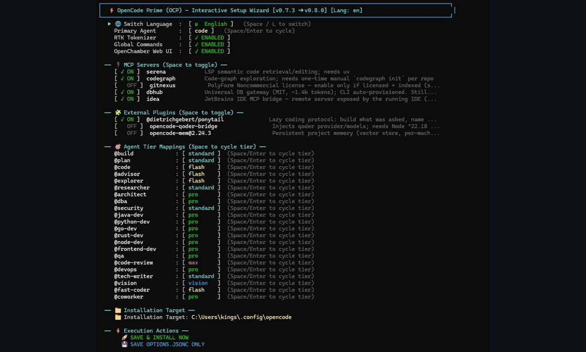

# OpenCode Prime (OCP)

<div align="center">

**Production-ready multi-agent engineering for [OpenCode](https://opencode.ai).**

[](https://github.com/kenlin8827/opencode-prime/releases)


**[Documentation](https://kenlin8827.github.io/opencode-prime/)** · **[Releases](https://github.com/kenlin8827/opencode-prime/releases)** · **[中文](README.zh-CN.md)**

<br />



</div>

## Features

- **Specialist agent team:** 21 focused agents for frontend, Java, databases, security, QA, DevOps, and more.
- **Engineering guardrails:** Optional ADR, secret-file, E2E, and commit-discipline gates keep delivery predictable.
- **Layered intelligence:** Configure CodeGraph, GitNexus, Serena LSP, DBHub, and other MCP services from one dashboard.
- **Model governance:** Map agents to `flash`, `standard`, `pro`, `max`, and `vision` tiers, then switch profiles in one action.
- **Guided setup:** Use the TUI wizard to configure providers, profiles, project knowledge, and guardrails without hand-editing files.
- **One configuration, three surfaces:** Work from the OpenCode terminal, OpenChamber web UI, or native desktop app.
- **Safe lifecycle commands:** Install, upgrade, update, inspect, and uninstall the suite while preserving local configuration.

## Install

```bash
# macOS / Linux / WSL
curl -fsSL https://raw.githubusercontent.com/kenlin8827/opencode-prime/main/install.sh | bash
```

```powershell
# Windows PowerShell
irm https://raw.githubusercontent.com/kenlin8827/opencode-prime/main/install.ps1 | iex
```

Re-run the installer to upgrade while retaining API keys, custom models, and tier mappings. For prerequisites, pinned versions, offline inspection, and clone-based installation, see the [installation guide](https://kenlin8827.github.io/opencode-prime/).

## Quick start

```bash
ocp                 # launch the OpenCode terminal UI
ocp wizard          # configure OCP interactively
ocp dashboard       # manage MCPs, plugins, and model tiers
ocp provider        # configure model providers
ocp profile         # select or manage a model-tier profile
ocp project         # configure and initialize the current project
ocp usage           # inspect token and cost usage across projects
ocp web             # launch the OpenChamber web UI
ocp desktop         # launch the native desktop app
ocp update          # check and apply available updates
```

Run `ocp help` for all commands. The [CLI reference](https://kenlin8827.github.io/opencode-prime/maintenance/ocp-cli) covers aliases, arguments, upgrade behavior, and maintenance operations.

## Documentation

Read the [online documentation](https://kenlin8827.github.io/opencode-prime/) for agent roles, workflows, profiles, MCP servers, guardrails, installer options, and development guidance. Repository contributors should start with [DEVELOPING.md](DEVELOPING.md).

## License

Copyright (C) 2026 Ken Lin — licensed under the [GNU Affero General Public License v3.0 or later](LICENSE). Third-party integrations retain their own licenses.
