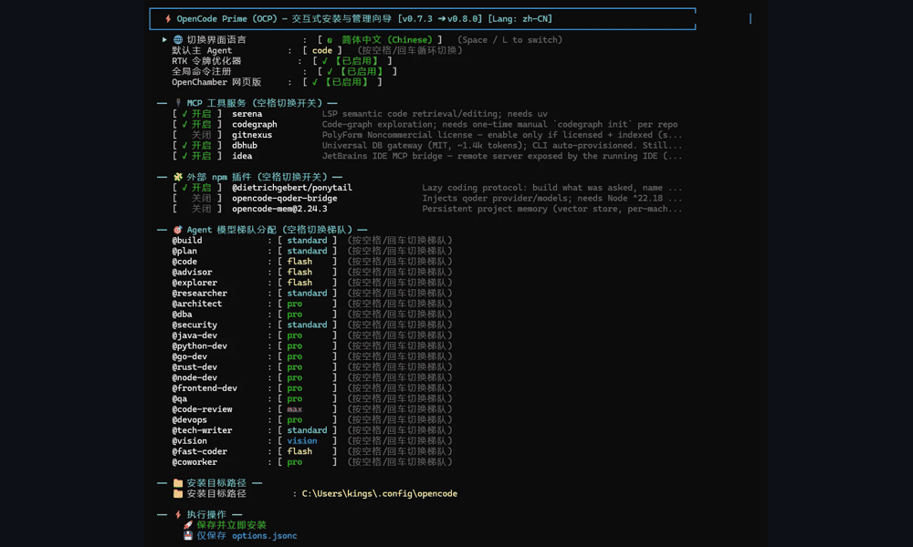

# OpenCode Prime（OCP）

<div align="center">

**面向 [OpenCode](https://opencode.ai) 的生产级多智能体工程套件。**

[](https://github.com/kenlin8827/opencode-prime/releases)


**[在线文档](https://opencode-prime.dev/zh/)** · **[发布版本](https://github.com/kenlin8827/opencode-prime/releases)** · **[English](README.md)**

<br />



</div>

## 特性

- **专家智能体团队：** 内置 21 位专业智能体，覆盖前端、Java、数据库、安全、测试、DevOps 等领域。
- **工程护栏：** 可选 ADR、密钥文件、E2E 与提交纪律门控，让交付过程更可控。
- **分层代码智能：** 在统一控制台管理 CodeGraph、GitNexus、Serena LSP、DBHub 等 MCP 服务。
- **模型分层治理：** 为不同智能体映射 `flash`、`standard`、`pro`、`max`、`vision` 层级，并可一键切换预设。
- **引导式配置：** 通过 TUI 向导完成 Provider、Profile、项目知识图谱与护栏配置，无需手改配置文件。
- **一套配置，五种客户端形态：** 终端 TUI 目前可选三种模式：直接模式（`ocp`）、Herdr 模式（`ocp tui`）和 Luvus 模式（`ocp tui`）；另有 OpenChamber VS Code 扩展（`ocp code`）、网页界面（`ocp web`）与原生桌面应用（`ocp desktop`）。
- **安全的生命周期命令：** 安装、升级、更新、检查和卸载套件时保留本地配置。

## 安装

```bash
# macOS / Linux / WSL
curl -fsSL https://raw.githubusercontent.com/kenlin8827/opencode-prime/main/install.sh | bash
```

```powershell
# Windows PowerShell
irm https://raw.githubusercontent.com/kenlin8827/opencode-prime/main/install.ps1 | iex
```

重复运行安装命令即可升级，同时保留 API 密钥、自定义模型和模型层级配置。前置条件、指定版本、检查脚本后再运行，以及克隆安装方式请见[在线文档](https://opencode-prime.dev/zh/)。

> 中国大陆网络环境可通过 `OCP_RAW_MIRROR`、`OCP_API_MIRROR` 与 `OCP_RELEASE_MIRROR` 配置 GitHub 镜像；详细说明见[安装与维护文档](https://opencode-prime.dev/zh/maintenance/ocp-cli)。

## 快速开始

```bash
ocp                 # 直接启动 OpenCode 终端界面
ocp tui             # 通过所选工作区包装器启动 OpenCode 终端界面
ocp wizard          # 交互式配置 OCP
ocp dashboard       # 管理 MCP、插件与模型层级
ocp provider        # 配置模型 Provider
ocp profile         # 选择或管理模型层级预设
ocp project         # 配置并初始化当前项目
ocp usage           # 查看跨项目 Token 与费用用量
ocp web             # 启动 OpenChamber 网页界面
ocp desktop         # 启动原生桌面应用
ocp code            # 打开 VS Code 并保证 OpenChamber 扩展就绪
ocp update          # 检查并安装可用更新
```

使用 `ocp help` 查看完整命令。命令别名、参数、升级行为与维护操作请参阅 [OCP CLI 参考](https://opencode-prime.dev/zh/maintenance/ocp-cli)。

## 文档

[在线文档](https://opencode-prime.dev/zh/)包含智能体职责、工作流、预设、MCP 服务、工程护栏、安装选项与开发说明。参与仓库开发请先阅读 [DEVELOPING.md](DEVELOPING.md)。

## 许可证

版权所有 (C) 2026 Ken Lin — 基于 [GNU Affero 通用公共许可证 v3.0 或更高版本](LICENSE) 发布。第三方集成保留各自许可证。
