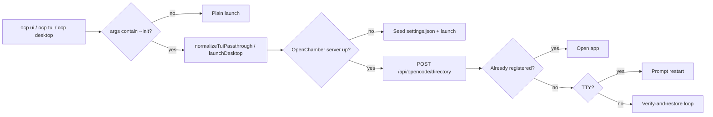

# Iteration 0.10.0 · CLI and OpenChamber activation

> Index: [`README.md`](./README.md). Amendment (2026-09-10): `.` is no longer an `--init` alias.

## Cheatsheet

1. Drop `plugins/ocp/`; global `ocp` shim is the canonical CLI surface (ADR-0.10.0#01)
2. Only explicit `--init` triggers init; bare `.` is a no-op everywhere (ADR-0.10.0#01)
3. Init in one place: TS engine owns; bin never invokes (ADR-0.10.0#01)
4. `ocp ui --init` registers cwd before launch via OpenChamber's own endpoints (ADR-0.10.0#01)

---

## Quick view

| Disposition | Path | Owner |
| --- | --- | --- |
| `plugins/ocp/*` | removed | plugins |
| `bin/opencode-prime(.ps1)` | normalizes `.` → `--init`, delegates | dispatcher |
| `install/src/launcher.ts` | `launchDesktop` + OpenChamber integration | runtime |
| `install/src/index.ts` | CLI engine + `project` namespace + `desktop` action | runtime |
| `install/install.sh|ps1` | adds `desktop`/`project` to info-command list | installer |

---

### 01. OCP CLI migration and OpenChamber activation
**Status**: 🟡 proposed (amended 2026-09-10)

**Background**: `plugins/ocp/` slash commands (`/ocp project init|index|sync`, `/ocp ui`, `/ocp tui`) duplicated CLI surface and could not reach OpenChamber desktop (slash commands run inside the agent). The original dispatcher aliased bare `.` to `--init`, making `ocp tui .` look like "open the TUI here" while actually running project init — and even surfacing the interactive wizard via the bin dispatcher's `project init` detour.

**Decision**:

| # | Point | Content |
| --- | --- | --- |
| 1 | Plugin surface | Drop `plugins/ocp/*`; ship CLI on global `ocp` shim: `project init|index|sync`, `tui --init`, `ui --init`, plain `desktop` / `ui` |
| 2 | Init alias | Only explicit `--init` triggers init; bare `.` is a stripped no-op everywhere (`ocp tui .` ≡ `ocp tui`) |
| 3 | Init choke point | TS engine owns init: `normalizeTuiPassthrough` (tui), `launchDesktop` (desktop/ui); bin dispatcher is a normalizer, never an invoker |
| 4 | OpenChamber registration (offline) | Seed `~/.config/openchamber/settings.json` with the same id/field format OpenChamber uses |
| 5 | OpenChamber registration (online) | POST `/api/opencode/directory` (same endpoint *Add project* uses); on TTY prompt restart so the running window reopens with the project loaded |
| 6 | OpenChamber registration (already) | Already registered → open app, no prompts |
| 7 | Installer | Add `desktop` and `project` to the info-command list so the OpenCode auto-install prompt never fires |

**Rationale**:

- **CLI is the canonical surface** — one shim removes the slash/CLI split and stays reachable from companion tools
- **Init in exactly one place** — TS engine owns init semantics; bin dispatcher is a normalizer; no surprise wizard surfacing
- **Explicit `--init`, no `.` alias** — only an explicit `--init` triggers init; bare `.` stripped to a no-op matches user reading
- **OpenChamber registration is one-shot, not a watcher** — each `ocp ui --init` reconciles once via the dialog endpoint; project list reload picks up the change on launch

**Rejected**:

| Option | Reason rejected |
| --- | --- |
| Keep `plugins/ocp/` alongside the shim | Slash commands can't reach OpenChamber desktop and double surface area for the same actions |
| Continue `.` → `--init` alias | Shipping an alias that runs init when the user reads it as "open here" is exactly the surprise the 2026-09-10 amendment eliminates |
| Bin dispatcher performs init-specific argument rewriting | Split-brain init logic across bin + TS engine reintroduces the original surprise class |

**Impact**:

- **Plugins** — `plugins/ocp/*` removed; `install/versions/0.9.2.manifest.txt` lists the removal
- **Runtime** — `install/src/launcher.ts` owns `launchDesktop`, OpenChamber settings read, fast path, POST helper, prompt + kill; `install/src/index.ts` owns the CLI engine, `project` namespace, `desktop` action wired to `launchDesktop`
- **Dispatcher** — `bin/opencode-prime` + `.ps1` normalizes a leading `.` to `--init` and delegates to `install.sh|ps1 desktop|tui`; bare `ocp ui` stays a plain launch
- **Installer** — `install/install.sh|ps1` adds `desktop` and `project` to the info-command list
- **OpenChamber integration** — running-window race (stale UI overwrites project list) is mitigated, not solved; a real fix needs upstream changes (selective PUT or server push on `persistSettings`); OCP direct writes trust the seed path only when no server owns the file, since server's `persistSettings` is read-modify-write that survives concurrent saves

**Future extensions**: ship a downstream patch upstream (selective PUT on `persistSettings` or server push on project add) so the running-window race is closed at the source.