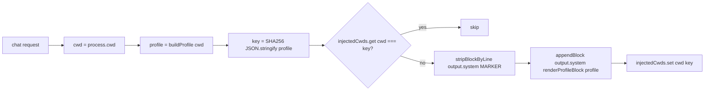

# Iteration 0.34.0 · Profiler cache and ponytail removal

> Index: [`README.md`](./README.md). Supersedes the same-day ponytail opt-in draft.

## Cheatsheet

1. Project profiler cache: SHA-256 of profile content, not cwd (ADR-0.34.0#01)
2. Strip-then-append stays; Tier 2 delta withdrawn (Scenario A) (ADR-0.34.0#01)
3. Shared strip/append helpers in `plugins/shared/system-block.ts` (ADR-0.34.0#01)
4. `@dietrichgebert/ponytail` removed entirely from OCP (ADR-0.34.0#02)
5. Forcing function folded into `prompts/code.md` step 4 + `prompts/lite.md` (ADR-0.34.0#02)
6. Fragment-cache replaces skip-on-same-state in 5 plugins (ADR-0.34.0#01)

---

## Quick view

| File | Old | New |
| --- | --- | --- |
| Cache | `Map<cwd, block>` (cwd only) | `Map<cwd, profileKey>` (content hash) |
| Hit condition | unconditional `cachedBlocks.get(root)` | `injectedCwds.get(cwd) === profileKey(profile)` |
| Strip helper | inline `string.replace` | `stripBlockByLine(output.system, MARKER)` from shared module |
| Append helper | inline `output.system.push(...)` | `appendBlock(output.system, renderProfileBlock(profile))` |
| Marker regex | hand-rolled | `escapeRegExp(MARKER)` line-start pattern |
| Prompt contract | unchanged | unchanged (Scenario A has only one block per prompt) |
| Tier 2 delta layer | implemented in PR | withdrawn (defensive design for non-occurring Scenario B) |

---

### 01. Project profiler cache keyed by profile content hash
**Status**: ✅ accepted

**Background**: `plugins/project-profiler/project-profiler.ts` advertises runtime backend capabilities (CodeGraph / GitNexus / Serena / tgrep) by appending a `[PROJECT CAPABILITIES]` block to the system prompt on every chat request. The previous cache keyed only on cwd: mid-session edits to `~/.config/opencode/opencode.jsonc` (e.g. enabling `codegraph` MCP) or adding `.codegraph/` made `buildProfile()` return a different profile, but `cachedBlocks.get(root)` returned the stale block rendered before the change — the model kept seeing `CodeGraph=unavailable` until restart or cwd change. This is a correctness bug, not a performance one (AGENTS.md §0: "architectural legitimacy outranks implementation convenience"). The original draft also proposed Tier 2 append-only delta architecture, implemented and stripped back after empirical verification proved opencode is Scenario A (`output.system` rebuilt per request); Tier 2 was defensive design for a non-occurring scenario (Defendability gate rejects shipping defensive-only code with documentation acknowledging it's dead).

**Decision**:

| # | Point | Content |
| --- | --- | --- |
| 1 | Cache key | `profileKey(profile)` = SHA-256 of `JSON.stringify(profile)` (64 hex chars) |
| 2 | Cache map | `injectedCwds: Map<cwd, string>` (per-cwd content hash slot, no cross-contamination) |
| 3 | Hit condition | `injectedCwds.get(cwd) === profileKey(profile)` (skip on hit) |
| 4 | Miss path | `stripBlockByLine(output.system, MARKER)` → `appendBlock(output.system, renderProfileBlock(profile))` → `injectedCwds.set(cwd, key)` |
| 5 | Tier 2 | Not introduced — withdrawn after empirical Scenario A verification |
| 6 | Strip pattern | Line-start, derived from `MARKER` via `escapeRegExp`; single source in `plugins/shared/system-block.ts` |
| 7 | Prompt contract | Unchanged — "read `[PROJECT CAPABILITIES]`" stays (Scenario A has only one block per prompt) |
| 8 | Exports | Exactly what runtime needs (`ProjectProfilerPlugin`) + pure functions for future refactor (`MARKER`, `mcpEnabledFrom`, `ProjectProfile`, `buildProfile`, `renderProfileBlock`, `profileKey`); no re-exports for test import paths (AGENTS.md §100) |
| 9 | Shared helpers | `appendBlock`, `stripBlockByLine`, `escapeRegExp` extracted to `plugins/shared/system-block.ts`; reused by `auto-advisor`, `project-manager`, `adr-guard`, `e2e-guard` |
| 10 | Fragment cache (parallel) | `auto-advisor` / `adr-guard` / `e2e-guard` / `project-manager` / `project-profiler` "skip on same state" trackers replaced with `Map<state, key, text>`; always inject when state says inject; keep defensive strip for Scenario B correctness |

**Rationale**:

- **Cache invalidation rides on content** — same cwd + same profile → skip; same cwd + different profile → re-emit; different cwd → independent slot
- **`JSON.stringify` safe on closed union** — `ProjectProfile` is fixed-shape record of `Capability` literals; serialization deterministic across JS engines; SHA-256 keeps the key bounded with O(length) comparison
- **Strip-then-append stays, Tier 2 withdrawn** — under Scenario A strip is a defensive no-op against within-request hook chaining; under future Scenario B the strip is correct. Tier 2 was technically correct under both scenarios but its rationale does not apply under Scenario A; Defendability gate rejects shipping defensive-only code with documentation acknowledging it's dead
- **Shared helpers in `plugins/shared/system-block.ts`** — closes the pre-existing migration in 4 sister plugins
- **No prompt contract change** — under Scenario A there is only one block per prompt; "LATEST" / "ignore earlier blocks" framing would mislead
- **No exports for tests' sake** — exports are exactly what the runtime surface needs plus pure functions a future refactor might legitimately reuse

**Rejected**:

| Option | Reason rejected |
| --- | --- |
| Keep cwd-keyed cache | The bug. Mid-session MCP / `.codegraph` / `.gitnexus` edits don't propagate to the model until restart |
| Tier 2 append-only delta (skip/append-full/append-delta branches) | Defensive design for Scenario B that doesn't occur on opencode 1.18.30. Verified with 4 hook calls across 2 sessions, all `markerSurvived: false` |
| "Skip on same state" prompt-cache-preservation fast path | Same dead-code class — fixed in this release by fragment cache for 5 plugins |

**Impact**:

- **Correctness** — mid-session MCP / `.codegraph` / `.gitnexus` changes propagate on the next chat request, no restart; cache models "what the profile looks like right now", not "what it looked like the first time we looked"
- **Defendability** — "why SHA-256 of the profile?" has a one-paragraph answer that survives review; "why not Tier 2 delta?" has an answer — Scenario A verified, delta path is dead code
- **Smallest possible diff** — removes a real bug without introducing a speculative one
- **Cost** — one extra `JSON.stringify` + SHA-256 per request (microsecond-scale on 4 short strings); savings from skipping `buildProfile()` dwarf this by orders of magnitude
- **Plugin module** — `MARKER`, `ProjectProfile`, `mcpEnabledFrom`, `buildProfile`, `renderProfileBlock`, `profileKey` exported; cache `Map<cwd, profileKey>` keyed on cwd + content hash
- **Shared module** — `appendBlock`, `stripBlockByLine`, `escapeRegExp` in `plugins/shared/system-block.ts`, shared by every system-transform injector
- **Tests** — `tests/test-project-profiler-unit.ts` rewritten for Tier 1 fix (idempotency / invalidation / 64-hex / cache-stable / cache-invalidation-visible / `escapeRegExp` / `appendBlock` happy + fallback / round-trip strip+append invariant); `tests/test-system-block-unit.ts` new parallel coverage; `tsc --noEmit` clean
- **Follow-ups (separate issues)** — fragment cache replaces "skip on same state" trackers in 5 plugins (✅ 2026-09-11); `md-to-pdf` / `md-to-docx` could add `ANY_CAPABILITY_MARKER_RE` for future Scenario B safety (out of scope, correct today); `deepseek-anchor` could migrate to `appendBlock` (last-only) for semantic alignment (out of scope, its per-session tracking is correct for its first-turn-only contract); if opencode switches to Scenario B the fragment-cache + always-inject + defensive-strip pattern still works end-to-end

**Future extensions**: when prompt-cache-preservation becomes a live path (opencode Scenario B), the same `Map<cwd, {key, text}>` already serves it — no rework needed for any of the 5 plugins covered above.

### 02. Remove ponytail from OCP
**Status**: ✅ accepted

**Background**: OCP shipped `@dietrichgebert/ponytail` as a default-on npm plugin (`opencode.template.jsonc:plugin`, `install/options.jsonc:plugin['@dietrichgebert/ponytail'] = true`). The plugin's framing — "build what was asked, then name the lazier alternative in one line" — promotes "laziness" as a positive engineering value. This directly conflicts with `cp#10` (`Top-tier floor + YAGNI discipline`), which rejects rationales that bypass the top-tier engineering floor under any "do less" framing. Architecturally, OCP's own prompt stack (`cp#10`, `prompts/architect.md:38`, `prompts/code-review.md:27`, `cp#7` no-premature-abstraction) already covers YAGNI, SOLID, KISS, DRY — a third-party npm package imposing its own "what good code looks like" framing on the agent's design process is an external constraint on architectural decisions the project should own. The original draft proposed flipping to opt-in; same day the stronger decision was taken: remove the npm dep entirely, fold the only non-redundant bit (the "consider a simpler alternative" forcing function) into our own agent prompts.

**Decision**:

| # | Point | Content |
| --- | --- | --- |
| 1 | npm dep | `package.json` drops `@dietrichgebert/ponytail` (`bun.lock` regenerated) |
| 2 | Plugin map | `install/options.jsonc:plugin`, `opencode.template.jsonc:plugin` drop the entry; headroom MCP comment drops "ponytail supplements rtk" |
| 3 | i18n | `install/src/i18n.ts` + `install/locales/{en,zh-CN}.json` drop `pluginLabels` entry |
| 4 | lite-mode | `plugins/lite-mode/lite-mode.ts` drops `PONYTAIL MODE ACTIVE` / `# Ponytail` strip logic (dead code) |
| 5 | Docs | `DEVELOPING.md` "5. Ponytail protocol" removed; `docs/workflows/plugins.md` (ZH) drops row; `docs/maintenance/options.md` (ZH) drops example entry; `docs/core/mcp-servers.md` (ZH) reverts "rtk + ponytail" to "rtk" |
| 6 | Tests | `tests/test-all.ps1` drops plugin/env checks; `tests/test-lite-mode-unit.ts` drops ponytail block section; `tests/README.md` drops behavioral descriptions |
| 7 | Forcing function | One-line addition to `prompts/code.md` step 4 (Implement) + `prompts/lite.md` Editing-code line: "Before finalizing, briefly consider a YAGNI-aligned simpler path — name it in the report if obvious; skip for trivial changes. (`cp#10` floor still applies.)" |
| 8 | Installer readme | `install/README.md` example config no longer mentions ponytail |

**Rationale**:

- **`cp#10` conflict at the framing level** — ponytail's "lazier alternative" framing is exactly the rationalization pattern `cp#10` rules out, ships as actual behavior not just docs
- **Architectural sovereignty** — design principles live in the project (`AGENTS.md`, `cp#N`); npm plugin's "what good code looks like" framing is an external constraint
- **No marginal value** — ponytail's only non-redundant contribution is the forcing function, expressible in two lines of our own prompt text
- **Defendability gate restored** — removing ponytail closes the "why shipped but disabled" surface area that opt-in left open
- **Behavior preserved** — every behavior ponytail contributed that the project wanted is now in our own prompt text

**Rejected**:

| Option | Reason rejected |
| --- | --- |
| Keep default-on, reframe docs "YAGNI-scoped" | Docs don't change actual behavior or rationalization-framing output; conflict stays |
| Flip to opt-in (default off) | Surface area still shipped; Defendability-gate liability "why shipped but disabled" remains; active opt-in reintroduces `cp#10` conflict |
| Keep default-on | Same `cp#10` conflict, same Defendability-gate liability |

**Impact**:

- **Surface** — `package.json`, `bun.lock`, install graph, OCP package surface all leaner; "lazy coding" framing gone everywhere
- **Defendability** — fully restored; no "why shipped" surface area
- **Token cost** — ponytail ruleset block no longer injected into any session; lite-mode strip is dead code removed
- **Forcing function** — preserved via in-prompt one-line addition; no behavior loss
- **Existing users** — manually configured ponytail (npm install + `opencode.jsonc` edit outside OCP) lose it after upgrade; release notes + CHANGELOG must call this out; npm package still on public registry, users who want it can install themselves and wire into their own `opencode.jsonc` — they just don't get OCP's framing or lite-mode strip
- **Test surface** — env-dependent ponytail test removed (no test to maintain); strip logic gone; nothing left to regression-test
- **`cp#10` unchanged** — YAGNI framing remains the gate for any "simpler" alternative surfaced; `prompts/architect.md:38,46`, `prompts/code-review.md:27`, `instructions/coding-principles.md` row 7 already cover SOLID+YAGNI+KISS+DRY at architecture/review tiers — gap ponytail filled at implementation tier is now filled by the in-prompt forcing function

**Future extensions**: any future external plugin idea follows the same `cp#10` + architectural-sovereignty test — re-evaluate before adopting.