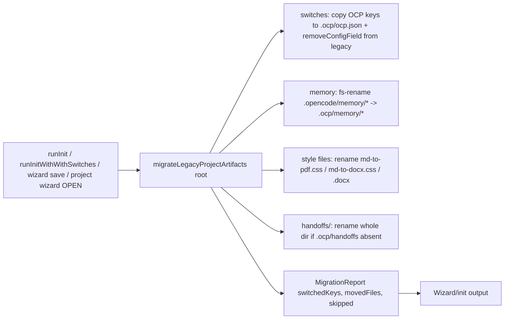

# Iteration 0.35.0 · OCP path contract

> Index: [`README.md`](./README.md).

## Cheatsheet

1. OCP artifacts → `.ocp/`; global config → `ocp.json`; `.opencode/` stays OpenCode's (ADR-0.35.0#01)
2. No runtime compat: one path/artifact; init-time migration (ADR-0.35.0#01)
3. Single choke point: `plugins/shared/opencode-prime.ts` exports every path helper (ADR-0.35.0#01)
4. Migration idempotent + non-destructive + visible via `MigrationReport` (ADR-0.35.0#01)
5. `.ocp/.gitignore` single-sourced from `ensureOcpGitignore` (ADR-0.35.0#01)
6. Upgrade-without-re-init = defaults until wizard or `/project sync` runs (ADR-0.35.0#01)

---

## Quick view

| Artifact | Old | New | Disposition |
| --- | --- | --- | --- |
| Project switch keys | `.opencode/opencode.jsonc` / root `opencode.jsonc` (OCP keys only) | `.ocp/ocp.json` | moves at init migration (keys copied, removed from legacy) |
| Memory | `.opencode/memory/{public,private}.md` | `.ocp/memory/*` | moved (merge-append if target exists) |
| Handoffs | `.opencode/handoffs/` | `.ocp/handoffs/` | moved (skipped if target exists) |
| Logs + dev-ultra state | `.opencode/logs/`, `.opencode/dev-ultra-state.md` | `.ocp/logs/`, `.ocp/dev-ultra-state.md` | disposable; runtime uses new path only |
| Style files | `.opencode/md-to-pdf.css`, `md-to-docx.css`, `md-to-docx.docx` | `.ocp/*` | moved (skipped if target exists) |
| OCP `.gitignore` | `.opencode/.gitignore` (OCP bootstrap) | `.ocp/.gitignore` | moves (frozen, never written again) |
| Docs convention | `.opencode/recovery/` | `.ocp/recovery/` | docs text only |
| Platform themes | `.opencode/themes/` | — | stays (platform-read at `opencode-theme.ts:136`) |
| Platform config | `.opencode/opencode.jsonc` / root `opencode.jsonc` (`$schema`, `agent`, `mcp`, …) | — | stays (OCP never writes it) |
| Platform discovery | `.opencode/{agent,command,plugin,skill}/` | — | stays |
| Global user config | `~/.config/opencode/ocp.jsonc` | `~/.config/opencode/ocp.json` | renamed by installer (skip+warn on collision) |
| Installer state | `~/.config/opencode/.ocp/installed.manifest.txt` | — | already `.ocp` (`installer.ts:102`) |
| Repo `.gitignore` | — | adds `.ocp/` | new entry |

| Removed (`cp-delete`) | Replaced by |
| --- | --- |
| `ensureOpencodeGitignore` | `ensureOcpGitignore` (single source) |
| `projectConfigFiles` (list) | single-path read in `readProjectConfig` |
| `readProjectTemplate` + `templates/opencode.jsonc` | pure-JSON config bootstraps from `{}` |

---

### 01. OCP path contract
**Status**: ✅ accepted

**Background**: OCP-owned artifacts (plugin switches, memory, handoffs, logs, style overrides) currently live inside `.opencode/` — a directory OpenCode also owns (config merging, `themes/`, `agent`/`command`/`plugin`/`skill` discovery). Mixing OCP state into a platform namespace means every OCP write potentially touches a file the platform reads, and the platform's own evolution can collide with OCP conventions. Verified code facts bound the migration scope: single choke point for project config IO in `plugins/shared/opencode-prime.ts`; five switch plugins route through `plugins/shared/plugin-switch.ts`; `sidebar-status.ts:181-200` duplicated the reader privately (consolidated); global config in `plugins/shared/ocp-config.ts:30-34`; installer already uses `.ocp` for global state (`installer.ts:102`); `.opencode/themes/` stays (platform-read at `opencode-theme.ts:136`); handoffs written by agents following skill text, not plugin code; `scripts/serena-workspace-daemon.mjs` writes `.opencode/logs/serena.log`; `deepseek-anchor-config.ts` and `auto-advisor-runtime.ts` read platform-owned surfaces (out of scope).

**Decision**:

| # | Point | Content |
| --- | --- | --- |
| 1 | Project scope | OCP switch keys (`autoAdvisorMode`, `adrGuard`, `adrLayout`, `adrDir`, `envGuard`, `e2eGuard`, `projectMemory`) move from `.opencode/opencode.jsonc` / root `opencode.jsonc` into `.ocp/ocp.json` |
| 2 | Memory | `.opencode/memory/{public,private}.md` → `.ocp/memory/*` (merge-append if target exists) |
| 3 | Handoffs | `.opencode/handoffs/` → `.ocp/handoffs/` (whole dir, skipped if target exists) |
| 4 | Logs + state | `.opencode/logs/` + `.opencode/dev-ultra-state.md` → `.ocp/logs/` + `.ocp/dev-ultra-state.md` (disposable, best-effort) |
| 5 | Style files | `md-to-pdf.css` / `md-to-docx.css` / `md-to-docx.docx` → `.ocp/*` (per-file, skipped if target exists) |
| 6 | `.gitignore` | OCP bootstrap moves to `.ocp/.gitignore` (legacy file frozen, never written again); `.ocp/` added to repo `.gitignore` |
| 7 | Platform stays | `.opencode/themes/`, `.opencode/opencode.jsonc` (platform keys), `.opencode/{agent,command,plugin,skill}/` — OCP never writes them |
| 8 | Global rename | `~/.config/opencode/ocp.jsonc` → `~/.config/opencode/ocp.json` by installer one-shot (skip+warn on collision; wrong-base rescue; never delete, never throw) |
| 9 | Read resolution | `readProjectConfig()` parses `
/.ocp/ocp.json` only; `writableProjectConfigFile()` returns `
/.ocp/ocp.json` unconditionally |
| 10 | `ocpDir(root)` | Honors `OCP_PROJECT_DIR` env only as project-RELATIVE path (`<root>/<env>`); unset/empty/absolute → `<root>/.ocp` |
| 11 | `ocpConfigPath()` | `OCP_CONFIG_PATH` env → `$XDG_CONFIG_HOME/opencode/ocp.json` → `~/.config/opencode/ocp.json` (one source) |
| 12 | Migration calls | `migrateLegacyProjectArtifacts(root)` runs at start of `runInit`, `runInitWithSwitches`, TUI wizard's save path, and wizard's OPEN (before switch detection) |
| 13 | Central API | Path contract lives in `plugins/shared/opencode-prime.ts` (`OCP_DIR = ".ocp"`, `OCP_CONFIG_REL = ".ocp/ocp.json"`, `ocpDir`, `ocpConfigFile`, `readProjectConfig`, `writableProjectConfigFile`, `ensureOcpGitignore`, `getProjectLogDir`, `getProjectHandoffDir`, `ocpArtifactPath`, `migrateLegacyProjectArtifacts`; exported `OCP_SWITCH_KEYS`) |
| 14 | `.ocp/.gitignore` | `.gitignore`, `logs/`, `*.log`, `handoffs/`, `memory/private.md`, `dev-ultra-state.md` (heal branch appends missing lines) |
| 15 | `JSONC` reads | Tolerate hand-edited comments; upsert/remove preserve comments via existing text surgery |
| 16 | `cp-delete` | `ensureOpencodeGitignore`, `projectConfigFiles` (single-path read replaces the list), `readProjectTemplate` + `templates/opencode.jsonc` bootstrap dependency |

**Rationale**:

- **Platform sovereignty** — `.ocp/` 100% OCP, `.opencode/` 100% platform; every write is owned by exactly one party, no shared namespace
- **Single source at runtime** — no fallback chains, no merge precedence, no dual-era reads; one file, one path, per artifact
- **Explicit user-triggered migration** — wizard and installer are the only places legacy paths are touched; idempotent + non-destructive + visible (`MigrationReport` surfaces in wizard/init output)
- **Central API** — every consumer imports from `plugins/shared/opencode-prime.ts`; `OCP_SWITCH_KEYS` shared by migration and `detectProjectSwitches`
- **Hand-edited comments survive** — `JSONC` reads + text surgery preserve comments in `.ocp/ocp.json`
- **Token budget** — shipped skill edits are line-for-line path substitutions, net-zero (AGENTS.md §2)

**Rejected**:

| Option | Reason rejected |
| --- | --- |
| Runtime read-fallback chain (per-key merge) | User decision rejects — every read path would carry two-era logic forever; tests must pin precedence rules no design doc can make obvious |
| Dual-write (mirror every write to legacy files) | Writes into platform files forever |
| One-shot migration with runtime compatibility | User decision explicitly rejects runtime fallback |
| Keep OCP state under `.opencode/` | Platform's own evolution (`themes/`, agent/command/plugin/skill discovery, config merging) collides with OCP conventions on every write |

**Impact**:

- **Runtime** — dead simple: one path per artifact, zero precedence logic, zero dual-era reads
- **Migration** — explicit, user-triggered, visible in wizard output; re-runnable via `/project sync` (repurposed from retired template top-up machinery)
- **Dedupe** — sidebar's private reader and project-memory's duplicated gitignore bootstrap fold into the shared module (closes standing P2 drift-watch item); `ensureOcpGitignore` single-sources gitignore bootstrap
- **Plugins** — `plugins/shared/opencode-prime.ts` extended (single-path reads/writes, `ensureOcpGitignore`, artifact helpers, `OCP_SWITCH_KEYS`, `migrateLegacyProjectArtifacts`; `cp-delete` removed); `shared/ocp-config.ts` switches to `ocp.json` only, pure-JSON writes; `plugin-switch.ts` contract unchanged; `project-memory/` single-path config; `project-manager/` `CONFIG_REL = OCP_CONFIG_REL`, `SCAFFOLD_TARGETS = [".ocp/ocp.json", "docs/git-commits.md", "AGENTS.md"]`, `templates/opencode.jsonc` → `templates/ocp.json` (pure JSON), init paths call `migrateLegacyProjectArtifacts()`, `runSync` repurposed to "run §3 migration on demand"; `md-to-pdf/engine.ts`, `md-to-docx/engine.ts` single-path stat; `adr-guard/adr-engine.ts` `IGNORED_DIRS += ".ocp"`; `tui/sidebar-status.ts` reader dedupe + scaffold row; `tui/project-wizard.ts` migration call on save + `CONFIG_REL` import; `tui/i18n.ts` path strings + migration report lines; `sdd/sdd-command.ts` `.ocp/handoffs/` text; `scripts/serena-workspace-daemon.mjs` `.ocp/logs/serena.log` + `.ocp/.gitignore` bootstrap (plain-js mirror)
- **Installer** — `install/src/installer.ts` global `ocp.jsonc → ocp.json` one-shot (skip+warn on collision); wrong-base rescue; collision (both files) → warn, keep both; never delete, never throw
- **Repo** — `.gitignore` gains `.ocp/`
- **Tests** — path/expectation updates across `test-project-memory-unit.ts`, `test-project-manager-unit.ts` (scaffold target `.ocp/ocp.json`; old "no second config spawned" pin **inverts** — write-new is policy), `test-env-guard-unit.ts`, `test-e2e-guard-unit.ts`, `test-sidebar-status-unit.ts`, `test-sidebar-tgrep-badge.ts`, `test-wizard-helpers-unit.ts`, `test-md-to-pdf-unit.ts`, `test-md-to-docx-unit.ts`, `test-ocp-config-unit.ts`, `test-ocp-ui-render.tsx`, `test-ocp-busy-alert-render.tsx`, `test-usage-unit.ts`, `installer.test.ts`, `tests/test-all.ps1`; new pins: migration moves switches + removes from legacy (platform keys/comments preserved); idempotent (second run = no-op report); memory rename; `ensureOcpGitignore` content (incl. `dev-ultra-state.md`); `setConfigField` creates `.ocp/ocp.json` pure JSON; installer rename skip-on-collision
- **Skills + docs (line-for-line)** — `skills/handoff/SKILL.md`, `skills/sdd-workflow/SKILL.md`, `skills/memory-summarize/SKILL.md`, `skills/dev-ultra/SKILL.md`, `skills/md-to-pdf/SKILL.md`, `skills/md-to-docx/SKILL.md`; `docs/workflows/*` + ZH mirrors; `docs/getting-started/project-init.md` + ZH; `DEVELOPING.md`; `install/versions/<v>.notes.md` user-facing migration note; `README.md` / `README.zh-CN.md` sweep
- **Upgrade-without-re-init** — switches at defaults until wizard or `/project sync` runs once; accepted; documented in release notes; `/project sync` is the on-demand escape hatch
- **`.json` extension** — forbids commented-switch documentation; discoverability shifts to wizard / `/project setup` / docs
- **Downgrade** — lossy by design (older OCP versions do not read `.ocp/`)

**Future extensions**: fold `.deepseek-anchor-enabled` / `.active-profile` global dotfiles into `ocp.json` keys (deferral recommended); deprecation horizon for `migrateLegacyProjectArtifacts` (legacy paths only) — remove after 2 minor versions.