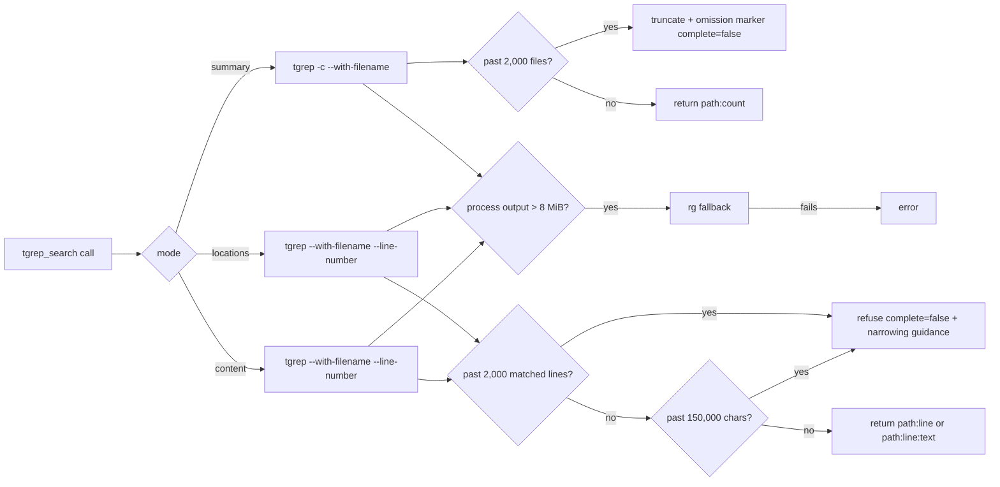

# Iteration 0.36.0 · tgrep probe-first contract

> Index: [`README.md`](./README.md).

## Cheatsheet

1. `tgrep_search`: complete per-call response; `summary`/`locations`/`content` modes (ADR-0.36.0#01)
2. `files_with_matches` is a `summary` alias — no new shape (ADR-0.36.0#01)
3. 2,000-row budget: detail past 2k refused; summary truncates (ADR-0.36.0#01)
4. 150,000-char cap closes long-line + probe↔detail race (ADR-0.36.0#01)
5. 8 MiB `spawnSync` buffer; `rg` fallback on overflow (ADR-0.36.0#01)
6. Upstream alignment: summary `tgrep -c`; detail `tgrep --with-filename --line-number` (ADR-0.36.0#01)

---

## Quick view

| Mode | CLI flag | Output shape | Row cap |
| --- | --- | --- | --- |
| omitted / `summary` | `tgrep -c --with-filename` | `path:count` | 2,000 files (truncate + omit) |
| `locations` | `tgrep --with-filename --line-number` | `path:line` | 2,000 lines (refuse) |
| `content` | `tgrep --with-filename --line-number` | `path:line:text` | 2,000 lines + 150,000 chars (refuse) |
| `files_with_matches` | alias for `summary` | `path:count` | 2,000 files (truncate + omit) |

| Boundary | Value | Action |
| --- | --- | --- |
| Per-call rows | 2,000 | refuse (`locations`/`content`) / truncate + omit (`summary`) |
| Materialized detail | 150,000 chars | refuse (`locations`/`content`) |
| Process capture | 8 MiB | fallback to `rg`; error if fallback fails |

---

### 01. tgrep probe-first search contract
**Status**: ✅ accepted

**Background**: `tgrep_search` previously returned a single, potentially broad match stream. Managing that stream as paged cursor state would make the tool stateful and would require snapshot retention, expiry, cleanup, and retry semantics. v0.36.0 instead makes search a two-step, probe-first interaction: the default request answers "where and how many?" before an agent requests individual locations or matching text, and the public result contract must stay complete, stateless, and aligned with the upstream `tgrep` CLI. Existing implementation proves the relevant upstream behavior: `-c --with-filename` produces the summary's `path:count` entries; `--with-filename --line-number` produces detail suitable for `path:line` or `path:line:text`; tgrep errors fall back to `rg`, and the fallback preserves the requested search shape without passing tgrep-only corpus-policy flags. The contract explicitly excludes pagination cursors, materialized snapshots, and OCP-owned disk cache for search results; it does not remove tgrep's upstream index or the existing short-lived capability cache used to determine watcher readiness — neither exposes paged result state to callers.

**Decision**:

| # | Point | Content |
| --- | --- | --- |
| 1 | Probe modes | omitted `mode` / `summary` → `path:count`; `locations` → `path:line`; `content` → `path:line:text` |
| 2 | `files_with_matches` | Compatibility alias for `summary` (no filename-only shape, no new shape) |
| 3 | Replay | Detail call replays the original search parameters and requests the chosen representation |
| 4 | Per-response metadata | Backend + complete matched-file + matched-line totals; `complete: true` means successful return |
| 5 | Row cap | 2,000-row budget: detail refuses past 2,000 matched lines with `complete: false` + narrowing guidance; summary truncates to first 2,000 + omission marker with `complete: false` (partial aggregates stay truthful per file; metadata totals stay complete) |
| 6 | Char cap | Materialized detail additionally bounded at 150,000 chars (long-line window, growth race) |
| 7 | Process capture | 8 MiB `spawnSync` buffer: `request → summary probe or detail search → process output ≤ 8 MiB → complete response`; exceeds/fails → `rg` fallback; error if fallback fails (not a partial-result protocol) |
| 8 | Upstream alignment | summary `tgrep -c --with-filename`; detail `tgrep --with-filename --line-number`; regex/literal/case/glob/path/`noIndex` pass through |
| 9 | Fallback | `rg` is correctness fallback when watcher unavailable or tgrep fails; OCP does not persist, snapshot, or page either backend's results |

**Rationale**:

- **Broad searches compact by default** — omitting `mode` returns per-file `path:count` probe; agent sees "where and how many" before requesting lines; detail opt-in
- **Every successful response is complete** — no cursor store, no replayed offsets; replay-the-parameters is reproducible from the request, never from server state
- **Stateless + replay-only** — tool never retains result state; no snapshot retention, expiry, invalidation, cleanup, or retry semantics
- **OCP uses documented upstream CLI output** — summary uses `tgrep -c --with-filename`; detail uses `tgrep --with-filename --line-number`; no parallel retrieval protocol
- **Clear response-size boundary** — 2,000-row budget + 150,000-char cap + 8 MiB buffer; detail refuses past the line budget with narrowing guidance, never floods context
- **`files_with_matches` preserved** — existing callers keep receiving summary representation without introducing another shape

**Rejected**:

| Option | Reason rejected |
| --- | --- |
| Cursor snapshots | Needs result retention, expiry/invalidation, cleanup, semantics for repo changes between pages; makes a result incomplete by default — exactly the state-management tax v0.36.0 set out to avoid |
| Parameter replay as primary API | Stateless but agents must reason about page boundaries; can miss/duplicate matches on file change; doesn't give a compact first answer for broad searches |
| Bare summary refusal past 2,000-file budget | Leaves caller with no coarser mode to narrow from; summary truncates with omission marker and stays complete per file; detail refuses (no coarser shape to fall back to) |
| OCP-owned disk cache for search results | Persistence violates the stateless contract; tgrep upstream index and short-lived watcher-readiness cache stay internal execution concerns, not result-pagination mechanisms |

**Impact**:

- **Agent UX** — small complete summaries first; second call only when summary identifies files needing detail; never face an unbounded dump
- **API surface** — `tgrep_search` with three modes + `files_with_matches` alias; one `complete` field; one `path:count` / `path:line` / `path:line:text` shape per mode
- **Implementation** — `plugins/tgrep.ts`, `plugins/tgrep/tgrep-search.ts`, `plugins/tgrep/tgrep-mode.ts`, `plugins/tgrep/tgrep-output.ts` implement mode / summary / fallback / buffer / shape contracts; `plugins/tgrep/tgrep-tool-description.md` is canonical public description; `tests/test-tgrep-search-unit.ts` pins the contract
- **Boundaries** — 2,000-row refuses detail past line count + truncates summary past file count; 150,000-char refuses detail past materialized size; 8 MiB `spawnSync` is capture ceiling with `rg` fallback
- **Statelessness** — no cursor store, no snapshot invalidation, no retention policy, no disk cleanup; calls reproducible from parameters
- **Caller workflow** — when boundaries trip, callers narrow `path` / `glob` and repeat; when summary exceeds 2,000 files, callers drill down per file
- **Upstream alignment** — tgrep errors fall back to `rg`; fallback preserves requested search shape without tgrep-only corpus-policy flags
- **Migration** — none; existing `files_with_matches` callers keep receiving summary representation

**Future extensions**: if opencode ever needs sub-prompt-token summaries for ultra-broad searches, a per-file `path:count` shape with selective inclusion can be added as another alias — `summary` itself stays the stable probe.