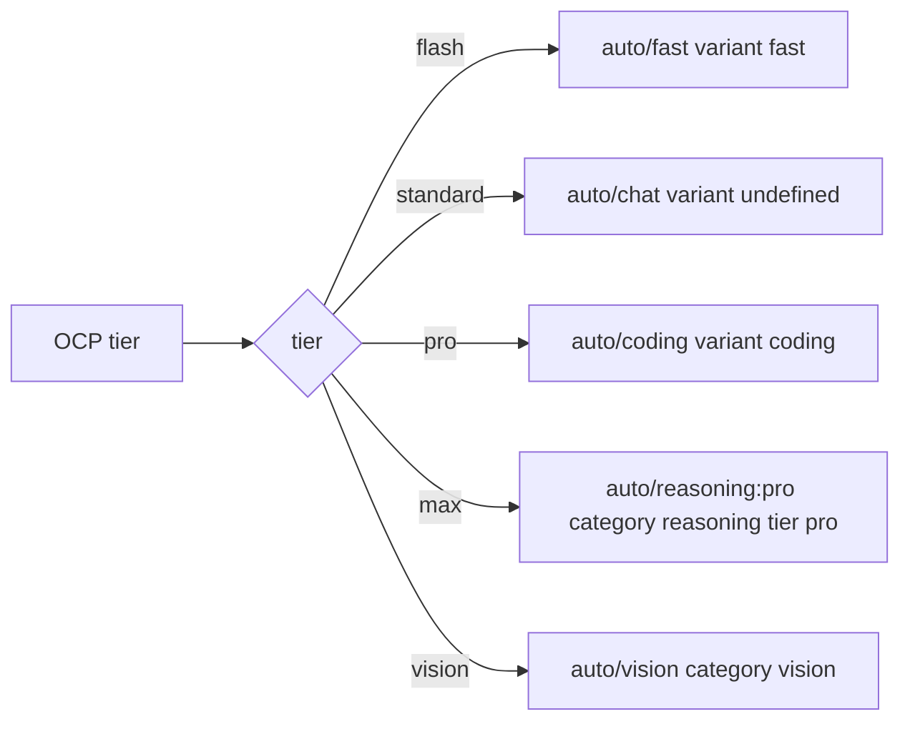

# Iteration 0.38.0 · OmniRoute gateway profile

> Index: [`README.md`](./README.md).

## Cheatsheet

1. Profile maps tiers → `omniroute/*` channels matching the tier's role (ADR-0.38.0#01)
2. Provider preset on `@ai-sdk/openai-compatible`; env-var only (ADR-0.38.0#01)
3. Documented `auto/<category>` over legacy `auto/best-*` aliases (ADR-0.38.0#01)
4. Portable: env-var config only, no deploy-side pinning (ADR-0.38.0#01)
5. Known gap: `auto/reasoning:pro` lacks quality-weight bias; `pro <= max` not guaranteed (ADR-0.38.0#01)

---

## Quick view

| Tier | Channel | Engine semantics |
| --- | --- | --- |
| flash | `auto/fast` | variant `fast` = ship-fast weights (latency-first) |
| standard | `auto/chat` | variant `undefined` = balanced default |
| pro | `auto/coding` | variant `coding` = quality-first weights, taskFit-heavy |
| max | `auto/reasoning:pro` | category `reasoning` = reasoning-capable; tier `pro` = premium pool |
| vision | `auto/vision` | category `vision` = vision-capable only |

| Survival under operator switch | Survives? |
| --- | --- |
| `hidePaidModels` | `auto/fast`, `auto/chat`, `auto/coding`, `auto/vision` survive (not paid-tier); `auto/reasoning:pro` removed (`:pro` suffix + `isPaidTierAutoId()`) |

---

### 01. OmniRoute gateway profile
**Status**: ✅ accepted

**Background**: OCP ships tiered profiles that map each tier to a concrete model or channel. This change adds a bundled profile for a self-hosted OmniRoute gateway — a model router whose `auto/*` channels select a model at request time from health, quota, cost, latency, and task-fit signals. Two new shipped files: `profiles/router/omniroute-auto.json` (the bundled OCP profile mapping the five tiers to `omniroute/*` model refs) and `providers/omniroute.json` (a companion provider preset on `@ai-sdk/openai-compatible` with `baseURL: {env:OMNIROUTE_BASE_URL}` and `apiKey: {env:OMNIROUTE_API_KEY}`, listing the gateway's 38 advertised `auto/*` channels plus a bare `auto`). The decision is which channel each tier resolves to, given the gateway's documented `auto/<category>` grammar and its legacy flat aliases.

**Decision**:

| # | Point | Content |
| --- | --- | --- |
| 1 | flash | `auto/fast` (variant `fast` = ship-fast weights, latency-first) |
| 2 | standard | `auto/chat` (variant `undefined` = balanced default) |
| 3 | pro | `auto/coding` (variant `coding` = quality-first weights, taskFit-heavy) |
| 4 | max | `auto/reasoning:pro` (category `reasoning` = reasoning-capable models; tier `pro` = premium pool) |
| 5 | vision | `auto/vision` (category `vision` = vision-capable models only) |
| 6 | Grammar | Documented `auto/<category>` over legacy `auto/best-*` aliases — engine-identical for 4 of 5 tiers, but legacy names mislead and upstream labels them "legacy flat template" |
| 7 | Provider preset | `@ai-sdk/openai-compatible` based; inert until `OMNIROUTE_BASE_URL` + `OMNIROUTE_API_KEY` set |
| 8 | Portability | Env-var configuration only; no deploy-side model pinning or fitness overrides |

**Rationale**:

- **Each tier's channel matches the tier's role** — latency for flash, balanced for standard, quality for pro, reasoning for max, vision for vision
- **Documented grammar over legacy aliases** — where `auto/<category>` and a legacy alias are engine-identical, documented grammar wins (legacy names mislead, e.g. `best-chat` resolves to balanced default)
- **Profile stays portable** — env-var only (`OMNIROUTE_BASE_URL`, `OMNIROUTE_API_KEY`); no deploy-side pinning that would tie the bundled profile to a specific operator
- **Survives operator switches where possible** — `auto/fast`, `auto/chat`, `auto/coding`, `auto/vision` are not paid-tier ids and survive `hidePaidModels`; only `auto/reasoning:pro` carries a paid-tier suffix and is removed when an operator enables `hidePaidModels`

**Rejected**:

| Option | Reason rejected |
| --- | --- |
| `auto/best-*` legacy aliases | Engine-identical for flash/standard/pro/vision but names mislead; upstream labels them "legacy flat template" |
| `auto/pro-*` aliases | Same variant as `best-*` plus flagged paid-tier by `isPaidTierAutoId()`; removed from catalog when `hidePaidModels` enabled |
| Bare `auto` for standard | Gateway documents bare `auto` as LKGP-sticky; on reference deployment it resolves to a free model (`oc/big-pickle`) while `auto/chat` resolves to a stronger one — sticky-cheap route is a downgrade for high-traffic orchestrator tier |
| `auto/smart` for max | Same quality-first weight pack as `auto/coding` plus 10% exploration, no reasoning-capability filter — does not distinguish max from pro |

**Impact**:

- **Provider preset** — `providers/omniroute.json` lists bare `auto` + 38 `auto/*` channels; `@ai-sdk/openai-compatible`-based, inert until env vars set
- **Bundled profile** — `profiles/router/omniroute-auto.json` maps flash/standard/pro/max/vision to `omniroute/fast`, `omniroute/chat`, `omniroute/coding`, `omniroute/reasoning-pro`, `omniroute/vision` — matching channel ids in the provider preset
- **Documented grammar** — matches upstream documentation, avoids misleading legacy names
- **Engine semantics match role** — latency / balanced / quality / reasoning / vision
- **Known gap** — gateway exposes no channel combining reasoning filtering with quality-first weights; `auto/reasoning:pro` carries no weight bias (`pro` tier only filters pool by cost class, both `deepseek-v4-pro` and `deepseek-v4-flash` sit in that pool); `max` is scored by default balanced weights (health/quota/cost/latency dominate; taskFit minor); observed resolving to cheapest premium reasoning model (`deepseek-v4-flash`); `pro <= max` ladder NOT guaranteed by this profile; fixing it needs deploy-side `user_override` fitness entry or pinned concrete model id — both out of scope for a portable bundled profile
- **Operator switch** — `auto/reasoning:pro` is paid-tier id; `hidePaidModels` removes it from advertised catalog; `max` ref can disappear on such deployment; `auto/fast` / `auto/chat` / `auto/coding` / `auto/vision` are not paid-tier and survive
- **Vision tier** — correctness depends on deployment's vision-bridge / model-capability plumbing rather than profile; on reference deployment, image requests initially 502'd (vision path resolved to browser-driven provider with missing server-side Chromium), recovered via gateway's circuit-breaker self-healing (root cause unfixed); deployment-side operational dependency, not profile defect

**Future extensions**: ship a deploy-side `user_override` fitness entry for `max` on operators who need `pro <= max` ladder guaranteed; close the vision-bridge / Chromium gap upstream so the `vision` tier does not rely on circuit-breaker self-healing.