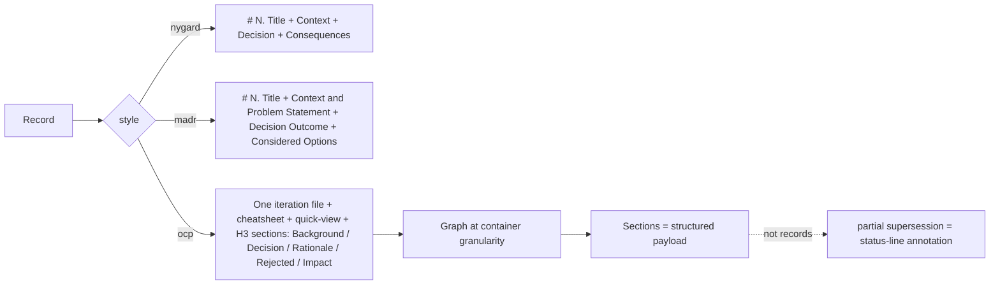
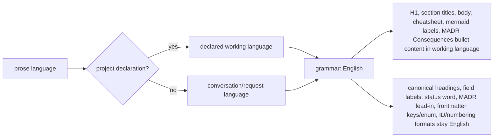

# Iteration 0.40.0 · Multi-style ADL and prose language policy

> Index: [`README.md`](./README.md). Amendment (2026-09-18): `ocp` reframed as container = record, sections = structured payload.

## Cheatsheet

1. Three styles: `nygard` / `madr` industry; `ocp` OCP-native container (ADR-0.40.0#01)
2. `style` declared in frontmatter; adapters handle own template only (ADR-0.40.0#01)
3. Numbering orthogonal to style; containers reserve `<b>.<i>.*` ns (ADR-0.40.0#01)
4. Graph at CONTAINER granularity; sections are payload (ADR-0.40.0#01)
5. `/adr init` ships `standard` / `evolution` / `ocp` / `custom` suites (ADR-0.40.0#01)
6. Grammar fixed to English; prose in the working language (ADR-0.40.0#02)

---

## Quick view

| Aspect | Grammar (English, never translated) | Prose (working language) |
| --- | --- | --- |
| Headings | canonical `## Context` / `## Decision Outcome` / `## Considered Options`; ocp `## Cheatsheet` / `## Quick view` | ocp H3 section titles `### 01. <title>`; H1 title |
| Field labels | `**Status**:` / `**Background**:` / `**Decision**:` / `**Rationale**:` / `**Rejected**:` / `**Impact**:` / `**Future extensions**:` | — |
| Status word | `✅ accepted` / `🟡 proposed` / `🔄 superseded` / `⛔ deprecated` (fixed protocol token, greppable) | — |
| MADR labels | `**Positive**` / `**Negative / Risks**`; lead-in `Chosen option: …, because …` | Consequences bullet content |
| Frontmatter | keys + enum values (`status: accepted`); `style:` | — |
| IDs / numbering | `0001.`, `### 01.`, `ADR-0.2.54#01`; numeric filename prefix; ASCII slug | — |
| Body content | — | background / decision / rationale / rejected reasons / impact content |
| Cheatsheet / Mermaid | Cheatsheet heading | conclusion lines; mermaid node labels |

---

### 01. Multi-style ADL and universal protocol
**Status**: 🟡 proposed

**Background**: The `adr-guard` plugin grew around a single MADR-shaped template with per-directory numbering, path-based references, and hard-coded `feat`/`refactor` gating. The plan at `docs/plan/adr-multistyle-adl-refactor.md` audited that design against industry practice and OCP engineering discipline, and surfaced eight decision points that change how this project (and its users) record architecture decisions: whether to keep a proprietary `ocp` record style alongside industry templates; whether `style` frontmatter is mandatory for new source documents; whether record IDs are globally unique across the whole ADL including dotted iteration IDs; how evolution metadata groups records (baseline/iteration vs. domain/refactor theme); whether a universal protocol layer (immutable accepted semantics, supersession, AI-drafts/human-decides, readability) applies to every style; whether the numbering policy (sequential default | iteration dotted IDs) is orthogonal to style; governance choices (strict enforcement mode and default governance for AI-assisted projects); and whether `/adr init` exposes suites (`standard`/`evolution`/`ocp`/`custom`) instead of bare orthogonal options. No earlier ADR (0001–0006) records ADR-tooling guidance that this decision replaces, so nothing is superseded; this record is additive.

**Decision**:

| # | Point | Content |
| --- | --- | --- |
| 1 | Styles | `nygard` + `madr` are interop templates; `ocp` is the OCP-native container style (OCP grammar) — this refactor's adapters are their own first customer |
| 2 | Container shape | One record per iteration file (`ADR-<baseline>.<iteration>`, stem `0.2.54-slug.md`); each section is an H3 short form `### 01. <title>` (canonical ID `ADR-0.2.54.01` derives from container namespace, never spelled in heading); sections carry 5-part skeleton (background/decision/rationale/rejected/impact) + emoji status line |
| 3 | Namespace | Container reserves the whole `<baseline>.<iteration>.*` sub-ID space at creation; dotted grammar stays collision-free with per-decision records |
| 4 | Graph | Operates at CONTAINER granularity; sections are structured payload, never records; partial supersession = status-line annotation + prose cross-reference (OCP practice) |
| 5 | Restatement | Cheatsheet / quick-view are container body content (authored, prose-wins red line); cross-record views stay generated |
| 6 | `style` frontmatter | Mandatory for new source documents (`nygard` / `madr`); pre-refactor style-less documents remain readable as `legacy`; conversion only via `/adr migrate --to` (explicit, dry-run first) |
| 7 | ID uniqueness | Sequential (`ADR-0001`) and dotted (`ADR-0.2.54.01`) grammars are disjoint; IDs frozen forever — never reused, never renumbered |
| 8 | Evolution grouping | Optional `baseline` / `iteration` metadata on any style; reconstructed by `INDEX.by-iteration.md` + `/adr context --iteration` — never hand-maintained, never a multi-entry container file |
| 9 | Universal protocol | Applies to every style; governance modes (`none` / `review` / `strict`) decide enforcement, never per-style dialect |
| 10 | Numbering | Orthogonal to style; iteration IDs only allocated when `--baseline`/`--iteration` passed — no iteration value invented |
| 11 | Strict governance | Deferred (build only on demand, on normalized records); AI-assisted projects default `review` |
| 12 | Init suites | `standard` / `evolution` / `ocp` / `custom` — persist resolved `adr.*` values + informational `adr.suite` label |

**Rationale**:

- **One adapter interface, one normalized record model** — indexes, trees, history, integrity checks behave identically across styles
- **`ocp` reframed as container = record, sections = structured payload** — audit conflated entry skeleton with file shape; skeleton maps onto MADR, file shape does not; reframed, `ocp` stops violating the record model; graph keeps operating at one-record-per-file; previously fatal "multi-entry container" objection only applied to treating sections as records
- **Strict style isolation** — adapter scaffolds / parses / validates / formats only its own template; nothing leaks between styles; MADR-only sections (Considered Options, Decision Drivers) have no Nygard home and would be dropped by `--to nygard`
- **Namespace reservation keeps ID grammars collision-free** — iteration container reserves `<baseline>.<iteration>.*` at creation; per-decision IDs never minted under occupied iteration
- **Universal protocol layer over per-style dialect** — governance modes decide enforcement; immutable accepted semantics, supersession, AI-drafts/human-decides, readability apply to every style
- **Numbering orthogonal to style** — container `ADR-<baseline>.<iteration>` and sequential `ADR-NNNN` share allocator only when project groups by iteration
- **`evolution` profile as opt-in OCP discipline** — non-empty Considered Options with per-option cons, good/bad Consequences split, Confirmation required for `risk: high` records
- **`/adr init` suites over bare options** — opinionated bundles reduce decision fatigue and pin resolved `adr.*` values once

**Rejected**:

| Option | Reason rejected |
| --- | --- |
| Option A — keep `ocp` template as third style without reframing | Audit conflated skeleton with file shape; reframing makes Option A admissible |
| Option C — one style only (MADR), drop Nygard | Simplest parser surface but locks out teams standardized on Nygard grammar |
| Implicit / undeclared style | Legacy documents parse through MADR adapter and stay `legacy`; conversion is explicit, never silent |
| Per-directory numbering | Rejected globally unique IDs across whole ADL |
| Hand-maintained evolution quick-references | Generated per-iteration views over shared metadata are the single source of truth |
| Style-private governance | Universal protocol layer applies to every style |
| Numbering embedded in styles | Numbering is orthogonal to style |
| Mechanical strict gating now | Deferred; `/adr init` defaults AI-assisted projects to `review` |
| Bare option exposure | Opinionated init suites ship instead |
| Migrate `ocp` via `/adr migrate --to` | Container grammar not reachable by per-file conversion; adopt `ocp` by creating container (`/adr new --style ocp --baseline <b> --iteration <i> <title>`) |

**Impact**:

- **Plugin** — three parsers (one adapter per style) sharing one normalized record model; `legacy` audit (`/adr check --report-style`) keeps documents honest in mixed-style ADLs
- **Migration** — explicit and dry-run first; preserves `created`, `date`, status, all references verbatim; verified to re-parse as target style; MADR-only sections (Considered Options, Decision Drivers) have no Nygard home and would be dropped by `--to nygard`
- **OCP container** — second write shape (`/adr section ADR-<container> <title>` appends a section); namespace reservation allocation must never bypass; sections structured payload, never records
- **Generated indexes** — render each record's style; `/adr history` and `/adr context` traverse relationships across styles
- **Supersession** — cross-style supersession works because references are IDs, not paths; partial supersession of one section stays a status-line annotation + prose cross-reference — never a graph edge
- **`adr-guard` commit gate** — stays narrower; when enabled enforces ADR coverage for `feat` and `refactor` commits; not the iteration classifier; doesn't replace architectural judgment
- **ID grammars** — sequential (`ADR-0001`), per-decision dotted (`ADR-<baseline>.<iteration>.<seq>`), container (`ADR-<baseline>.<iteration>`), container section (`ADR-<container>#NN` via `#` fragment); four disjoint grammars that cannot collide; IDs frozen forever

**Future extensions**: lift `adr-guard` strict gate from `feat`/`refactor` to other commit types when normalized record model is stable; add opt-in `ocp` strict profile requiring per-section `Considered Options`; allow `ocp` containers to declare per-section `Considered Options` block as a fifth skeleton field.

### 02. ADR prose language policy
**Status**: 🟡 proposed

**Background**: The three adr-guard record styles (nygard / madr / ocp) fix their GRAMMAR — canonical headings, field labels, frontmatter keys and enum values — to a single English authority (`LANG_PAREN_RE` in `adr-types.ts`, the adapters' `FIELD_LINE_RE`). This is the foundation of parser stability and cross-repository interoperability, and it is not negotiable. But the constitution (ADR-0.40.0#01) and the protocol layer never specified which language PROSE uses: the current rule is merely "prose is the author's choice". "Any language allowed" is engineering-wise "no rule": scaffold placeholders are English-only, existing sample corpus is English-only, drafting protocol is silent on language. These three biases stack, and LLM-drafted records drift into prose detached from the team's language environment — non-English teams get architecture records their primary readers find awkward. This decision must answer: is prose language a free choice, or a deterministic rule driven by the language environment?

**Decision**:

| # | Point | Content |
| --- | --- | --- |
| 1 | Precedence | Project-level declaration (pinned at init / config) wins; absent one, conversation / request language at drafting time decides |
| 2 | Prose (working language) | H1 title; ocp section titles `### 01. <title>`; all body prose (background / decision / rationale / rejected reasons / impact content); Cheatsheet conclusion lines; Mermaid node labels; MADR Consequences bullet content |
| 3 | Grammar (English) | Canonical section headings; ocp field labels; ocp section status word after emoji (`✅ accepted` / `🟡 proposed` / `🔄 superseded` / `⛔ deprecated` — fixed protocol token echoing frontmatter enum); MADR Consequences labels; MADR lead-in `Chosen option: …, because …`; frontmatter keys + enum values; ID + numbering formats; numeric filename prefix; ASCII slug; ocp scaffold quote + `## Cheatsheet` / `## Quick view` headings |
| 4 | Emoji | Language-neutral status signals; parsing recognizes only the emoji (`✅🟡🔄⛔`); word after is decoration |
| 5 | Rejected separator | ASCII colon (`REASON_SPLIT_RE` does not recognize full-width colons), independent of working language |
| 6 | Three-part landing | Protocol doc (`adr-guard-protocol.md`) absorbs scattered language notes; plugin source stays zero-Chinese (engineering red line); three-style sample library ships as bilingual manual at `docs/workflows/adr-samples/` (EN tree) + `docs/zh/workflows/adr-samples/` (ZH tree) — isomorphic corpora |
| 7 | Effective | For all new records from the moment this record is accepted |

**Rationale**:

- **Readability** — record's primary readers are the team itself; prose in the language the team's environment determines
- **Parser stability** — localizing grammar labels would break `headingLineRe` / `FIELD_LINE_RE` entirely, invalidating all three adapters and the existing corpus
- **Environment determinism** — prose language must be uniquely derivable from environment, never improvised per draft
- **Generation bias** — LLMs draft by strongly imitating scaffold placeholder text and existing examples; unspecified rule lets the bias decide output
- **Sample fidelity** — sample corpus must be derivable from the written rule, otherwise samples lose teaching value
- **One concept, one vocabulary** — emoji + status-word token is fixed protocol token; greppability across language trees preserved only by keeping status word English

**Rejected**:

| Option | Reason rejected |
| --- | --- |
| English-only records | Simplest for parsers and search, but non-English teams pay permanent reading cost — contradicts "primary reader is the team itself" |
| Status quo (prose language unspecified) | Zero change, but English bias persists and output varies with each drafter's improvisation |
| Localize grammar too (translate headings / labels with environment) | Best readability, but exact-match `headingLineRe` breaks entirely; cross-team interoperability goes to zero — directly rejected by ADR-0.40.0#01 §7 strict style isolation |
| Full-width colon separator | `REASON_SPLIT_RE` does not recognize full-width colons; separator is ASCII colon, independent of working language |

**Impact**:

- **Readability** — every team reads records in the language its environment determines; scaffold, protocol, and sample biases all point the same way
- **Parser** — zero change; entire existing corpus and all tests stay valid
- **Plugin source** — stays zero-Chinese (engineering red line); three adapters' scaffold placeholders remain English; guide drafters with English hints (`in the working language`)
- **Protocol** — `adr-guard-protocol.md` absorbs scattered language notes (`styles/ocp.ts` header comment, `LANG_PAREN_RE`, protocol's former "Reading aids vs grammar"); promotes rule into drafting protocol; on conflict this section wins
- **Sample library** — three-style sample library ships as bilingual manual; EN tree + ZH tree; isomorphic corpora demonstrating same grammar rendering prose under different language environments
- **Multilingual repos** — must pin working language at init, otherwise prose language fluctuates with drafting session within one ADL
- **Interop** — keeping English `Chosen option` lead-in is an interoperability compromise (parsers don't hard-validate the line, but preserves fidelity to upstream MADR template)
- **Search** — full-text search must mind the language split between prose and labels
- **Adoption** — this record itself drafted in English prose even though drafting conversation ran in Chinese; this ADL's project-level working language is English (records 0001–0007); project declaration takes precedence over conversation language — the precedence rule established above

**Future extensions**: when multilingual repos need per-section language overrides, extend working-language derivation to accept section-level annotation that still inherits grammar from project declaration; keep ASCII colon rejected-option separator regardless.