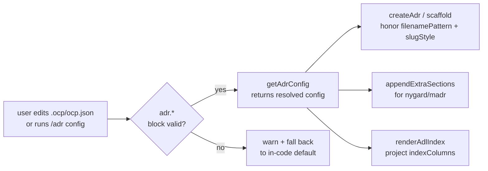

# Iteration 0.40.1 · Project-level ADR overrides

> Index: [`README.md`](./README.md). Supersedes / amends: —.
>
> Cheatsheet & quick view are restatement layers: diagrams/tables restate the
> section prose and never add facts — on conflict the prose wins.
> Amend/supersede relations are declared in each section's status line;
> accepted semantics never move one character.

## Cheatsheet

1. `/adr config` covers all 8 `adr.*` keys; arrays persist as JSON (ADR-0.40.1#02)
2. Corrupt `.ocp/ocp.json` renders the last-good config table (ADR-0.40.1#04)
3. Protocol body is an L2 skill — loaded on ADR intent only (ADR-0.40.1#03)
4. OCP containers opt out of `extraSections` — extend via `/adr section` (ADR-0.40.1#01)
5. Per-turn system prompt cost ~5200 → ~254 tokens (-95%) (ADR-0.40.1#03)
6. Four override keys are opt-in; defaults stay byte-identical (ADR-0.40.1#01)

---

## Quick view

<!-- Draw only when there is structure. mermaid `flowchart LR` preferred (horizontal flow reads better than vertical chains). Tables for: >=2 candidates x >=3 dimensions, old->new mapping, enum semantics, decision lists, rejected-option lists. <=2 figures per section; the restate layer fills the rest by table. -->

| Aspect | Before (0.40.0) | After (0.40.1) |
| --- | --- | --- |
| Filename pattern | hard-coded `${id}-${slug}.md` | configurable `adr.filenamePattern` |
| Slug style | kebab-only | `adr.slugStyle`: kebab \| snake \| lower |
| Extra H2 sections | none (style adapters only) | `adr.extraSections` (nygard/madr only) |
| INDEX.md columns | fixed 8-column shape | `adr.indexColumns` projection |
| System prompt per turn | ~5200 tokens (full protocol body) | ~254 tokens (hint + config table) |

---

<!-- Sections: /adr section ADR-0.40.1 "<title>" appends the next one.
     H3 short form "### NN. <title>" — the canonical ID derives from the
     container namespace and is never spelled out in the heading.
     Drafter (ADR-0.40.0#02): fill ALL prose — cheatsheet, section titles,
     field bodies, status decoration words — in the working language
     derived from the language environment; the Cheatsheet is the
     reader's primary entry (pure conclusions). Field labels stay English.

     Output protocol (see docs/adr/README.md OCP output protocol section):
     - Cheatsheet: <=6 numbered items, each <=60 chars, ADR ref suffix
     - Background: <=3 sentences — situation + pain, no solution detail
     - Decision: TABLE form `| # | Point | Content |` — no prose dump
     - Rationale: >=2 bullets, bold-keyword led (e.g. "**Why X**: ...")
     - Rejected: TABLE form `| Option | Reason rejected |` — no prose dump
     - Impact: bullets grouped by layer (Plugins / Runtime / Dispatcher / Installer / Tests / Docs)
     - Paragraphs <=4 lines; one sentence = one idea; no nested dashes
     - mermaid `flowchart LR`; <=2 figures per section; restate layer fills the rest by table -->

### 01. Project-level overrides — fields, defaults, semantics

**Status**: 🟢 Accepted
**Background**: ADR-0.40.0 closed the multi-style ADL grammar (nygard / madr / ocp) and pinned the filename template `${id}-${slug}.md` plus kebab slugify as the canonical behavior. Downstream projects repeatedly asked for project-local control — the next package team wants `ADR-{id}-{slug}.md` with snake_case slugs; another wants `## Risks` and `## Notes` appended to every scaffolded MADR. Pre-Phase-7 these were hard-coded across three adapters and the engine, with no documented extension point.

**Decision**:

| # | Point | Content |
| --- | --- | --- |
| 1 | Schema addition | Extend the existing `adr.*` block in `.ocp/ocp.json` with four new OPT-IN keys; no new top-level field, no new file. |
| 2 | `adr.filenamePattern` | String template. Required `{id}` placeholder; optional `{slug}`. Whitespace collapsed; stray placeholders stripped with a one-shot warning. Default `{id}-{slug}` (pre-Phase-7 behavior). |
| 3 | `adr.slugStyle` | Enum: `kebab` (default) / `snake` / `lower`. Drives the shared `slugify(title, style)` used by `createAdr` and `createAdrContainer`. |
| 4 | `adr.extraSections` | Array of H2 heading lines (`## Risks` etc). Appended to nygard/madr scaffolds after the style's last canonical section; OCP containers deliberately opt out (see ADR-0.40.1#01). Empty array = no-op. |
| 5 | `adr.indexColumns` | Array drawn from the 8 canonical columns (`id`, `title`, `style`, `layer`, `status`, `domain`, `iteration`, `created`). Reorders/narrows the INDEX.md table; missing-column cells render empty. Default = the full 8-column shape (pre-Phase-7 byte-identical). |
| 6 | Invalid value behavior | One-shot console warning + silent fall back to the in-code default. Never throws — mirrors the `governance` warning convention from ADR-0.40.0. |
| 7 | Backward compat | Every default reproduces pre-Phase-7 output exactly (verified by `test-adr-project-overrides-unit.ts: test12_BackwardCompat_NoOverrides`). Existing projects regenerate byte-identical INDEX.md and write `NNNN-slug.md` filenames without any config change. |

**Rationale**:

- **Why in `adr.*`, not a new file**: The contract is documented in ADR-0.35.0 — one path per artifact, all per-project switches live in `.ocp/ocp.json`. Adding `.adr/config.yaml` would create a second source of truth that drifts.
- **Why opt-in, not opt-out**: Every default reproduces pre-Phase-7 behavior. A project that ignores the new keys sees no change; the surface area is purely additive.
- **Why four keys, not one mega-config**: Each key maps to one engine surface (naming, slug, body, view). Splitting lets a project override one without inheriting opinions about the others.
- **Why OCP opts out of `extraSections`**: ADR-0.40.0 §7 amendment pinned the OCP container's grammar — Cheatsheet, Quick view, then per-section H3 blocks. An H2 injection would either be ignored or break `validate()`'s structural check. The right way to add sections to a container is `/adr section ADR-x.y.z "<title>"`.

**Rejected**:

| Option | Reason rejected |
| --- | --- |
| Per-style plugin (new `styles/<team>-madr.ts` for each downstream) | Forces every project to ship TS code; bypasses the JSON config contract; collides with the §7 "no style cross-talk" rule. |
| `.adr/config.yaml` sidecar | Second source of truth — drifts from `.ocp/ocp.json`; ADR-0.35.0 explicitly retired the `.jsonc` legacy path to enforce strict JSON. |
| ENV vars (`ADR_FILENAME_PATTERN`, …) | Not project-local; can't diff across projects; breaks the `git commit -m "docs: bump ADR filename pattern"` audit trail. |
| Apply `extraSections` to OCP containers too | Breaks the container grammar validator (`validate()` flags unknown H2 sections); OCP's section grammar IS the extension point. |
| New top-level `.ocp/ocp.json` fields (`adrFilenamePattern`, …) | Re-introduces the legacy flat-key pattern ADR-0.35.0 §6.4 deprecated; the nested `adr.*` block is the future home. |

**Impact**:

- **Plugins**: `adr-guard-config.ts` gains 4 normalizers + `setAdrOverrideField` / `clearAdrOverrideField` helpers; `adr-engine.ts` exports `slugify(title, style)` and `renderAdrFilename(pattern, id, slug)` + `appendExtraSections`; `adr-views.ts` accepts an `IndexColumn[]` projection. No plugin manifest change — all wiring is via `getAdrConfig()`.
- **Runtime**: `system.transform` injection reads `getAdrConfig()` at every request, so a project that edits `.ocp/ocp.json` mid-session sees the new behavior on the next ADR scaffold. INDEX.md regeneration picks up the new columns on the next write.
- **Dispatcher**: One new command family — `/adr config [key] [value]` and `/adr config reset <key>` — handled in `handleAdrConfigCommand` alongside `/adr layout`, `/adr init`, `/adr migrate`. No dispatcher change.
- **Installer**: None — schema additions live in `.ocp/ocp.json`, not in `install/options.jsonc` (which is install-time only).
- **Tests**: One new test file `test-adr-project-overrides-unit.ts` (90 cases) covers schema validation, defaults, set/clear round-trip, byte-identical backward-compat, end-to-end `createAdr` honoring the config, and INDEX column projection. All 95 pre-existing ADR tests pass unchanged.
- **Docs**: This ADR (0.40.1) is the canonical record. `commands/adr-guard-config` (no separate command file — registered programmatically like `/adr-guard`) prints the current resolved config via `guard.adr.configList`.

**Future extensions**:

- A `--strict` mode for `extraSections` that fails `validate()` when an H2 is empty after a configurable grace period — useful for projects that want to enforce the section is filled.
- `adr.frontmatterExtras` — extra frontmatter fields appended on every scaffold (mirrors `extraSections` for the YAML block).
- `adr.dateFormat` — override `YYYY-MM-DD` if a downstream project insists on ISO-week or epoch-based timestamps.

### 02. `/adr config` — one command for all eight keys

**Status**: 🟡 Proposed
**Background**: Phase 7.0 shipped `/adr config` for the four Phase-7 override keys only — `/adr config style madr` was rejected because suite fields were not override keys. Projects had to hand-edit `.ocp/ocp.json` or re-run `/adr init` to change a single suite field. Array-valued overrides also serialized as quoted strings instead of JSON arrays — a double-encoding bug.

**Decision**:

| # | Point | Content |
| --- | --- | --- |
| 1 | Type rename + expansion | `AdrOverrideKey` → `AdrConfigKey`; 4 → 8 keys, adding the suite fields `style` / `numbering` / `layout` / `governance`. |
| 2 | Unified write path | `setAdrConfigKey` validates via the field's own normalizer, then persists through `upsertAdrBlock` — `/adr init`'s comment-preserving surgery. |
| 3 | Unified clear path | `clearAdrConfigKey` removes the key from the nested block; absent key = in-code default, overrides and suite fields alike. |
| 4 | Array serialization | `extraSections` / `indexColumns` persist as JSON array literals — ends the `"[\"## Risks\"]"` double-encoding bug. |
| 5 | Bare listing | `/adr config` with no args renders all 8 keys, each tagged `config` (set in the block) or `default` (fallback). |

**Rationale**:

- **One write path**: suite fields and overrides share the nested `adr.*` block, so they share one comment-preserving upsert; two writers would drift.
- **Normalizer reuse**: `/adr init` and `/adr config` now accept identical values per field — one validator each, no second opinion to maintain.
- **JSON literals, not strings**: a double-encoded array fails its normalizer on the next read — the write "succeeds" and the value silently vanishes into the default.
- **Informed reset**: the `config` / `default` source tags show which values a project actually set, so a `reset` decision is informed, not blind.

**Rejected**:

| Option | Reason rejected |
| --- | --- |
| Keep the 4-key scope (status quo) | Suite fields force a hand edit of `.ocp/ocp.json` or a full `/adr init` re-run for a one-key change. |
| Top-level keys for suite fields | Revives the flat-key layout ADR-0.35.0 §6.4 deprecated; the nested `adr.*` block is the single home. |
| Generic JSON writer without per-field validation | An invalid `style` would persist and only degrade at read time with a warning; validation belongs at the write gate. |

**Impact**:

- **Plugins**: `adr-guard-config.ts` — `AdrConfigKey` (8 keys), `setAdrConfigKey` / `clearAdrConfigKey` / `parseAdrConfigKeyValue`; the Phase-7 `setAdrOverrideField` / `clearAdrOverrideField` helpers are gone.
- **Runtime**: none — `getAdrConfig()` already read all 8 block keys; this is a write-path fix only.
- **Dispatcher**: `/adr config <key> <value>` accepts all 8 keys; bare `/adr config` renders the source-tagged table; unknown keys still reject with usage.
- **Tests**: `test-adr-project-overrides-unit.ts` — suite-field round-trips and array-serialization assertions.
- **Docs**: cheatsheet item 1 re-anchored here.

### 03. Protocol skill-ization — two fragments replace the body

**Status**: 🟡 Proposed
**Background**: The ADR protocol body (`adr-guard-protocol.md`, ~5008 tokens) rode `experimental.chat.system.transform` into the system prompt on every chat turn. The system prompt opens every provider request, so its bytes gate the prefix cache for the whole conversation. Roughly 90% of turns never touch ADR work, yet each one paid the full body.

**Decision**:

| # | Point | Content |
| --- | --- | --- |
| 1 | Body → L2 skill | The protocol body moves to `skills/adr-protocol/SKILL.md`; its frontmatter description carries the trigger words and the LLM loads it via `read_file` on ADR intent. |
| 2 | `[ADR-GUARD]` hint | ~67 tokens measured — ADR directory, command entry points, skill pointer. Byte-stable for the whole session. |
| 3 | `[ADR-CONFIG-RUNTIME]` table | ~187 tokens — all 8 `adr.*` keys + `adrDir`; deterministically re-rendered from `.ocp/ocp.json` every turn. |
| 4 | `adrGuard` scope | No longer toggles prompt content — controls only the `tool.execute.before` commit guard; the hint always advertises the switch. |
| 5 | Deterministic load trigger | `/adr new` / `/adr supersede` receipts embed "read `skills/adr-protocol/SKILL.md` BEFORE drafting". |
| 6 | Strip hygiene | Each fragment owns a marker span; `stripAllMarkers` cuts marker → next marker, byte-restoring the prompt. |

**Rationale**:

- **Provider prefix cache**: the system prompt sits at the head of every request; any byte change re-bills everything after it, conversation history included. Byte-frozen fragments keep the prefix stable.
- **Disclosure-layer fit**: a ~5 KB workflow guide is on-demand L2 content, not iron law every step must pay for — OCP's injection matrix routes workflow through skills.
- **Measured win**: ~5200 → ~254 tokens per turn (-95%) — the only per-turn ADR cost left in ordinary sessions.
- **Deterministic beats heuristic**: embedding the read instruction in the command receipt fires the skill load exactly when drafting starts; discovery alone depends on the model noticing.

**Rejected**:

| Option | Reason rejected |
| --- | --- |
| Keep injecting a shorter body | Any body size is paid on 100% of turns — it still taxes the ~90% that never draft ADRs. |
| Summarize the protocol into the system prompt | A summary is a second protocol source of truth; it drifts from the skill and the records. |
| Toggle the body by `adrGuard` state | Flipping the switch mutates the prompt prefix and re-bills the whole conversation; scope it to the tool guard instead. |
| Inject on detected ADR intent only | Hook-level intent detection is heuristic — a miss drops the protocol, a hit breaks the byte-stable prefix. |

**Impact**:

- **Plugins**: `adr-guard-protocol.md` deleted; `adr-guard-instructions.ts` builds the two fragments; `adr-guard-system-inject.ts` injects two independent marker spans.
- **Runtime**: per-turn cost ~5200 → ~254 tokens (-95%); an unchanged config renders byte-identical fragments (prefix-cache safe).
- **Dispatcher**: `/adr new` / `/adr supersede` receipts gain the deterministic skill-read line.
- **Tests**: fragment and strip tests in `test-adr-guard-unit.ts` re-target the two-marker contract.
- **Docs**: skill description documents the on-demand contract (Phase 7.8).
- **Skills**: new `skills/adr-protocol/SKILL.md` (347 lines) — frontmatter triggers + full protocol body.

### 04. Config table last-good fallback — corrupt-file guard

**Status**: 🟡 Proposed
**Background**: `readProjectConfig()` returns null both when `.ocp/ocp.json` is absent and when it exists but fails to parse — two states readers cannot tell apart. A hand-edit typo therefore flipped the `[ADR-CONFIG-RUNTIME]` table silently back to protocol defaults: a table asserting values the project never set.

**Decision**:

| # | Point | Content |
| --- | --- | --- |
| 1 | Corruption detection | `isProjectConfigCorrupt()` mirrors `parseConfigFile` semantics — exists but `JSON.parse(stripJsonc(...))` throws = corrupt; absent file ≠ corrupt (defaults are legitimately correct there). |
| 2 | Last-good memo | `getAdrConfigRuntimeFragment()` memoizes the last parse-success render and serves it while the file stays corrupt — stale but truthful. |
| 3 | No corrupt memoization | Renders produced in the corrupt state are never memoized; the first good read replaces the memo. |
| 4 | Cold-start corrupt | No memo yet (process started against a corrupt file) → render from defaults gracefully, still without memoizing. |

**Rationale**:

- **Truthful beats fresh**: the table is policy the agent obeys; serving defaults during corruption claims values the user never wrote — worse than yesterday's truth.
- **Mirror the reader**: detection runs the same parse the config reader runs, so "corrupt" means exactly "the reader returned null despite an existing file".
- **Self-healing**: memoizing only parse-success renders means a fixed file heals the next turn — no restart, no invalidation hook.

**Rejected**:

| Option | Reason rejected |
| --- | --- |
| Distinguish the nulls in `readProjectConfig()` | Changes the shared reader's contract for every consumer; the side-check scopes the fix to the lying surface. |
| Refuse to render while corrupt | The fragment builder must never break a chat request over config; degrade-don't-throw is the plugin convention. |
| Render defaults plus a warning | The warning scrolls away; the table itself still shows values the project never set. |

**Impact**:

- **Plugins**: `adr-guard-instructions.ts` — `isProjectConfigCorrupt()`, the `lastGoodFragment` memo, `resetAdrLastGoodFragment()` test hook.
- **Runtime**: a corrupt `.ocp/ocp.json` renders the last-good table; fixing the file heals the next turn without restart.
- **Tests**: corruption round-trips — corrupt serves the memo, heal re-renders fresh, cold-start corrupt degrades gracefully.
- **Docs**: cheatsheet item 2 anchors here.
