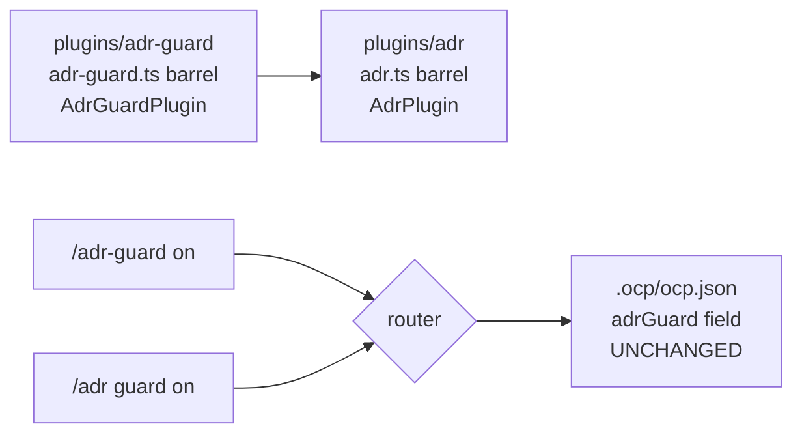

# Iteration 0.40.2 · Rename adr-guard plugin to adr

> Index: [`README.md`](./README.md).

## Cheatsheet

1. Plugin is a full ADR workbench; the commit gate is one submodule — name it `adr`, not `adr-guard` (ADR-0.40.2#01)
2. `plugins/adr-guard/` → `plugins/adr/`; barrel `adr.ts`; export `AdrPlugin` (ADR-0.40.2#01)
3. `/adr guard on|off|reset|status` is the switch; `/adr-guard` stays a first-class alias (ADR-0.40.2#01)
4. `adrGuard` config field + i18n keys + wizard schema UNCHANGED — zero state migration (ADR-0.40.2#01)
5. Filenames follow one rule: `adr-<role>.ts` for everything under `plugins/adr/` — misnomers and injection layer lose the `guard` prefix, and the gate itself is `adr-tool-guard.ts`; the guard's identity lives in `/adr guard`, the `[ADR-GUARD]` block message, and the docs, not in filenames (ADR-0.40.2#01, amended 2026-09-19)
6. History untouched: `install/versions/*`, `docs/adr/0.x*`, `adr-upgrade-guide` (ADR-0.40.2#01)

---

## Quick view

| Surface | Old | New |
| --- | --- | --- |
| Plugin dir | `plugins/adr-guard/` | `plugins/adr/` |
| Barrel / entry | `plugins/adr-guard.ts` / `adr-guard.ts` | `plugins/adr.ts` / `adr/adr.ts` |
| Export | `AdrGuardPlugin` | `AdrPlugin` |
| Misnomer files | `adr-guard-command/-config/-runtime.ts` | `adr-command.ts` / `adr-config.ts` / `adr-runtime.ts` |
| Gate file | `adr-guard-tool-guard.ts` | `adr-tool-guard.ts` (injection layer: `adr-instructions/-system-inject/-announce.ts`) |
| Switch command | `/adr-guard <state>` | `/adr guard <state>` (+ alias) |
| Config field | `adrGuard` | unchanged |
| Sidebar badge | `adr-guard` | `adr` |

---

### 01. Rename the adr-guard plugin to adr
**Status**: ✅ accepted

**Background**: The plugin started as the iron-law commit gate but grew into the project's full ADR lifecycle workbench. Measured split at rename time: guard-specific hooks (`tool-guard`, `system-inject`, `instructions`, `announce`) are ~15% of the directory's code; `adr-engine.ts` (47.6K), `adr-views.ts` (28.7K), `adr-migration.ts` (22.6K), `adr-evolution.ts` + `adr-governance.ts` (~27K) and the multi-style ADL adapters (Nygard / MADR / OCP) are pure workbench with no enforcement role. The command surface tells the same story: `/adr` routes 13+ subcommands while the switch is one state. "guard" as the plugin identity therefore misnames ~85% of the code and misleads newcomers about what the plugin does. Additional code facts bound the rename: the plugin id derives from the root barrel filename (`plugins/*.ts`); `plugin-scope.json` has no `adr-guard` entry (it inherits the blanket deny — renaming keeps that posture); the wizard / sidebar / i18n chain is anchored to the `adrGuard` config field name; sibling plugins already use short noun ids (`sdd`, `tgrep`, `tui`); `tests/test-all.ps1` still asserted a `adr-guard-protocol.md` that no longer exists (protocol moved to `skills/adr-protocol/SKILL.md` in the Phase 7.8 skill split) — 5 pre-existing structural FAILs.

**Decision**:

| # | Point | Content |
| --- | --- | --- |
| 1 | Identity | `plugins/adr-guard/` → `plugins/adr/`; barrel `adr-guard.ts` → `adr.ts`; entry `adr-guard/adr-guard.ts` → `adr/adr.ts`; export `AdrGuardPlugin` → `AdrPlugin` |
| 2 | Misnomer files | `adr-guard-command.ts` → `adr-command.ts` (routes all of `/adr`), `adr-guard-config.ts` → `adr-config.ts` (90% ADR config), `adr-guard-runtime.ts` → `adr-runtime.ts` (shared by env-guard/e2e-guard) |
| 3 | Filenames by role | Every file follows `adr-<role>.ts`: misnomers → `adr-command/-config/-runtime.ts`; injection layer → `adr-instructions/-system-inject/-announce.ts`; gate → `adr-tool-guard.ts` (amended 2026-09-19: initially kept as `adr-guard-tool-guard.ts`, renamed for the uniform rule — the guard's identity is carried by `/adr guard`, the `[ADR-GUARD]` block message, and the docs, not by filenames) |
| 4 | Command surface | New `/adr guard on\|off\|reset\|status` subcommand routed through the shared `handleGuardCommand`; `/adr-guard <state>` retained as a first-class alias (same `COMMAND_NAME` registration, description marked "Alias of /adr guard"); help + toasts advertise `/adr guard` |
| 5 | Config compat | `adrGuard` field, `LEGACY_ADR_KEYS` handling, i18n keys (`project.switchAdrGuard`, …), wizard schema `project-guards.json` all unchanged — no state migration, no breaking change |
| 6 | User-visible strings | Sidebar badge `adr-guard` → `adr`; toast/warning prefixes `[adr-guard]` → `[adr]`; log service name `adr` |
| 7 | Scope id | `scoped(..., "adr", client)` in `adr-system-inject.ts` — behavior-neutral: `plugin-scope.json` has no entry for either name, both inherit the blanket deny |
| 8 | History untouched | `install/versions/*.manifest.txt` + notes, `docs/adr/0.x*` records (EN+zh), `docs/workflows/adr-upgrade-guide.md` (point-in-time upgrade record) are immutable; living docs (EN + zh mirrors), skills, `tests/README.md` updated |
| 9 | Stale checks fixed | `tests/test-all.ps1` protocol assertions repointed from the nonexistent `adr-guard-protocol.md` to `skills/adr-protocol/SKILL.md`; file inventory lists the new paths |
| 10 | Tests | All import paths + symbol updated; new section 05b pins `/adr guard` routing, alias parity, status/reset, and no-fall-through-to-`new` |

**Rationale**:

- **Name honesty** — the id should name the workbench, with the guard visible as the submodule it is; `adr` is also the primary command users already type
- **Convention alignment** — `sdd/`, `tgrep/`, `tui/` set the short-noun precedent; `adr/` matches, and `adr-guard-*` filenames inside keep the submodule self-describing
- **One command namespace** — folding the switch into `/adr guard` removes the second top-level command while the alias preserves every existing habit and script
- **Zero-drama compat** — the risky renames (config field, scope semantics) are explicitly rejected; the alias and field stability make the change non-breaking for installed projects
- **Minimal diff discipline** — 3 file renames fix real misnomers; the 4 accurate guard filenames stay, avoiding churn without adding clarity

**Rejected**:

| Option | Reason rejected |
| --- | --- |
| `adr-suite` / `adr-workbench` | Adds a qualifier without adding meaning; `adr` alone matches sibling convention and the primary `/adr` surface |
| Rename `adrGuard` field to `adr`/`guard` | Breaks existing project `.ocp/ocp.json` state, wizard/i18n/schema chain for zero functional gain; the field describes the guard switch specifically |
| Keep `adr-guard` + docs clarification | Leaves the misleading id in every path, manifest, and UI surface forever; docs cannot fix an identity problem |
| Drop the `/adr-guard` alias | Breaks muscle memory and user scripts for a cosmetic gain; the alias costs one registration block |
| Also rename `adr-guard-*` guard files to `guard-*` | Pure churn inside an `adr/` directory; current names already say "this is the guard part" |

**Impact**:

- **Runtime** — plugin id `adr`; `/adr guard` + `/adr-guard` alias both live; scope deny posture unchanged; `adrGuard` field reads/writes identically
- **Tests** — 15 suites (~1200 assertions) green after path/symbol updates; +12 new routing/alias assertions (section 05b); `test-adr-project-overrides-unit` hint assertion updated to the new advertised command; `test-all.ps1` structural FAIL count 5 → 0
- **Docs** — living EN+zh mirrors (`plugins.md`, `commands.md`, `sdd.md`, `getting-started`, `DEVELOPING.md`, `adr/README.md`, `git-commits.md`) and `skills/adr-protocol` + `skills/sdd-workflow` updated; historical records untouched
- **Release** — next version manifest regenerates from the tree (`bun run manifest:generate`; no hardcoded adr-guard refs in installer/generator); release notes should mention the new command and alias for installed-base clarity
- **Known leftover** — `install/versions/*` and historical ADRs still contain `adr-guard` by design; the deprecation horizon for the `/adr-guard` alias follows the existing legacy-key policy (remove no earlier than v1.0)

**Future extensions**: retire `/adr-guard` alias after the v1.0 legacy-key cleanup; consider surfacing `guard` in `/adr` tab-completion hints once the alias is retired.
