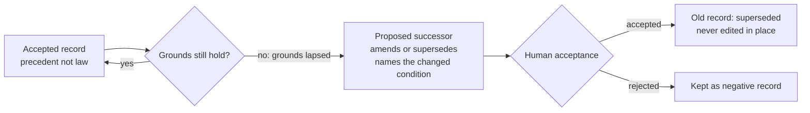

# Iteration 0.40.3 · Appealability of accepted decisions

> Index: [`README.md`](./README.md).

## Cheatsheet

1. Accepted records are precedent, not law — grounds can lapse (ADR-0.40.3#01)
2. Challenge grounds: new facts, changed constraints, flawed rationale (ADR-0.40.3#01)
3. Never edit in place — a challenge lands as a proposed successor (ADR-0.40.3#01)
4. A challenge must name the concrete changed condition (ADR-0.40.3#01)
5. "I prefer otherwise" is not a reason — that is the churn guard (ADR-0.40.3#01)
6. Acceptance stays human; agents draft and interrogate only (ADR-0.40.3#01)

---

## Quick view

| Aspect | Immutability (existing) | Appealability (new) |
| --- | --- | --- |
| Question | HOW may a record change | WHEN may it be challenged |
| Rule | never edit in place; successor required | grounds lapsed → challenge allowed |
| Channel | amend/supersede via a new record | same channel — a proposed successor |
| Gate | human acceptance | human acceptance |

---

### 01. Add the appealability principle to the drafting protocol
**Status**: ✅ accepted

**Background**: The suite ships to external teams, so the agent-facing protocol is the product — adopting teams cannot recalibrate prompts per team. The mechanism layer for changing decisions is complete: `/adr supersede`, amend/supersede status-line semantics, and the Frontmatter semantics rule "a changed decision MUST be an explicitly accepted successor" (`skills/adr-protocol/SKILL.md`). The permission layer is absent: no agent-facing text says an accepted decision may be challenged. The failure is observable: in one drafting session the agent treated ADR-0.40.0#02's Rejected table as unappealable authority and cited it to shut down re-analysis; the user had to push back twice before receiving fresh first-principles reasoning. LLM drafters imitate the prompt layer, so this under-challenging behavior ships to every adopting team. The inverse risk is equally real: a loose "any reason overturns" permission invites decision churn — re-litigating settled records and flooding the INDEX with supersede noise.

**Decision**:

| # | Point | Content |
| --- | --- | --- |
| 1 | Principle | An accepted record is precedent, not law. Any decision may be challenged when the grounds it stood on no longer hold |
| 2 | Grounds | New facts, changed constraints, or a flaw in the original rationale. "I prefer otherwise" is not a reason; "the condition the decision assumed has changed" is |
| 3 | Channel | A challenge never edits the old record in place: it lands as a proposed successor (new record or section) that amends or supersedes, and must name the concrete changed condition |
| 4 | Human gate | Acceptance stays human; agents draft and interrogate only — the existing "Agents draft and interrogate; humans decide and own" stance is unchanged |
| 5 | Landing | One Appealability bullet in `skills/adr-protocol/SKILL.md` Frontmatter semantics, directly after the immutability line — the skill ships to adopting teams; `docs/**` is dev-only and never ships |
| 6 | Not a config axis | `adr.governance` (none/review/strict) measures acceptance enforcement — orthogonal to challenge permission. Churn protection lives in the wording, not a switch |
| 7 | Immutability relation | Complementary, not conflicting: immutability fixes HOW a record may change (never in place), appealability fixes WHEN it may be challenged (grounds may lapse). "Accepted semantics never move one character" still holds |

**Rationale**:

- **Default is the product** — a published suite cannot tune its prompts per adopting team; whatever the protocol says by default is what every team gets
- **Empirical failure** — the under-challenge behavior is not hypothetical; it was observed in this ADL's own drafting session and cost two explicit user pushbacks
- **Churn guard in wording** — the concrete-condition burden plus the proposed-successor channel keeps re-litigation explicit, documented, and rare
- **Ships where agents read** — `skills/*/SKILL.md` is injected into agent system prompts; a README-only rule would reach zero external teams
- **Extends, never amends** — no prior decision is overturned by this record; ADR-0.40.0#02's rejected options stand unless separately challenged on their own grounds

**Rejected**:

| Option | Reason rejected |
| --- | --- |
| Config-gated appealability (new `adr.governance` axis) | Orthogonal axis is YAGNI; a switch invites teams to disable the permission layer entirely, recreating the under-challenge default |
| Loose wording ("any reason overturns") | Invites decision churn from imitative LLM drafters; supersede noise degrades the INDEX as a navigation aid |
| Land only in `docs/adr/README.md` | `docs/**` is dev-only per the ships manifest; the rule would ship to zero adopting teams |
| Land in scaffold comments (`styles/ocp.ts`) | The scaffold already carries the output protocol; it teaches record shape, not governance posture |
| Silent skill/README edit without a record | Violates the suite's own governance: a semantic protocol change is a new record, not a hand edit |

**Impact**:

- **Skills** — one Appealability bullet in `skills/adr-protocol/SKILL.md` (~60 tokens against the ~5 KB skill budget); no other shipped file changes
- **Docs** — this record plus the zh reading-tree mirror; `docs/adr/README.md` may cross-reference the skill rule in its governance section (dev-only)
- **Adopting teams** — agents gain an explicit, bounded license to challenge decisions with concrete grounds; compliance-minded teams gain documented change justification, which audits want
- **Governance** — zero parser, config, or corpus change; `/adr supersede` remains the only channel; existing records untouched
- **Known leftover** — shipped scaffold comments reference `docs/adr/README.md`, which does not ship (dangling references for adopting teams); pre-existing gap, separate fix

**Future extensions**: if a team's compliance regime needs law-like immutable records, a future governance axis could pin individual records; appealability stays the default until such a need is concrete.
