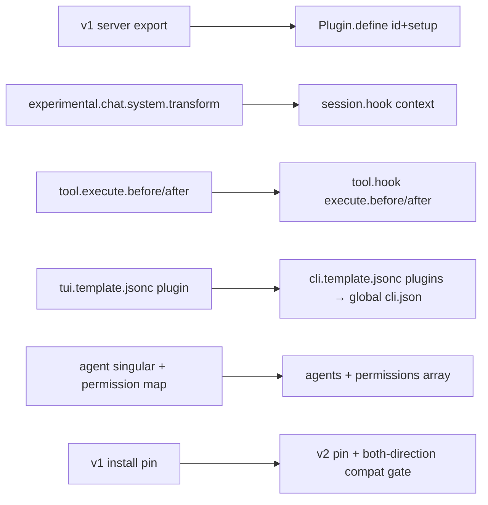

# Iteration 2.0.0 · Adapt OpenCode Prime to the OpenCode v2 runtime

> Index: [`README.md`](./README.md). Supersedes / amends: amends ADR-0.41.0#05
> (the opencode v1 install pin is retired by this iteration; the major-version
> lock itself stays).
>
> Cheatsheet & quick view are restatement layers: diagrams/tables restate the
> section prose and never add facts — on conflict the prose wins.

## Cheatsheet

1. Native `Plugin.define({id, setup})` only — the v1 `server()` export is gone (ADR-2.0.0#01)
2. v1-config auto-normalize used only to absorb user files, never as OCP's target (ADR-2.0.0#01)
3. `agents` + ordered `permissions[]` + `providers{package,settings}` + `mcp.servers` ship (ADR-2.0.0#01)
4. TUI config: layered `tui.json(c)` → one global `cli.json`; slot/keymap API (ADR-2.0.0#01)
5. v2 has no per-agent hook scoping — `agent-scope.ts` restores the gate (ADR-2.0.0#01)
6. Every accepted degradation is a `OCP-V2-GAP` marker in code, not folklore (ADR-2.0.0#01)

---

## Quick view

| v1 surface | v2 replacement (shipped) | Notes |
|---|---|---|
| `server()` export, string-keyed hook map | `Plugin.define({id, setup})`, domain hooks + transforms | `@opencode/plugin@^2.0.15`; registrations return disposables, cleanup returned from `setup` |
| `chat.params` / `experimental.chat.system.transform` | `ctx.session.hook("context")` on `SystemPart[]` | hook carries `agent` + `model` — the scope channels |
| `tool.execute.before` / `after` | `ctx.tool.hook("execute.before" / "execute.after")` | one mutable event; `execute.after` re-hosts question authorization |
| tool/command registration via `tool:` + `config` hooks | `ctx.tool.transform` / `ctx.command.transform` | commands are registered, not intercepted |
| `file.edited` event | `ctx.event.subscribe` → `filesystem.changed` | `unlink` filtered |
| v1 `tui.json(c)` layers, `display_thinking` | one global `cli.json`, `session.thinking`, `plugins` list | legacy v1 plugin list migrated on upgrade |
| root `small_model` | `agents.title.model` | runtime `normalize.ts` migrates the legacy key |

---

### 01. Go native-v2: native plugin API and V2-native config keys, no v1 shim
**Status**: ✅ accepted

**Background**: OpenCode v2 (runtime 2.0.x) replaced the plugin contract, the
config schema and the TUI client surface; OCP 0.x pinned the v1 major and
would silently break on a v2 runtime. The branch `dev-v2-copy2` resets the
suite to version 2.0.0 with one mandate: run natively on v2, keep v1 users
unharmed.

**Decision**:

| # | Point | Content |
| --- | --- | --- |
| 1 | Plugin API | Every entry is `Plugin.define({ id, setup })` from `@opencode/plugin@^2.0.15`; behavior registers through domain hooks and synchronous transforms; no v1 `server()` export ships |
| 2 | Config contract | `opencode.template.jsonc` uses V2-native keys (`agents`, ordered `permissions[]`, `providers{package,settings}`, `plugins`, `mcp.servers`); the runtime's v1 normalize is used only to absorb preserved user configs, never as OCP's authored surface |
| 3 | TUI contract | `tui.template.jsonc` → `cli.template.jsonc`, merged into the ONE global `~/.config/opencode/cli.json`; six TUI plugins ported to the `@opencode/plugin/tui` slot/keymap API under `plugins/tui/`; a legacy v1 `tui.jsonc` plugin list migrates on upgrade |
| 4 | Scope + authorization | `plugins/shared/agent-scope.ts` restores per-agent gating on `event.agent` → system sentinel → `parentID`; question authorization re-implemented on `ctx.tool.hook("execute.after")` |
| 5 | Installer | v1 major-pin retired; `@script:opencode` resolves the newest v2 release and upgrades an in-profile v1 binary in place; `checkRuntimeCompat` refuses v1-runtime↔v2-package in both directions before any mutation |

**Rationale**:

- **Platform-native**: v2's extension points are the only sustainable base; a compat workaround that "works" defies the platform's design and invites the maintainers' own defensibility veto
- **One mental model**: a dual v1/v2 codebase forces every contributor to know which half they touch; a clean cutover keeps one grammar for plugins, config and tests
- **Honest failure surface**: with the pin lifted, a mismatched runtime becomes a refused install (compat gate) instead of a half-loaded session
- **Gap registry over folklore**: every removed v1 affordance that degrades an OCP feature is an `OCP-V2-GAP` comment at the degradation site — 16 markers at tag time: server-log-line announces (no TUI notification domain), `/queued` edit dropped (inbox payload immutable), step counts proxied by assistant messages (v2 folds steps per turn), tool-result titles dropped (`Tool.Result` has none), command-level variant rewriting withheld (v2 `Command` carries no model), wizard filter box cosmetic change

**Rejected**:

| Option | Reason rejected |
| --- | --- |
| Rely on v1-compat auto-normalize (keep authoring v1 keys/hooks, let `normalize.ts` translate) | It is upstream's migration runway for user files, not a target contract; OCP would ship a config surface its own docs cannot defend as v2-native |
| Dual v1+v2 export from one package entry (`{ ...Plugin.define(...), server() }`) | Doubles the plugin maintenance and test matrix for a runtime line OCP explicitly drops; untested v1 paths rot while still shipping |
| Stay on the v1 pin until v2 matures | Upstream's default branch is the v2 line and the user requirement is the v2 adaptation itself; the N2 WORKING-EXAMPLE (`plugins/lite-mode.ts` barrel: v2 auto-discovery loads a `Plugin.define` default export end to end in the sandbox) proved v2 plugins load under stated conditions — pinning would be inertia, not prudence |

**Impact**:

- **Plugins** — 20 server barrels + 6 TUI feature modules rewritten; barrels default-export the `Plugin.define` object
- **Runtime** — fresh installs are pure V2-native config; flash-tier ref lands in `agents.title.model` instead of root `small_model`
- **Installer** — v1 pin lifted (`opencode.sh\|.ps1`), compat gate + `cli.json` merge + preset ledger shipped
- **Tests** — v2 hook-wiring unit tests added; full runtime integration + final E2E are the open N8/N9 nodes
- **Docs** — `docs/**` + `docs/zh/**` + READMEs + `DEVELOPING.md` moved to v2 facts; release notes `install/versions/2.0.0.notes.md`
- **Governance** — amends ADR-0.41.0#05 (v1 install pin); the major-lock mechanism itself is unchanged and now guards v2↔v3

**Future extensions**: TBD #1 — variant folding into model refs: v2 has no
effort variants at hook level, so reasoning-effort refs are folded onto proven
sibling models and the variant flag cleared (command-scoped folding withheld
until v2 commands carry a model ref). TBD #2 — provider presets:
`providers/*.json` still ship in the v1 definition shape (`npm`/`options`) and
ride the runtime's legacy normalization; a v2-native preset surface (or
`ctx.provider.transform` registration) is deferred to a follow-up iteration,
as is re-verification against a compiled v2 binary instead of the source-run
sandbox copy.
