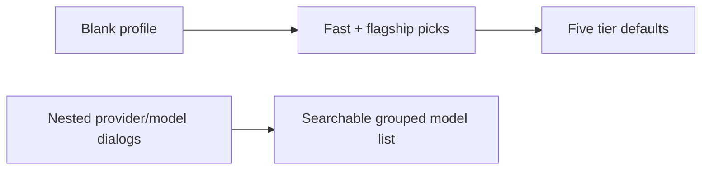

# Iteration 2.0.1 · Searchable two-model profile setup

> Index: [`README.md`](./README.md).
>
> Cheatsheet and quick view restate the section; the section prose is authoritative.

## Cheatsheet

1. One searchable model list replaces provider/model dialogs (ADR-2.0.1#01)
2. Two picks fill `flash`/`standard`/`vision` and `pro`/`max` (ADR-2.0.1#01)
3. Review and per-tier overrides remain available (ADR-2.0.1#01)
4. Custom refs and provider categories stay supported (ADR-2.0.1#01)
5. New and existing profiles share quick setup (ADR-2.0.1#01)
6. Native TUI selects; no custom form or second catalog (ADR-2.0.1#01)

---

## Quick view

| Surface | Decision | Preserved capability |
|---|---|---|
| Profile defaults | Fast pick fills `flash`, `standard`, `vision`; flagship fills `pro`, `max` | Review and edit every tier before apply |
| Model lookup | One searchable list grouped by provider | Custom refs and provider categories remain |
| UI | Native TUI select dialogs | No bespoke form or duplicate catalog implementation |

---

### 01. Search models directly and seed profiles from two picks
**Status**: 🟡 proposed

**Background**: New profiles previously started with five blank tier mappings. Changing a model required separate provider and model dialogs. Users need useful defaults without losing precise control of individual tiers.

**Decision**:

| # | Point | Content |
| --- | --- | --- |
| 1 | Model lookup | Show catalog models in one searchable select, grouped by provider; retain the custom-ref fallback |
| 2 | Fast setup | Map a fast pick to `flash`, `standard`, and `vision`; map a flagship pick to `pro` and `max` |
| 3 | Review | Open the tier editor after creation; offer the same quick setup for existing profiles and keep each tier individually editable |
| 4 | UI surface | Use native TUI selects; do not add a custom form or duplicate catalog/search implementation |

**Rationale**:

- **Useful by default**: new profiles start with five concrete mappings instead of blank refs
- **Direct discovery**: one searchable provider-grouped list removes nested navigation
- **No capability loss**: users can override any tier, enter a custom ref, and review before applying

**Rejected**:

| Option | Reason rejected |
| --- | --- |
| Create an empty five-tier profile | Requires repeated model lookups before the profile is useful |
| Keep provider and model as separate dialogs | Adds navigation without enabling cross-provider search |
| Build a bespoke multi-field form | The TUI dialog API has no native form surface; duplication adds unsupported UI and maintenance |

**Impact**:

- **TUI** — use one searchable model picker for profile and live-tier edits; offer two-model setup for new and existing profiles
- **Profile core** — expand two selected refs into the five-tier mapping without changing the persisted schema
- **Tests** — pin tier expansion and keep all eight locale catalogs complete
- **Docs** — update English and Chinese profile-wizard guidance
