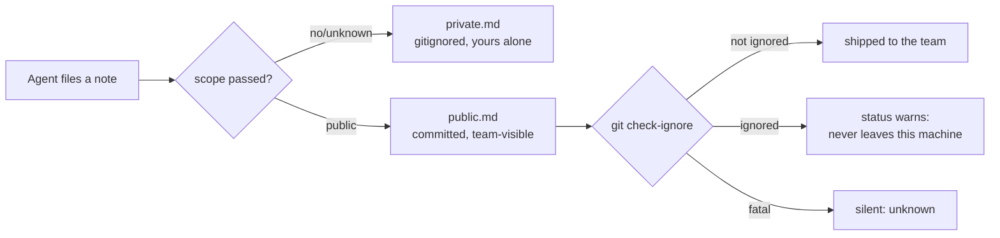

# Iteration 2.0.2 · Honest public scope in project memory

> Index: [`README.md`](./README.md).
>
> Cheatsheet and quick view restate the section; the section prose is authoritative.

## Cheatsheet

1. The agent tool defaults to `private`, the user command to `public` (ADR-2.0.2#01)
2. Unknown or malformed `scope` falls back to `private`, never `public` (ADR-2.0.2#01)
3. Public entries are committed repo content — English, one rule per entry (ADR-2.0.2#01)
4. `/memory status` probes git shareability and warns instead of failing silently (ADR-2.0.2#02)
5. A fatal probe exit is unknown, never "shared" (ADR-2.0.2#02)
6. The `memory_note` unit suite must never write outside its sandbox (ADR-2.0.2#03)

---

## Quick view

| Surface | Decision | Preserved capability |
|---|---|---|
| `memory_note` tool | default `private` | `scope: "public"` still reaches the team file |
| `/memory note` command | default `public` | `--private` still gives a local-only note |
| Public entry content | English, one rule per entry | Team reviewers read one rule per line |
| `/memory status` | tri-state `git check-ignore` probe + warning | Status still works with no git at all |
| Unit suite | fake plugin ctx injects the sandbox dir | Suite never touches a developer's real memory |

---

### 01. Default the agent tool to `private`, keep the command on `public`
**Status**: 🟡 proposed

**Background**: The `memory_note` tool hard-coded `public` as the fallback for an unset, misspelled, or non-conforming `scope`, and three agent prompts repeated "Default `public` scope (committed, PR review)" as standing instruction. The stated safety net — "when in doubt → public; PR review will route misclassified entries back" — assumed the agent's file always lands in a diff. It did not: a repository whose root `.gitignore` excluded the whole `.ocp/` tree kept `public.md` out of git entirely, so nothing ever reviewed it. The result in practice was a "public" file that was a personal notebook, carrying a permanent per-session injection charge for text nobody curated, and five entries of which two were durable team rules, one restated AGENTS.md, one was an external-API research note, and one was an unreadable fragment.

**Decision**:

| # | Point | Content |
| --- | --- | --- |
| 1 | Tool default | `memory_note` resolves an unset or unrecognized `scope` to `private`; `public` requires an explicit argument |
| 2 | Command default | `/memory note` keeps `public` — a human typing it is a deliberate, visible act, and the reply shows the resolved path |
| 3 | Tie-break rule | Default toward the scope whose misfiling is cheaper: a private note nobody sees, not a repo-polluting note injected forever |
| 4 | Public content | Public entries are committed repo content: English, one rule per entry |
| 5 | Prompt wording | `lite` / `code` / `build` state the tool's real default and point at the tool description instead of restating the heuristic a third time |

**Rationale**:

- **The old rationale had a hole**: "PR review will fix it" is only a safety net when the file is in the diff; measured in this repo it was not tracked at all
- **Asymmetric downside**: misfiling private costs one unseen note; misfiling public costs repo pollution, revert churn, and a permanent token charge on every session
- **Asymmetric actors**: the agent files notes speculatively with no reviewer, while the user's own keystroke is already a reviewed decision — one default cannot honestly serve both
- **Capability preserved**: `scope: "public"` is unchanged and tested, so nothing that used the team file loses it

**Rejected**:

| Option | Reason rejected |
| --- | --- |
| Keep `public` as the tool default, fix the `.gitignore` only | Removes the cause but not the bias: the cheap-to-be-wrong side is still the team file, and every future repo inherits the same footgun |
| Make `public` the default and add a confidence floor | A hard floor is theatre — the tool cannot verify a lesson is right, and blocking capture loses the note entirely |
| Introduce a draft tier between private and public | A third file is a curation workflow nobody asked for; the cost asymmetry already picks the right default without new state |
| Drop the `public` scope entirely | Destroys the team-sharing capability the plugin exists for |

**Impact**:

- **Plugin tool** — `project-memory-tool.ts` scope resolution, schema description, and the shipped description text (heuristic compressed, `DO NOT USE FOR` extended with external-API research conclusions)
- **Agent prompts** — `prompts/lite.md`, `prompts/code.md`, `prompts/build.md` state the real default; net token cost near zero (heuristic detail was already deferred to the tool description)
- **Skill** — `skills/memory-summarize/SKILL.md` picks scope explicitly per lesson and marks public entries English
- **Docs** — English and Chinese plugin/command pages plus `DEVELOPING.md`

### 02. Warn in `/memory status` when public scope cannot ship
**Status**: 🟡 proposed

**Background**: "Public" is a promise about git visibility, and nothing verified it. The 2026-09-12 project-memory review recorded the gap as a P2 backlog item — a root-ignore can silently un-commit `public.md`, with no `git check-ignore` detection — and this repository was living proof: `public.md` had never been tracked. A user filing team lessons had no way to learn that except by inspecting git plumbing by hand.

**Decision**:

| # | Point | Content |
| --- | --- | --- |
| 1 | Probe | `/memory status` runs `git check-ignore -q` against `public.md` and warns when the verdict is "ignored" |
| 2 | Tri-state | `0` → not shared (warn), `1` → shared, anything else (fatal 128, killed child, missing git) → unknown, stay silent |
| 3 | Index-aware | The probe runs WITHOUT `--no-index`, so an already-tracked `public.md` reads as healthy even if a stale ignore rule still matches it |
| 4 | Ownership | This repo's own `.gitignore` un-ignores `.ocp/memory/public.md` (directory first, then the file) so the shipped contract is actually true here |
| 5 | Surface | One new i18n key in all 8 locales, appended to `statusText()` only |

**Rationale**:

- **The failure is silent by construction**: entries look filed, the reply says "saved", and the team simply never receives them
- **Silence beats a false alarm**: a tri-state probe means a machine without git, or a project outside any repository, gets no nagging
- **Index-aware is the correct predicate**: the question is "will this file reach a teammate", and a tracked file already has, whatever the rules say
- **Costless when healthy**: one fast subprocess inside a command a user runs deliberately, behind a 5s timeout with swallowed errors

**Rejected**:

| Option | Reason rejected |
| --- | --- |
| Document the caveat and leave detection out | The failure mode is invisible by definition; a doc line nobody reads is not detection |
| Read `.gitignore` and re-implement the matching rules | Re-implementing gitignore semantics (negation, nesting, `**`, directory-vs-file) is a losing game |
| Warn on every `note` call to public scope | Fires at capture time, before the user has filed anything worth warning about, and repeats forever once the file is fine |
| Hard-fail the public append when ignored | A read-only status report must stay read-only; refusing the write turns a visibility bug into data loss |

**Impact**:

- **Plugin config** — `classifyCheckIgnore()` (pure, unit-pinned) + `publicScopeShared()` (spawnSync, 5s timeout, `windowsHide`)
- **Plugin command** — `statusText()` appends the warning only on the "not shared" verdict
- **i18n** — `guard.memory.publicUnshared` in 8 locales; catalog grows 612 → 613 keys
- **Repo** — root `.gitignore` stops shadowing `.ocp/memory/public.md`; `private.md` and all other `.ocp/` runtime state stay ignored

### 03. Sandbox the project-memory unit suite
**Status**: 🟡 proposed

**Background**: `tests/test-project-memory-unit.ts` built its fake plugin context with `location: { directory: process.cwd() }`. The plugin entry calls `setProjectDir(ctx.location.directory)`, and every later `publicPath()` / `privatePath()` in the file follows it — so from that line onward the suite's fixtures (`rule A`, `note P`, `no-ctx allowed`) were written into the real `<repo>/.ocp/memory/`, overwriting whatever the developer had actually filed. It surfaced as a junk public entry that matched a test fixture string verbatim. Every run of the suite destroyed the repository's own memory; only the untracked, gitignored nature of `private.md` kept the damage quiet.

**Decision**:

| # | Point | Content |
| --- | --- | --- |
| 1 | Fixture | The fake ctx injects the suite's own `tmp` sandbox, never `process.cwd()` |
| 2 | Pin | Assert `getProjectDir() === tmp` right after plugin setup, so a future fixture edit fails loudly instead of silently re-aiming at the repo |
| 3 | Restore | Re-file the entries the suite had destroyed |

**Rationale**:

- **A test suite must never write outside its sandbox**: this one had a live data-loss path, not a flaky assertion
- **The entry point was the bug, not the assertions**: fixing the injected directory repairs every downstream path at once
- **The pin converts a silent hazard into a loud one**: the assertion sits where the mistake would be introduced

**Rejected**:

| Option | Reason rejected |
| --- | --- |
| Read the real files and restore them in teardown | Couples the suite to developer state; the next new `rmSync(publicPath())` reintroduces the loss |
| `git`-guard the writes (skip if inside a repo) | Hides the misconfiguration instead of removing it |
| Snapshot-and-restore around the whole file | Same coupling, more moving parts, and it hides which assertion wrote what |

**Impact**:

- **Tests** — sandbox `location.directory` + post-setup pin; run verified byte-identical on the real `.ocp/memory/` files afterward
