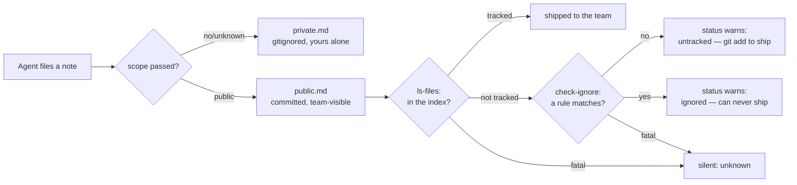

# Iteration 2.0.2 · Honest public scope in project memory

> Index: [`README.md`](./README.md).
>
> Cheatsheet and quick view restate the section; the section prose is authoritative.

## Cheatsheet

1. The agent tool defaults to `private`, the user command to `public` (ADR-2.0.2#01)
2. Unknown or malformed `scope` falls back to `private`, never `public` (ADR-2.0.2#01)
3. Public entries are committed repo content — English, one rule per entry (ADR-2.0.2#01)
4. `/memory status` asks git whether `public.md` is tracked, then whether it is ignored (ADR-2.0.2#02)
5. Untracked and ignored both warn; any fatal probe exit is unknown and stays silent (ADR-2.0.2#02)
6. The `memory_note` unit suite must never write outside its sandbox (ADR-2.0.2#03)
7. Truncation never leaves a broken code point in an entry (ADR-2.0.2#04)

---

## Quick view

| Surface | Decision | Preserved capability |
|---|---|---|
| `memory_note` tool | default `private` | `scope: "public"` still reaches the team file |
| `/memory note` command | default `public` | `--private` still gives a local-only note |
| Public entry content | English, one rule per entry | Team reviewers read one rule per line |
| `/memory status` | 4-state tracked / untracked / ignored / unknown probe + warning | Status still works with no git at all |
| Unit suite | fake plugin ctx injects the sandbox dir | Suite never touches a developer's real memory |

---

### 01. Default the agent tool to `private`, keep the command on `public`
**Status**: 🟡 proposed

**Background**: The `memory_note` tool hard-coded `public` as the fallback for an unset, misspelled, or non-conforming `scope`, and three agent prompts repeated "Default `public` scope (committed, PR review)" as standing instruction. The stated safety net — "when in doubt → public; PR review will route misclassified entries back" — assumed the agent's file always lands in a diff. It did not: a repository whose root `.gitignore` excluded the whole `.ocp/` tree kept `public.md` out of git entirely, so nothing ever reviewed it. The result in practice was a "public" file that was a personal notebook, carrying a permanent per-session injection charge for text nobody curated, and five entries of which two were durable team rules, one restated AGENTS.md, one was an external-API research note, and one was an unreadable fragment.

**Decision**:

| # | Point | Content |
| --- | --- | --- |
| 1 | Tool default | `memory_note` resolves an unset or unrecognized `scope` to `private`; `public` requires an explicit argument |
| 2 | Command default | `/memory note` keeps `public` — a human typing it is a deliberate, visible act, and the reply shows the resolved path |
| 3 | Tie-break rule | Default toward the scope whose misfiling is cheaper: a private note nobody sees, not a repo-polluting note injected forever |
| 4 | Public content | Public entries are committed repo content: English, one rule per entry |
| 5 | Prompt wording | `lite` / `code` / `build` state the tool's real default and point at the tool description instead of restating the heuristic a third time |

**Rationale**:

- **The old rationale had a hole**: "PR review will fix it" is only a safety net when the file is in the diff; measured in this repo it was not tracked at all
- **Asymmetric downside**: misfiling private costs one unseen note; misfiling public costs repo pollution, revert churn, and a permanent token charge on every session
- **Asymmetric actors**: the agent files notes speculatively with no reviewer, while the user's own keystroke is already a reviewed decision — one default cannot honestly serve both
- **Capability preserved**: `scope: "public"` is unchanged and tested, so nothing that used the team file loses it

**Rejected**:

| Option | Reason rejected |
| --- | --- |
| Keep `public` as the tool default, fix the `.gitignore` only | Removes the cause but not the bias: the cheap-to-be-wrong side is still the team file, and every future repo inherits the same footgun |
| Make `public` the default and add a confidence floor | A hard floor is theatre — the tool cannot verify a lesson is right, and blocking capture loses the note entirely |
| Introduce a draft tier between private and public | A third file is a curation workflow nobody asked for; the cost asymmetry already picks the right default without new state |
| Drop the `public` scope entirely | Destroys the team-sharing capability the plugin exists for |

**Impact**:

- **Plugin tool** — `project-memory-tool.ts` scope resolution, schema description, and the shipped description text (heuristic compressed, `DO NOT USE FOR` extended with external-API research conclusions)
- **Agent prompts** — `prompts/lite.md`, `prompts/code.md`, `prompts/build.md` state the real default. Measured net effect against the pre-ADR baseline (`2d009af`, repo estimator `chars/4`): `lite` −2 tok, `code` −5 tok, `build` −4 tok — a net **saving**, because the new phrasing is shorter than the public-first text it replaced and the "public entries are committed, so write them in English" clause was replaced by the cross-reference to the tool description the same sentence already carried
- **Token budget** — the only added shipped-context cost in this ADR is the `memory_note` description: 334 → 367 est tok (+33), paid solely in sessions where the tool is in context. **L0 is untouched** (`instructions/**` + `opencode.template.jsonc` unchanged)
- **Skill** — `skills/memory-summarize/SKILL.md` picks scope explicitly per lesson and marks public entries English
- **Docs** — English and Chinese plugin/command pages plus `DEVELOPING.md`

### 02. Warn in `/memory status` when public scope cannot ship
**Status**: 🟡 proposed

**Background**: "Public" is a promise about git visibility, and nothing verified it. The 2026-09-12 project-memory review recorded the gap as a P2 backlog item — a root-ignore can silently un-commit `public.md`, with no `git check-ignore` detection — and this repository was living proof: `public.md` had never been tracked. A user filing team lessons had no way to learn that except by inspecting git plumbing by hand.

The gap has two halves, and the first fix covered only one. Ignoring a path is not the same as failing to ship it: a file that is untracked but matched by no ignore rule passes every `check-ignore` query and still never leaves the machine, because nothing has staged it. That was the state of this repo's own `public.md` after the `.gitignore` enabler landed — a probe that asked only "is a rule matching this?" reported the file as healthy while `git status` showed it as `??`. A status report that says "shipped" about an unshipped file is worse than no probe at all: it converts a silent failure into a false assurance.

**Decision**:

| # | Point | Content |
| --- | --- | --- |
| 1 | Probe | `/memory status` asks git two questions in order: `git ls-files --error-unmatch` — is `public.md` in the index? — and, only if it is not, `git check-ignore -q` — does a rule match it? |
| 2 | Four states | `tracked` → silent. `untracked` → warn, it ships the moment someone stages it. `ignored` → warn, it can never ship. Any fatal exit (128 not-a-repo, 129 usage), a killed child, or missing git → `unknown`, stay silent |
| 3 | Order is the short-circuit | A tracked file is already in the repo whatever the rules say, so the index is asked first and `check-ignore` is the fallback: one subprocess in the healthy case, two otherwise |
| 4 | Index-aware | `check-ignore` runs WITHOUT `--no-index`, so a tracked file under a stale ignore rule is not misreported as ignored |
| 5 | Pathspec | The probe passes a repo-relative POSIX pathspec, not the native absolute path git's own diagnostics are written against; a `D:\…` drive-letter component is at best tolerated and at worst parsed as a pathspec, failing as exit 128 → `unknown` → silence |
| 6 | Ownership | This repo's own `.gitignore` un-ignores `.ocp/memory/public.md` (directory first, then the file) so the shipped contract is actually true here |
| 7 | Surface | Two new i18n keys in all 8 locales, appended to `statusText()` only; each message names the concrete remedy, not just the fault |

**Rationale**:

- **The failure is silent by construction**: entries look filed, the reply says "saved", and the team simply never receives them
- **"Ignored" is only half the failure**: a path can be perfectly shareable by every rule and still be local, because sharing is a property of the index and not of the ignore list
- **The two states need different words**: `ignored` is unfixable-by-accident and needs the `.gitignore` shape spelled out; `untracked` is one `git add` away, so its message says exactly that
- **Silence beats a false alarm**: unknown verdicts — a machine without git, a project outside any repository, a spawn timeout — get no nagging
- **Index-aware is the correct predicate**: the question is "will this file reach a teammate", and a tracked file already has, whatever the rules say
- **Cheap when healthy**: a fast subprocess inside a command a user runs deliberately, behind a 5s timeout with swallowed errors

**Rejected**:

| Option | Reason rejected |
| --- | --- |
| Document the caveat and leave detection out | The failure mode is invisible by definition; a doc line nobody reads is not detection |
| Probe `check-ignore` only (the first attempt at this ADR) | Blind to the untracked case — it reports "shared" for the exact state this ADR was written about |
| Read `.gitignore` and re-implement the matching rules | Re-implementing gitignore semantics (negation, nesting, `**`, directory-vs-file) is a losing game |
| Read `git status --porcelain` for the tracking half | Porcelain output is a format to parse, locale-adjacent and path-quoted; `--error-unmatch`'s exit code is a contract |
| Warn on every `note` call to public scope | Fires at capture time, before the user has filed anything worth warning about, and repeats forever once the file is fine |
| Hard-fail the public append when ignored | A read-only status report must stay read-only; refusing the write turns a visibility bug into data loss |

**Impact**:

- **Plugin config** — `classifyLsFiles()` and `classifyIsIgnored()` (pure, unit-pinned) composed by `classifyPublicScope()` (pure, unit-pinned over the full 3×3 matrix) + `publicScopeReach()` (spawnSync, 5s timeout, `windowsHide`)
- **Plugin command** — `statusText()` appends the warning on the `ignored` and `untracked` verdicts only
- **i18n** — `guard.memory.publicUnshared` (revised to carry the remedy) + `guard.memory.publicUntracked` (new) in 8 locales; catalog grows 612 → 614 keys
- **Repo** — root `.gitignore` stops shadowing `.ocp/memory/public.md`; `private.md` and all other `.ocp/` runtime state stay ignored

### 03. Sandbox the project-memory unit suite
**Status**: 🟡 proposed

**Background**: `tests/test-project-memory-unit.ts` built its fake plugin context with `location: { directory: process.cwd() }`. The plugin entry calls `setProjectDir(ctx.location.directory)`, and every later `publicPath()` / `privatePath()` in the file follows it — so from that line onward the suite's fixtures (`rule A`, `note P`, `no-ctx allowed`) were written into the real `<repo>/.ocp/memory/`, overwriting whatever the developer had actually filed. It surfaced as a junk public entry that matched a test fixture string verbatim. Every run of the suite destroyed the repository's own memory; only the untracked, gitignored nature of `private.md` kept the damage quiet.

**Decision**:

| # | Point | Content |
| --- | --- | --- |
| 1 | Fixture | The fake ctx injects the suite's own `tmp` sandbox, never `process.cwd()` |
| 2 | Pin | Seed the global with a different directory *before* `setup`, then assert `getProjectDir() === tmp`. Asserting after `setup` without seeding is a tautology — `setup` is what sets it, so the assertion only restates the line above it |
| 3 | Sandboxed-elsewhere | The git-repo branch of the probe asserts "not a repo → unknown", which `os.tmpdir()` breaks if it happens to sit inside a work tree (git walks up). Detect that case and skip loudly rather than assert something unsound |
| 4 | No leaks | The repo fixture is removed in a `finally`, and every git call that can legitimately fail (init, add) is guarded with a loud skip instead of aborting the suite |
| 5 | Restore | Re-file the entries the suite had destroyed |

**Rationale**:

- **A test suite must never write outside its sandbox**: this one had a live data-loss path, not a flaky assertion
- **The entry point was the bug, not the assertions**: fixing the injected directory repairs every downstream path at once
- **The pin converts a silent hazard into a loud one**: the assertion sits where the mistake would be introduced — but only once it is given something to fail against
- **A skip that announces itself is honest; a skip that hides in a green run is not**: every environment-dependent branch prints why it stood down

**Rejected**:

| Option | Reason rejected |
| --- | --- |
| Read the real files and restore them in teardown | Couples the suite to developer state; the next new `rmSync(publicPath())` reintroduces the loss |
| `git`-guard the writes (skip if inside a repo) | Hides the misconfiguration instead of removing it |
| Snapshot-and-restore around the whole file | Same coupling, more moving parts, and it hides which assertion wrote what |

**Impact**:

- **Tests** — sandbox `location.directory` + seeded post-setup pin; git-repo fixture cleaned up in a `finally`; environment-dependent branches skip loudly; `statusText()` called once per assertion instead of twice. Run verified byte-identical on the real `.ocp/memory/` files afterward

### 04. Never leave a broken code point in an entry
**Status**: 🟡 proposed

**Background**: The 2026-09-12 review logged a P2 here too: `formatMemoryEntry()` caps the lesson with `slice(0, 1000)`, which counts UTF-16 code units, so a cap that lands between the halves of a surrogate pair leaves an orphaned high surrogate behind. It serializes as `U+FFFD` — a replacement character in the middle of a rule. It was recorded as a P2 precisely because public entries were then a local file; under this ADR's premise that public entries are committed repo content, the same byte lands in the team's file, where a mojibake glyph is a review conversation rather than an invisible local artifact.

**Decision**:

| # | Point | Content |
| --- | --- | --- |
| 1 | Truncation | After the cap, drop a trailing lone high surrogate (`/[\uD800-\uDBFF]$/`) |
| 2 | Cost | One code point of headroom on a 1000-unit cap. A rule that is one character shorter is not worth a broken glyph |
| 3 | Scope | Both scopes share `formatMemoryEntry()`, so the fix applies to public and private alike — the entry format is a shared contract, not a public-only one |

**Rationale**:

- **Truncation must not corrupt**: a length cap is a deliberate cut, and a cut that leaves invalid text is a bug the cap itself introduced
- **The fix is testable at the boundary**: a pair ending exactly at the cap survives; a pair split by it does not leave an orphan

**Rejected**:

| Option | Reason rejected |
| --- | --- |
| Truncate by code point (`Array.from`) instead | Correct, but rewrites the cap's unit and its meaning; the orphan is the only observable defect |
| Leave it as a P2 backlog item | The backlog item predates the premise that made the file shared |
| Strip all non-ASCII from lessons | Public entries may legitimately quote non-English source, and a Chinese or Japanese rule is a real lesson |

**Impact**:

- **Plugin config** — `formatMemoryEntry()` drops an orphaned high surrogate after the length cap
- **Tests** — boundary cases pinned: a pair ending at the cap survives, a pair split by it yields no lone surrogate and no `U+FFFD`
