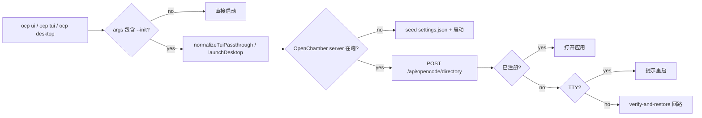

# 迭代 0.10.0 · CLI 与 OpenChamber 启动

> 索引见 [`README.md`](./README.md)。修订：`.` 不再是 `--init` 的别名（2026-09-10）。

## 速查（cheatsheet）

1. 整体移除 `plugins/ocp/`；global `ocp` shim 是唯一 CLI 入口（ADR-0.10.0#01）
2. 只有显式 `--init` 触发初始化；裸 `.` 在所有命令里都是空操作（ADR-0.10.0#01）
3. 初始化只放在 TS 引擎一处；bin 派发器不再调用 `project init`（ADR-0.10.0#01）
4. `ocp ui --init` 启动前经 OpenChamber 自有端点注册 cwd（ADR-0.10.0#01）

---

## 速览（图 + 表）

| 处置 | 路径 | 归属 |
| --- | --- | --- |
| `plugins/ocp/*` | 移除 | plugins |
| `bin/opencode-prime(.ps1)` | 归一化 `.` → `--init` 后代理 | dispatcher |
| `install/src/launcher.ts` | `launchDesktop` + OpenChamber 集成 | runtime |
| `install/src/index.ts` | CLI 引擎 + `project` 命名空间 + `desktop` action | runtime |
| `install/install.sh|ps1` | info-command 列表加 `desktop`/`project` | installer |

---

### 01. OCP CLI 迁移与 OpenChamber 启动
**Status**: 🟡 proposed（2026-09-10 修订）

**Background**: `plugins/ocp/` 下的一组斜杠命令（`/ocp project init|index|sync`、`/ocp ui`、`/ocp tui` 等）重复了 CLI 表面积，且因为运行在 agent 内部，无法触达 OpenChamber desktop。派发器原本把裸 `.` 当作 `--init` 别名，导致 `ocp tui .` 在用户眼里是"在这里打开 TUI"，实际却跑项目初始化，还会经由 bin 派发器的 `project init` 弹出交互式向导。

**Decision**:

| # | 决策点 | 内容 |
| --- | --- | --- |
| 1 | 插件表面积 | 整体移除 `plugins/ocp/*`；CLI 全部走 global `ocp` shim：`project init|index/sync`、`tui --init`、`ui --init`、裸 `desktop`/`ui` |
| 2 | init 别名 | 只有显式 `--init` 触发初始化；裸 `.` 在所有命令里都是被剥掉的空操作（`ocp tui .` ≡ `ocp tui`） |
| 3 | init 汇流点 | TS 引擎拥有 init 语义：`normalizeTuiPassthrough`（tui）、`launchDesktop`（desktop/ui）；bin 派发器是归一化器，绝不调用 `project init` |
| 4 | OpenChamber 注册（离线） | 按 OpenChamber 自身的 id/字段格式 seed `~/.config/openchamber/settings.json` |
| 5 | OpenChamber 注册（在线） | POST `/api/opencode/directory`（与 *Add project* 同端点）；TTY 下提示重启让运行窗口带项目重新打开 |
| 6 | OpenChamber 注册（已注册） | 已注册 → 直接打开应用，不弹提示 |
| 7 | Installer | info-command 列表加 `desktop` 与 `project`，使 OpenCode 自动安装提示不再触发 |

**Rationale**:

- **CLI 是唯一权威表面积**——一条 shim 同时清掉斜杠/CLI 分裂，对伴生工具保持可达
- **初始化只放在一处**——TS 引擎拥有 init 语义；bin 派发器是归一化器；杜绝双处理与意外弹向导
- **显式 `--init`，不再 `.` 别名**——只有显式 `--init` 触发初始化；裸 `.` 被剥成空操作，匹配用户阅读
- **OpenChamber 注册是一次性而非守护**——每次 `ocp ui --init` 经对话框端点同步一次 cwd；项目列表在启动时重新加载即拿到变更

**Rejected**:

| 被否方案 | 否因 |
| --- | --- |
| 同时保留 `plugins/ocp/` 与 shim | 斜杠命令无法触达 OpenChamber desktop，且同一动作双份表面积 |
| 裸 `.` 继续作为 `--init` 别名 | 用户读作"在这里打开"实际跑初始化的别名正是 2026-09-10 修订要消除的"意外" |
| bin 派发器做 init 专属参数改写 | bin + TS 引擎分裂逻辑重新引入同一类意外 |

**Impact**:

- **Plugins**——`plugins/ocp/*` 整体移除；`install/versions/0.9.2.manifest.txt` 列出此次移除
- **Runtime**——`install/src/launcher.ts` 拥有 `launchDesktop`、OpenChamber settings 读、快速通道、POST 辅助、prompt + kill；`install/src/index.ts` 拥有 CLI 引擎、`project` 命名空间、wire 到 `launchDesktop` 的 `desktop` action
- **Dispatcher**——`bin/opencode-prime` + `.ps1` 把开头的 `.` 归一化成 `--init` 并代理到 `install.sh|ps1 desktop|tui`；裸 `ocp ui` 保持直接启动
- **Installer**——`install/install.sh|ps1` 在 info-command 列表里加上 `desktop` 与 `project`
- **OpenChamber 集成**——运行中窗口竞态（过期 UI 覆盖项目列表）只能缓解不能根治；根治需要上游改动（`persistSettings` 上的 selective PUT 或 server push）；OCP 对 `settings.json` 的直写只在没有 server 拥有该文件时走 seed 路径，因为 server 的 `persistSettings` 是读-改-写，seed 在并发保存下能存活

**Future extensions**:上游侧推动 `persistSettings` 的 selective PUT 或项目新增时的 server push，从源头根治运行中窗口竞态。