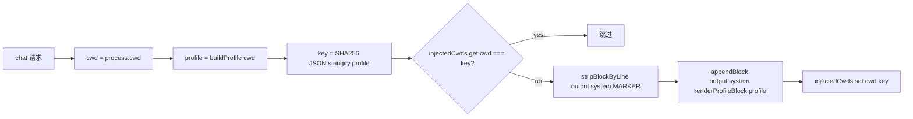

# 迭代 0.34.0 · Profiler 缓存与 ponytail 移除

> 索引见 [`README.md`](./README.md)。取代同日 ponytail opt-in 草案。

## 速查（cheatsheet）

1. profiler 缓存以 profile 内容哈希（SHA-256）为键，替代 cwd（ADR-0.34.0#01）
2. strip-then-append 保留；Tier 2 delta 回退（ADR-0.34.0#01）
3. 共享 strip/append 辅助集中到 `plugins/shared/system-block.ts`（ADR-0.34.0#01）
4. `@dietrichgebert/ponytail` 从 OCP 整体移除（ADR-0.34.0#02）
5. 强制函数折叠进 `prompts/code.md` step 4 + `prompts/lite.md`（ADR-0.34.0#02）
6. fragment-cache 模式替换五个插件的"key 不变跳过"跟踪器（ADR-0.34.0#01）

---

## 速览（图 + 表）

| 文件 | 旧 | 新 |
| --- | --- | --- |
| 缓存 | `Map<cwd, block>`（仅 cwd） | `Map<cwd, profileKey>`（内容哈希） |
| 命中条件 | 无条件 `cachedBlocks.get(root)` | `injectedCwds.get(cwd) === profileKey(profile)` |
| strip 辅助 | 内联 `string.replace` | `stripBlockByLine(output.system, MARKER)` 来自共享模块 |
| append 辅助 | 内联 `output.system.push(...)` | `appendBlock(output.system, renderProfileBlock(profile))` |
| 标记正则 | 手写 | `escapeRegExp(MARKER)` 行首模式 |
| prompt 契约 | 不变 | 不变（Scenario A 下每次提示只有一块） |
| Tier 2 delta 层 | 在 PR 中实现 | 回退（为不发生的 Scenario B 而设计的防御性架构） |

---

### 01. 项目 profiler 缓存以 profile 内容哈希为键
**Status**: ✅ accepted

**Background**: `plugins/project-profiler/project-profiler.ts` 通过往 system prompt 追加 `[PROJECT CAPABILITIES]` 块告知 LLM 运行时后端能力（CodeGraph / GitNexus / Serena / tgrep）。旧缓存仅以 cwd 为键：mid-session 编辑 `~/.config/opencode/opencode.jsonc`（如开启 `codegraph` MCP）或新增 `.codegraph/` 目录会让 `buildProfile()` 返回不同 profile，但 `cachedBlocks.get(root)` 仍返回旧块——模型在下一次重启或 cwd 变化前持续看到 `CodeGraph=unavailable`。这是正确性 bug，不是性能问题（AGENTS.md §0："架构合法性优先于实现便利"）。原草稿还提出 Tier 2 append-only delta 架构，实现后又回退，因为经验证 opencode 是 Scenario A（每次请求重建 `output.system`），Tier 2 因此成为应对不发生场景的防御性设计（Defendability gate 禁止附带"承认是死代码"文档去发防御性代码）。

**Decision**:

| # | 决策点 | 内容 |
| --- | --- | --- |
| 1 | 缓存键 | `profileKey(profile)` = `JSON.stringify(profile)` 的 SHA-256（64 hex 字符） |
| 2 | 缓存 map | `injectedCwds: Map<cwd, string>`（按 cwd 的内容哈希 slot，无交叉污染） |
| 3 | 命中条件 | `injectedCwds.get(cwd) === profileKey(profile)`（命中即跳过） |
| 4 | miss 路径 | `stripBlockByLine(output.system, MARKER)` → `appendBlock(output.system, renderProfileBlock(profile))` → `injectedCwds.set(cwd, key)` |
| 5 | Tier 2 | 不引入——Scenario A 经验证后回退 |
| 6 | strip 模式 | 行首，从 `MARKER` 经 `escapeRegExp` 派生；单源位于 `plugins/shared/system-block.ts` |
| 7 | prompt 契约 | 不变——"读 `[PROJECT CAPABILITIES]`"保持（Scenario A 下每次提示只有一块） |
| 8 | 导出 | 恰好等于运行时需要的（`ProjectProfilerPlugin`）+ 未来重构可能复用的纯函数（`MARKER`、`mcpEnabledFrom`、`ProjectProfile`、`buildProfile`、`renderProfileBlock`、`profileKey`）；不为测试导入路径 re-export（AGENTS.md §100） |
| 9 | 共享辅助 | `appendBlock`、`stripBlockByLine`、`escapeRegExp` 抽出到 `plugins/shared/system-block.ts`；`auto-advisor`、`project-manager`、`adr-guard`、`e2e-guard` 复用 |
| 10 | fragment cache（平行） | `auto-advisor` / `adr-guard` / `e2e-guard` / `project-manager` / `project-profiler` "key 不变跳过"跟踪器替换为 `Map<state, key, text>`；state 判定需要注入时始终注入；保留防御性 strip 以应对 Scenario B 正确性 |

**Rationale**:

- **缓存失效靠内容而非位置**——同 cwd + 同 profile 跳过；同 cwd + 不同 profile 重新发射；不同 cwd 独立 slot
- **`JSON.stringify` 对封闭 union 安全**——`ProjectProfile` 是 `Capability` 字面量的定长记录，跨引擎序列化确定性；SHA-256 让键有界、比较 O(length)
- **保留 strip-then-append，回退 Tier 2**——Scenario A 下 strip 是请求内钩子链的防御空操作；未来切到 Scenario B 时 strip 仍然正确。Tier 2 在两种 Scenarios 下技术上都验证正确，但 Scenario A 下其依据不成立；Defendability gate 禁止附带"承认是死代码"文档去发防御性代码
- **共享辅助在 `plugins/shared/system-block.ts`**——关闭四个姊妹插件的既有迁移工作
- **不改 prompt 契约**——Scenario A 下每次提示只有一块，"最新"或"忽略较早块"的措辞都会误导
- **不为测试加导出**——导出恰好等于运行时表面积加上未来重构可能合法复用的纯函数

**Rejected**:

| 被否方案 | 否因 |
| --- | --- |
| 保留 cwd 键缓存 | 正是 bug。Mid-session 对 MCP / `.codegraph` / `.gitnexus` 的编辑在重启前不会反映给模型 |
| Tier 2 append-only delta（skip/append-full/append-delta 三分支） | 为不发生的 Scenario B 而设计的防御性架构。opencode 1.18.30 上 4 次钩子调用跨 2 个会话实测，全部 `markerSurvived: false` |
| "key 不变跳过" 类 prompt-cache-preservation 快路径 | 同一类死代码——本次发布由 fragment cache 在 5 个插件上修复 |

**Impact**:

- **正确性**——mid-session 对 MCP / `.codegraph` / `.gitnexus` 的编辑在下一次 chat 请求即生效；缓存建模的是"profile 当前的样子"，而非"第一次看到时的样子"
- **Defendability**——"为什么缓存键是 profile 的 SHA-256？"有一句能通过评审的回答；"为什么不是 Tier 2 delta？"也有——Scenario A 经验证，delta 路径是死代码
- **最小可能 diff**——只修一个真实 bug，不带投机性设计
- **成本**——每次请求额外一次 `JSON.stringify` + SHA-256（profile 规模 4 个短字符串上是微秒级）；命中时跳过 `buildProfile()` 节省的读 `opencode.jsonc` + `stat` 两个目录的开销高出数个数量级
- **插件模块**——`plugins/project-profiler/project-profiler.ts` 导出 `MARKER`、`ProjectProfile`、`mcpEnabledFrom`、`buildProfile`、`renderProfileBlock`、`profileKey`；缓存 `Map<cwd, profileKey>` 以 cwd + 内容哈希为键
- **共享模块**——`appendBlock`、`stripBlockByLine`、`escapeRegExp` 在 `plugins/shared/system-block.ts`，所有 system-transform 注入器共享
- **测试**——`tests/test-project-profiler-unit.ts` 为最小 Tier 1 修复重写（幂等 / 失效 / 64-hex / cache-stable / cache-invalidation-visible / `escapeRegExp` / `appendBlock` 正常 + 兜底 / strip+append 往返不变式）；`tests/test-system-block-unit.ts` 新增平行的共享辅助覆盖；`tsc --noEmit` 通过
- **后续（独立 issue）**——fragment cache 替换 5 个插件的"key 不变跳过"跟踪器（✅ 2026-09-11）；`md-to-pdf` / `md-to-docx` 可加 `ANY_CAPABILITY_MARKER_RE` 应对未来 Scenario B（超出范围，Scenario A 下今天正确）；`deepseek-anchor` 可从逐字符串数组 append 迁到 `appendBlock`（last-only）以与其他插件语义对齐（超出范围，其按会话跟踪是其首轮独占注入契约的正确模式）；若 opencode 切到 Scenario B，fragment-cache + 始终注入 + 防御性 strip 模式端到端仍然成立，无需返工

**Future extensions**:prompt-cache-preservation 快路径成为活路径（opencode Scenario B）时，同一份 `Map<cwd, {key, text}>` 直接服务，上述五个插件都不需要返工。

### 02. 从 OCP 移除 ponytail
**Status**: ✅ accepted

**Background**: OCP 把 `@dietrichgebert/ponytail` 作为默认开启的 npm 插件发货（`opencode.template.jsonc:plugin`、`install/options.jsonc:plugin['@dietrichgebert/ponytail'] = true`）。插件框架是"先按要求实现，再以一行指出更偷懒的替代"，把"偷懒"包装成正向工程价值，并以该框架把简化方案抛给用户。这与 `cp#10`（`Top-tier floor + YAGNI discipline`）直接冲突——`cp#10` 拒绝以任何"少做"框架绕过顶级工程基线（正确性 / 安全 / 可测试 / 类型安全 / 错误与边界处理；可维护 / 可辩护 / 平台原生 / 简单），"更偷懒的替代"正是 `cp#10` 禁止的那种合理化反论。架构层面，OCP 自有的 prompt 栈（`cp#10`、`prompts/architect.md:38`、`prompts/code-review.md:27`、`cp#7` 不引入过早抽象）已覆盖 YAGNI、SOLID、KISS、DRY；第三方 npm 包强加的"什么是好代码"框架是对项目本应自持的架构决策的外部约束。原草稿提出翻成 opt-in，同日又做出更强的决策：整体移除 npm 依赖，把唯一不可替代的部分（"完成后考虑更简单的 YAGNI-aligned 替代" 强制函数）折叠进我们自己的 agent prompt。

**Decision**:

| # | 决策点 | 内容 |
| --- | --- | --- |
| 1 | npm 依赖 | `package.json` 移除 `@dietrichgebert/ponytail`（重新生成 `bun.lock`） |
| 2 | 插件映射 | `install/options.jsonc:plugin`、`opencode.template.jsonc:plugin` 移除该条目；headroom MCP 注释去掉"ponytail 补足 rtk" |
| 3 | i18n | `install/src/i18n.ts` + `install/locales/{en,zh-CN}.json` 从 `pluginLabels` 删除 |
| 4 | lite-mode | `plugins/lite-mode/lite-mode.ts` 删除 `PONYTAIL MODE ACTIVE` / `# Ponytail` strip 逻辑（死代码） |
| 5 | 文档 | `DEVELOPING.md` "5. Ponytail protocol" 移除；`docs/workflows/plugins.md`（ZH）删除该行；`docs/maintenance/options.md`（ZH）删除示例条目；`docs/core/mcp-servers.md`（ZH）"rtk + ponytail" 还原为 "rtk" |
| 6 | 测试 | `tests/test-all.ps1` 删除插件/环境检查；`tests/test-lite-mode-unit.ts` 删除 ponytail 块一节；`tests/README.md` 删除行为说明 |
| 7 | 强制函数 | 在 `prompts/code.md` step 4（Implement）+ `prompts/lite.md` Editing-code 行追加一行："Before finalizing, briefly consider a YAGNI-aligned simpler path — name it in the report if obvious; skip for trivial changes. (`cp#10` floor still applies.)" |
| 8 | Installer readme | `install/README.md` 示例配置不再提及 ponytail |

**Rationale**:

- **`cp#10` 在框架层面冲突**——ponytail 的"更偷懒的替代"框架正是 `cp#10` 禁止的那种合理化反论，以插件实际行为而非文档形式呈现
- **架构主权**——设计原则属于项目（`AGENTS.md`、`cp#N`），不属于第三方 npm 包
- **无边际价值**——ponytail 唯一不可替代的贡献就是强制函数，用我们自己 prompt 的两行就能表达
- **Defendability gate 恢复**——整体移除 ponytail 关闭 opt-in 留下的"为什么开了但默认关"表面积
- **行为保留**——ponytail 真正贡献的项目本就想保留的行为，现在回到我们自己的 prompt 文本里，没有丢失

**Rejected**:

| 被否方案 | 否因 |
| --- | --- |
| 保留默认开启、把文档重写为 "YAGNI scoped" | 改文档不改变实际行为或合理化框架输出；冲突原样存在 |
| 翻成 opt-in（默认关） | 表面积仍在、Defendability-gate 责任仍存（"为什么开了但默认关"没有好答案）；主动 opt-in 的用户重新引入 `cp#10` 冲突 |
| 保留默认开启 | 同 `cp#10` 冲突，同 Defendability-gate 责任 |

**Impact**:

- **表面积**——`package.json`、`bun.lock`、安装图、OCP 包表面积都变轻；"lazy coding" 合理化框架在发货表面积里完全消失
- **Defendability**——完全恢复；不再有"为什么开了"的尴尬表面积
- **Token 成本**——ponytail 的 ruleset 块不再注入任何会话；lite-mode 的 strip 逻辑是死代码，移除
- **强制函数**——由 in-prompt 一行式追加保留；ponytail 唯一不可替代贡献的行为无损失
- **既有用户**——手工配置 ponytail（OCP 之外 `npm install` + `opencode.jsonc` 编辑）的用户在升级后会看到它从 prompt 表面积上消失；发布说明 + CHANGELOG 必须明示这是行为变更；npm 包本身仍在公共 registry 上，确实需要的用户可自行安装并接入自己的 `opencode.jsonc`，只是不再获得 OCP 的框架或 lite-mode strip
- **测试表面**——env-dependent ponytail 测试移除（无测试可维护）；strip 逻辑也移除，没有东西可以回归测试
- **`cp#10` 不变**——YAGNI 框架仍是采纳任何"更简单"替代的门；`prompts/architect.md:38,46`、`prompts/code-review.md:27`、`instructions/coding-principles.md` 第 7 行（不引入过早抽象）已经在架构与评审层覆盖 SOLID + YAGNI + KISS + DRY——ponytail 原本在实现层填补的空白由 in-prompt 强制函数填补

**Future extensions**:未来任何外部插件想法都走同一 `cp#10` + 架构主权检验——采纳前重新评估。