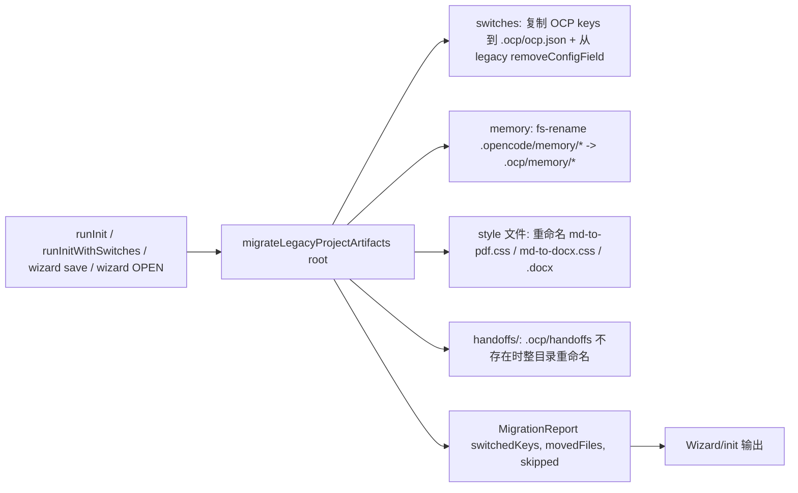

# 迭代 0.35.0 · OCP 路径契约

> 索引见 [`README.md`](./README.md)。

## 速查（cheatsheet）

1. OCP 制品迁到 `.ocp/`；global 配置变成 `ocp.json`；`.opencode/` 仍归 OpenCh（ADR-0.35.0#01）
2. 无运行时兼容：每制品一条路径；init 时一次性迁移（ADR-0.35.0#01）
3. 唯一汇流点：`plugins/shared/opencode-prime.ts` 导出全部路径辅助（ADR-0.35.0#01）
4. 迁移幂等 + 非破坏 + 可见（`MigrationReport`）（ADR-0.35.0#01）
5. `.ocp/.gitignore` 由 `ensureOcpGitignore` 单源化（ADR-0.35.0#01）
6. 升级但不重 init = 默认值，直到 wizard 或 `/project sync` 跑一次（ADR-0.35.0#01）

---

## 速览（图 + 表）

| 制品 | 旧 | 新 | 处置 |
| --- | --- | --- | --- |
| 项目开关键 | `.opencode/opencode.jsonc` / 根 `opencode.jsonc`（仅 OCP keys） | `.ocp/ocp.json` | init 迁移时移动（keys 复制，从 legacy 删除） |
| 内存 | `.opencode/memory/{public,private}.md` | `.ocp/memory/*` | 移动（目标存在则合并追加） |
| Handoffs | `.opencode/handoffs/` | `.ocp/handoffs/` | 移动（目标存在则跳过） |
| 日志 + dev-ultra state | `.opencode/logs/`、`.opencode/dev-ultra-state.md` | `.ocp/logs/`、`.ocp/dev-ultra-state.md` | 一次性；运行时仅走新路径 |
| 样式文件 | `.opencode/md-to-pdf.css`、`md-to-docx.css`、`md-to-docx.docx` | `.ocp/*` | 移动（目标存在则跳过） |
| OCP `.gitignore` | `.opencode/.gitignore`（OCP 引导） | `.ocp/.gitignore` | 移动（冻结，永不再写入） |
| 文档约定 | `.opencode/recovery/` | `.ocp/recovery/` | 仅文档文本 |
| 平台 themes | `.opencode/themes/` | — | 保留（平台读取 `opencode-theme.ts:136`） |
| 平台配置 | `.opencode/opencode.jsonc` / 根 `opencode.jsonc`（`$schema`、`agent`、`mcp`、…） | — | 保留（OCP 永不写入） |
| 平台发现 | `.opencode/{agent,command,plugin,skill}/` | — | 保留 |
| Global 用户配置 | `~/.config/opencode/ocp.jsonc` | `~/.config/opencode/ocp.json` | installer 重命名（冲突则跳过+警告） |
| Installer state | `~/.config/opencode/.ocp/installed.manifest.txt` | — | 已是 `.ocp`（`installer.ts:102`） |
| 仓库 `.gitignore` | — | 增加 `.ocp/` | 新条目 |

| 删除（`cp-delete`） | 替代 |
| --- | --- |
| `ensureOpencodeGitignore` | `ensureOcpGitignore`（单源） |
| `projectConfigFiles`（列表） | `readProjectConfig` 中的单路径读 |
| `readProjectTemplate` + `templates/opencode.jsonc` | 纯 JSON 配置从 `{}` 自举 |

---

### 01. OCP 路径契约
**Status**: ✅ accepted

**Background**: OCP 自有制品（插件开关、内存、handoff、日志、样式覆盖）目前位于 `.opencode/` 下——该目录同时被 OpenCode 平台拥有（config merge、`themes/`、`agent`/`command`/`plugin`/`skill` 发现）。把 OCP 状态混入平台命名空间意味着 OCP 的每次写入都可能碰到平台在读的文件，平台自身的演进也会和 OCP 约定碰撞。已验证的代码事实框定迁移范围：`plugins/shared/opencode-prime.ts` 是项目配置 IO 的唯一汇流点；五个开关插件都走 `plugins/shared/plugin-switch.ts`；`sidebar-status.ts:181-200` 曾私下重复实现配置读取（现已合并）；global 配置在 `plugins/shared/ocp-config.ts:30-34`；installer 已在 `install/src/installer.ts:102` 用 `.ocp` 作为 global state 目录；`.opencode/themes/` 保留（平台读取）；handoff 由 agent 按 skill 文本写入，不由插件代码写；`scripts/serena-workspace-daemon.mjs` 写 `.opencode/logs/serena.log`；`deepseek-anchor-config.ts` 与 `auto-advisor-runtime.ts` 读取平台自有面（范围外）。

**Decision**:

| # | 决策点 | 内容 |
| --- | --- | --- |
| 1 | 项目范围 | OCP 开关键（`autoAdvisorMode`、`adrGuard`、`adrLayout`、`adrDir`、`envGuard`、`e2eGuard`、`projectMemory`）从 `.opencode/opencode.jsonc` / 根 `opencode.jsonc` 迁到 `.ocp/ocp.json` |
| 2 | 内存 | `.opencode/memory/{public,private}.md` → `.ocp/memory/*`（目标存在则合并追加） |
| 3 | Handoffs | `.opencode/handoffs/` → `.ocp/handoffs/`（整目录，目标存在则跳过） |
| 4 | 日志 + state | `.opencode/logs/` + `.opencode/dev-ultra-state.md` → `.ocp/logs/` + `.ocp/dev-ultra-state.md`（一次性、尽力而为） |
| 5 | 样式文件 | `md-to-pdf.css` / `md-to-docx.css` / `md-to-docx.docx` → `.ocp/*`（逐文件，目标存在则跳过） |
| 6 | `.gitignore` | OCP 引导迁到 `.ocp/.gitignore`（legacy 文件冻结，永不再写入）；仓库 `.gitignore` 加 `.ocp/` |
| 7 | 平台保留 | `.opencode/themes/`、`.opencode/opencode.jsonc`（平台 keys）、`.opencode/{agent,command,plugin,skill}/`——OCP 永不写入 |
| 8 | Global 重命名 | `~/.config/opencode/ocp.jsonc` → `~/.config/opencode/ocp.json` 由 installer 一次性完成（冲突则跳过+警告；base 错误时救援；永不删除、永不抛错） |
| 9 | 读解析 | `readProjectConfig()` 仅解析 `
/.ocp/ocp.json`；`writableProjectConfigFile()` 无条件返回 `
/.ocp/ocp.json` |
| 10 | `ocpDir(root)` | 仅把 `OCP_PROJECT_DIR` env 当作项目相对路径（`<root>/<env>`）；未设/空/绝对值回落 `<root>/.ocp` |
| 11 | `ocpConfigPath()` | `OCP_CONFIG_PATH` env → `$XDG_CONFIG_HOME/opencode/ocp.json` → `~/.config/opencode/ocp.json`（单源） |
| 12 | 迁移调用 | `migrateLegacyProjectArtifacts(root)` 在 `runInit`、`runInitWithSwitches`、TUI wizard 的 save 路径、以及 wizard 的 OPEN（开关检测之前）开头调用 |
| 13 | 中央 API | 路径契约集中在扩展后的 `plugins/shared/opencode-prime.ts`（`OCP_DIR = ".ocp"`、`OCP_CONFIG_REL = ".ocp/ocp.json"`、`ocpDir`、`ocpConfigFile`、`readProjectConfig`、`writableProjectConfigFile`、`ensureOcpGitignore`、`getProjectLogDir`、`getProjectHandoffDir`、`ocpArtifactPath`、`migrateLegacyProjectArtifacts`；导出 `OCP_SWITCH_KEYS`） |
| 14 | `.ocp/.gitignore` | `.gitignore`、`logs/`、`*.log`、`handoffs/`、`memory/private.md`、`dev-ultra-state.md`（修复分支追加缺失行） |
| 15 | `JSONC` 读取 | 容忍手写注释；upsert/remove 走既有文本手术保持注释 |
| 16 | `cp-delete` | `ensureOpencodeGitignore`、`projectConfigFiles`（单路径读替换列表）、`readProjectTemplate` + `templates/opencode.jsonc` 引导依赖 |

**Rationale**:

- **平台主权**——`.ocp/` 100% OCP，`.opencode/` 100% 平台；每次写入恰好归一方，无共享命名空间
- **运行时唯一真相源**——无 fallback 链、无 merge 优先级、无双时代读；每个制品一条路径
- **显式由用户触发的迁移**——wizard 与 installer 是唯一动 legacy 路径的地方；幂等 + 非破坏 + 可见（`MigrationReport` 展示在 wizard/init 输出里）
- **中央 API**——所有消费者从 `plugins/shared/opencode-prime.ts` 导入，不硬编码路径；`OCP_SWITCH_KEYS` 供迁移与 `detectProjectSwitches` 共享
- **手写注释存活**——`JSONC` 读取 + 文本手术保持 `.ocp/ocp.json` 注释
- **Token 预算**——发货的 skill 编辑是逐行路径替换，净零（AGENTS.md §2）

**Rejected**:

| 被否方案 | 否因 |
| --- | --- |
| 运行时 fallback 链（按 key merge） | 用户决策驳回——每个读路径都要永远携带双时代逻辑；过渡期脑裂；测试得固定优先级规则 |
| 双写（每次写入镜像到 legacy 文件） | 永远写进平台文件 |
| 一次性迁移加运行时兼容 | 用户决策明确驳回运行时 fallback |
| OCP 状态继续放在 `.opencode/` 下 | 平台演进（`themes/`、agent/`command`/`plugin`/`skill` 发现、config merge）每次 OCP 写入都会和 OCP 约定碰撞 |

**Impact**:

- **Runtime**——极简：每个制品一条路径，零优先级逻辑，零双时代读
- **迁移**——显式、由用户触发、在 wizard 输出可见，且可通过 `/project sync` 重新运行（由废弃的模板 top-up 机器复用——纯 JSON 配置不需要模板 top-up）
- **去重**——sidebar 私下的配置读取与 project-memory 重复的 gitignore 引导合并到共享模块（关闭长期 P2 drift-watch 项）；`ensureOcpGitignore` 为 OCP 自有路径单源化 gitignore 引导
- **Plugins**——`plugins/shared/opencode-prime.ts` 扩展（单路径读/写、`ensureOcpGitignore`、artifact helpers、`OCP_SWITCH_KEYS`、`migrateLegacyProjectArtifacts`；`cp-delete` 移除）；`shared/ocp-config.ts` 切换到仅 `ocp.json`、纯 JSON 写；`plugin-switch.ts` 契约不变；`project-memory/` 单路径配置；`project-manager/` `CONFIG_REL = OCP_CONFIG_REL`、`SCAFFOLD_TARGETS = [".ocp/ocp.json", "docs/git-commits.md", "AGENTS.md"]`、`templates/opencode.jsonc` → `templates/ocp.json`（纯 JSON），init 路径调用 `migrateLegacyProjectArtifacts()`，`runSync` 复用为"按需跑 §3 迁移"；`md-to-pdf/engine.ts`、`md-to-docx/engine.ts` 单路径 stat；`adr-guard/adr-engine.ts` `IGNORED_DIRS += ".ocp"`；`tui/sidebar-status.ts` 读侧去重 + 脚手架行；`tui/project-wizard.ts` save 时调用迁移 + `CONFIG_REL` 导入；`tui/i18n.ts` 路径字符串 + 迁移报告行；`sdd/sdd-command.ts` `.ocp/handoffs/` 文本；`scripts/serena-workspace-daemon.mjs` `.ocp/logs/serena.log` + `.ocp/.gitignore` 引导（纯 js 镜像）
- **Installer**——`install/src/installer.ts` global `ocp.jsonc → ocp.json` 一次性重命名（冲突时跳过+警告）；`$XDG_CONFIG_HOME||~/.config/opencode` 作为运行时解析的目的地，与 `ocpConfigPath()` 镜像（带 keep-in-sync 互引注释）；base 错误时救援；冲突（两文件都有）→ 警告，两文件都保留；永不删除、永不抛错
- **仓库**——`.gitignore` 增加 `.ocp/`
- **测试**——路径/期望更新覆盖 `test-project-memory-unit.ts`、`test-project-manager-unit.ts`（脚手架目标 `.ocp/ocp.json`；旧的"没有第二个配置被生成"断言**反转**——write-new 是策略）、`test-env-guard-unit.ts`、`test-e2e-guard-unit.ts`、`test-sidebar-status-unit.ts`、`test-sidebar-tgrep-badge.ts`、`test-wizard-helpers-unit.ts`、`test-md-to-pdf-unit.ts`、`test-md-to-docx-unit.ts`、`test-ocp-config-unit.ts`、`test-ocp-ui-render.tsx`、`test-ocp-busy-alert-render.tsx`、`test-usage-unit.ts`、`installer.test.ts`、`tests/test-all.ps1`；新增最小检查（各一）：迁移移动开关并从 legacy 文件移除它们（平台键/注释保留）；迁移幂等（第二次跑 = no-op 报告）；memory 文件重命名；`ensureOcpGitignore` 内容（含 `dev-ultra-state.md`）；`setConfigField` 创建 `.ocp/ocp.json` 纯 JSON；installer 重命名冲突跳过
- **发货的 skill + 文档（逐行路径替换）**——`skills/handoff/SKILL.md`、`skills/sdd-workflow/SKILL.md`、`skills/memory-summarize/SKILL.md`、`skills/dev-ultra/SKILL.md`、`skills/md-to-pdf/SKILL.md`、`skills/md-to-docx/SKILL.md`；`docs/workflows/*` + ZH 镜像；`docs/getting-started/project-init.md` + ZH；`DEVELOPING.md`；`install/versions/<v>.notes.md` 用户视角的迁移说明；`README.md` / `README.zh-CN.md` 一旦发现 `.opencode/` 制品提及则清扫
- **升级但不重 init**——开关回默认值，直到 wizard 或 `/project sync` 跑一次；用户决策接受；发布说明中说明；`/project sync` 是按需逃逸口
- **`.json` 后缀**——禁止注释化开关文档；可发现性转向 wizard / `/project setup` / 文档
- **降级**——按设计有损（更老的 OCP 版本不读 `.ocp/`）

**Future extensions**:把 `.deepseek-anchor-enabled` / `.active-profile` global dotfile 折进 `ocp.json` 键（建议延后）；`migrateLegacyProjectArtifacts`（仅 legacy 路径）退役时间——2 个小版本后删除。