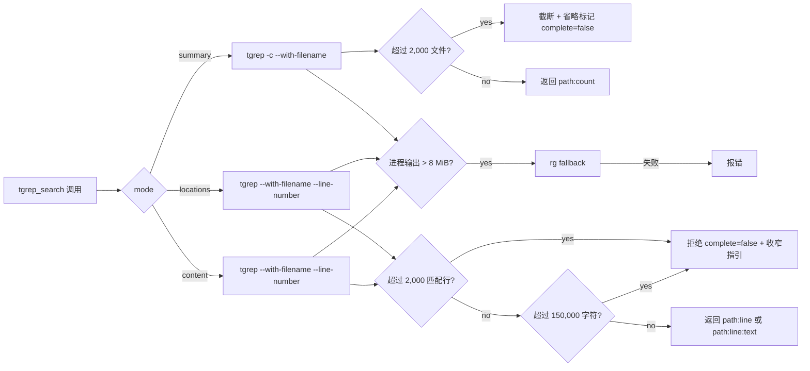

# 迭代 0.36.0 · tgrep probe-first 契约

> 索引见 [`README.md`](./README.md)。

## 速查（cheatsheet）

1. `tgrep_search` 每次返回完整响应；三模式 `summary` / `locations` / `content`（ADR-0.36.0#01）
2. `files_with_matches` 是 `summary` 别名——不引入新形态（ADR-0.36.0#01）
3. 2,000 行预算：detail 超 2k 行拒绝；summary 超 2k 文件截断（ADR-0.36.0#01）
4. 150,000 字符上限关闭长行窗口与探测↔detail 增长竞态（ADR-0.36.0#01）
5. 8 MiB `spawnSync` 缓冲：超限 → `rg` fallback；fallback 失败报错（ADR-0.36.0#01）
6. 上游对齐：summary `tgrep -c`；detail `tgrep --with-filename --line-number`（ADR-0.36.0#01）

---

## 速览（图 + 表）

| Mode | CLI 标志 | 输出形态 | 行数上限 |
| --- | --- | --- | --- |
| 省略 / `summary` | `tgrep -c --with-filename` | `path:count` | 2,000 文件（截断 + 省略） |
| `locations` | `tgrep --with-filename --line-number` | `path:line` | 2,000 行（拒绝） |
| `content` | `tgrep --with-filename --line-number` | `path:line:text` | 2,000 行 + 150,000 字符（拒绝） |
| `files_with_matches` | `summary` 别名 | `path:count` | 2,000 文件（截断 + 省略） |

| 边界 | 值 | 动作 |
| --- | --- | --- |
| 单次调用行数 | 2,000 | 拒绝（`locations`/`content`）/ 截断 + 省略（`summary`） |
| 物化 detail | 150,000 字符 | 拒绝（`locations`/`content`） |
| 进程捕获 | 8 MiB | fallback 到 `rg`；fallback 失败则报错 |

---

### 01. tgrep probe-first 搜索契约
**Status**: ✅ accepted

**Background**: `tgrep_search` 此前返回单条、可能非常宽泛的匹配流。把这条流当作分页游标状态管理会让工具变成有状态的，且需要快照保留、过期、清理与重试语义。v0.36.0 改用两步、probe-first 交互：默认请求先回答"在哪里、有多少"，agent 才会请求具体位置或匹配文本；公开结果契约必须保持完整、无状态、与上游 `tgrep` CLI 对齐。现有实现已验证相关上游行为：`-c --with-filename` 产生 summary 的 `path:count` 行；`--with-filename --line-number` 产生适合 `path:line` 或 `path:line:text` 的 detail；tgrep 出错 fallback 到 `rg`，fallback 保留请求的搜索形态而不透传 tgrep 专属的 corpus-policy 标记。该契约明确排除分页游标、物化快照、以及 OCP 自有的搜索结果磁盘缓存；不移除 tgrep 的上游索引，也不移除用于判定 watcher readiness 的短期 capability 缓存——二者都不向调用方暴露分页结果状态。

**Decision**:

| # | 决策点 | 内容 |
| --- | --- | --- |
| 1 | 探测模式 | 省略 `mode` / `summary` → `path:count`；`locations` → `path:line`；`content` → `path:line:text` |
| 2 | `files_with_matches` | `summary` 的兼容别名（无文件名-仅形态，无新形态） |
| 3 | 重放 | detail 调用重放原始搜索参数并请求目标形态 |
| 4 | 每次响应 metadata | 后端 + 完整匹配文件 / 匹配行合计；`complete: true` 表示成功返回 |
| 5 | 行数上限 | 2,000 行预算：detail 在 2,000 匹配行超出时拒绝并附 `complete: false` + 收窄指引；summary 截断到前 2,000 + 省略标记加 `complete: false`（每文件的部分聚合保持真实；metadata 合计保持完整） |
| 6 | 字符上限 | 物化 detail 另受 150,000 字符上限（长行窗口、增长竞态） |
| 7 | 进程捕获 | 8 MiB `spawnSync` 缓冲：`request → summary probe or detail search → process output ≤ 8 MiB → complete response`；超出/失败 → `rg` fallback；fallback 也失败时报错（不是 partial-result 协议） |
| 8 | 上游对齐 | summary `tgrep -c --with-filename`；detail `tgrep --with-filename --line-number`；regex/literal/case/glob/path/`noIndex` 直接透传 |
| 9 | Fallback | `rg` 在 watcher 不可用或 tgrep 失败时仍是正确性 fallback；OCP 不持久化、快照或分页任一后端的结果 |

**Rationale**:

- **宽泛搜索默认紧凑**——省略 `mode` 返回每文件 `path:count` 探测，让 agent 先看到"在哪里、有多少"再请求行；detail opt-in
- **每次成功响应都完整**——无游标存储、无 offset 重放；重放参数可从请求重现，不依赖服务端状态
- **无状态 + 仅重放**——工具不保留结果状态；无快照保留、过期、失效、清理或重试语义
- **OCP 使用文档化的上游 CLI 输出**——summary 用 `tgrep -c --with-filename`，detail 用 `tgrep --with-filename --line-number`；无平行取回协议
- **明确的响应大小边界**——2,000 行预算 + 150,000 字符上限 + 8 MiB 缓冲；detail 在行预算超出时拒绝并附收窄指引，不淹没调用方上下文
- **`files_with_matches` 作为 `summary` 别名保留**——既有调用方继续拿到 summary 表示，不引入新形态

**Rejected**:

| 被否方案 | 否因 |
| --- | --- |
| 游标快照 | 需要结果保留、过期与失效规则、清理，以及分页间仓库变更的语义；让工具结果默认不完整——正是 v0.36.0 要规避的状态管理成本 |
| 以参数重放为主 API | 无状态但 agent 必须推理分页边界；文件变更时会漏匹配或重复匹配；也不为宽泛搜索提供紧凑的首答 |
| 文件数超过 2,000 时 summary 单纯拒绝 | 让调用方失去更粗的收窄模式；改为 summary 截断并附省略标记、按文件保持完整，同时 detail 拒绝（因为没有更粗形态可回退） |
| OCP 自有的搜索结果磁盘缓存 | 持久化违反无状态契约；tgrep 上游索引与短期 watcher-readiness 缓存保持内部执行关注，不作为结果分页机制 |

**Impact**:

- **Agent UX**——小而完整的 summary 先；仅在 summary 识别出需要 detail 的文件时再发起第二次调用；绝不面对无界结果转储
- **API 表面积**——`tgrep_search` 三种模式（`summary` / `locations` / `content`）加 `files_with_matches` 别名；一个 `complete` 字段；每种模式对应一种 `path:count` / `path:line` / `path:line:text` 形态
- **实现**——`plugins/tgrep.ts`、`plugins/tgrep/tgrep-search.ts`、`plugins/tgrep/tgrep-mode.ts`、`plugins/tgrep/tgrep-output.ts` 实现 mode / summary / fallback / 缓冲 / 形态契约；`plugins/tgrep/tgrep-tool-description.md` 是公开权威描述；`tests/test-tgrep-search-unit.ts` 锁定契约
- **边界**——匹配行 2,000 行预算使 detail 在行数超出时拒绝、summary 在文件数超出时截断；物化大小 150,000 字符上限使 detail 在超出时拒绝；8 MiB `spawnSync` 是进程捕获天花板，`rg` fallback
- **无状态**——无游标存储、无快照失效、无保留策略、无磁盘清理；调用可由参数重现
- **调用方工作流**——触发 2,000 行 / 150,000 字符 / 8 MiB 边界时，调用方收窄 `path` / `glob` 后重跑；summary 超过 2,000 文件时调用方按文件下钻
- **上游对齐**——tgrep 出错 fallback 到 `rg`；fallback 保留请求的搜索形态而不透传 tgrep 专属的 corpus-policy 标记
- **迁移**——无；既有用 `files_with_matches` 的调用方继续拿到 summary 表示

**Future extensions**:opencode 未来需要次-prompt-token summary 以应对超宽泛搜索时，可加一个每文件 `path:count` 形态作为别名——`summary` 本身保持稳定探测。