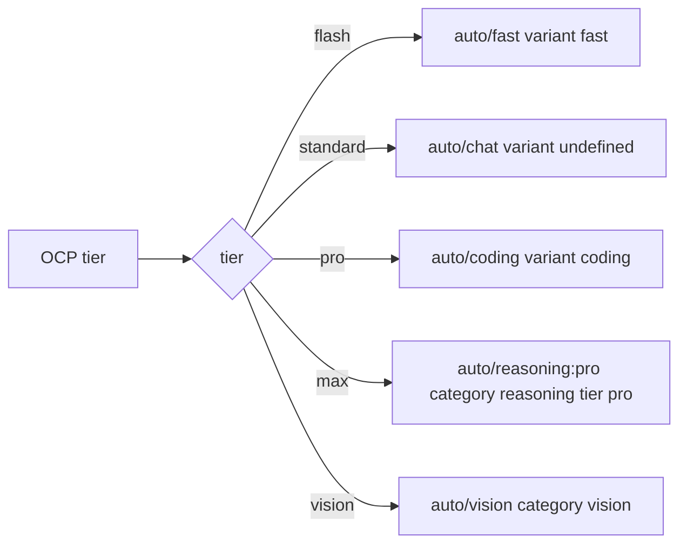

# 迭代 0.38.0 · OmniRoute 网关 profile

> 索引见 [`README.md`](./README.md)。

## 速查（cheatsheet）

1. profile 把五个 tier 映射到与角色匹配的 `omniroute/*` channel（ADR-0.38.0#01）
2. provider preset 基于 `@ai-sdk/openai-compatible`；仅 env-var（ADR-0.38.0#01）
3. 文档化 `auto/<category>` 语法，不用 legacy `auto/best-*` 别名（ADR-0.38.0#01）
4. profile 可移植：仅环境变量配置，无部署侧钉死（ADR-0.38.0#01）
5. 已知缺口：`auto/reasoning:pro` 无 quality-weight 偏向；`pro <= max` 不被保证（ADR-0.38.0#01）

---

## 速览（图 + 表）

| Tier | Channel | engine 语义 |
| --- | --- | --- |
| flash | `auto/fast` | variant `fast` = ship-fast 权重（latency-first） |
| standard | `auto/chat` | variant `undefined` = balanced default |
| pro | `auto/coding` | variant `coding` = quality-first 权重、taskFit-heavy |
| max | `auto/reasoning:pro` | category `reasoning` = reasoning-capable；tier `pro` = premium pool |
| vision | `auto/vision` | category `vision` = vision-capable only |

| Operator 切换下的存活 | 是否存活 |
| --- | --- |
| `hidePaidModels` | `auto/fast`、`auto/chat`、`auto/coding`、`auto/vision` 存活（非 paid-tier）；`auto/reasoning:pro` 被移除（`:pro` 后缀 + `isPaidTierAutoId()`） |

---

### 01. OmniRoute 网关 profile
**Status**: ✅ accepted

**Background**: OCP 发货分层 profile，把每个 tier 映射到一个具体模型或 channel。本次新增一个针对自托管 OmniRoute 网关的内置 profile——一种按请求时刻根据健康、配额、成本、延迟、任务匹配信号挑选模型的 `auto/*` channel 模型路由器。两个新 ship 文件：`profiles/router/omniroute-auto.json`（把五个 tier 映射到 `omniroute/*` 模型引用的内置 OCP profile）与 `providers/omniroute.json`（配套 provider preset，基于 `@ai-sdk/openai-compatible`，`baseURL: {env:OMNIROUTE_BASE_URL}`、`apiKey: {env:OMNIROUTE_API_KEY}`，列出网关所宣传的 38 个 `auto/*` channel 加一个裸 `auto`）。决策点在于：在网关文档化的 `auto/<category>` 语法与 legacy flat 别名并存的情况下，每个 tier 应解析到哪个通道。

**Decision**:

| # | 决策点 | 内容 |
| --- | --- | --- |
| 1 | flash | `auto/fast`（variant `fast` = ship-fast 权重，latency-first） |
| 2 | standard | `auto/chat`（variant `undefined` = balanced default） |
| 3 | pro | `auto/coding`（variant `coding` = quality-first 权重，taskFit-heavy） |
| 4 | max | `auto/reasoning:pro`（category `reasoning` = reasoning-capable 模型；tier `pro` = premium pool） |
| 5 | vision | `auto/vision`（category `vision` = vision-capable 模型 only） |
| 6 | 语法 | 文档化 `auto/<category>` 优于 legacy `auto/best-*` 别名——5 个 tier 中 4 个 engine-identical，但 legacy 名称会误导且上游标记为 "legacy flat template" |
| 7 | Provider preset | 基于 `@ai-sdk/openai-compatible`；`OMNIROUTE_BASE_URL` + `OMNIROUTE_API_KEY` 设置前保持惰性 |
| 8 | 可移植性 | 仅用环境变量配置；无部署侧模型钉死或 fitness 覆盖 |

**Rationale**:

- **每个 tier 的 channel 匹配其角色**——flash 要延迟、standard 要 balanced、pro 要质量、max 要推理、vision 要视觉
- **文档化语法优于 legacy 别名**——文档化 `auto/<category>` 与 legacy 别名 engine-identical 的地方，文档化语法胜出（legacy 名称会误导，例如 `best-chat` 实际解析到 balanced default）
- **profile 保持可移植**——仅用环境变量配置（`OMNIROUTE_BASE_URL`、`OMNIROUTE_API_KEY`）；无部署侧钉死，避免把内置 profile 绑死到具体 operator
- **Operator 切换时尽可能存活**——`auto/fast`、`auto/chat`、`auto/coding`、`auto/vision` 不是 paid-tier id，在 `hidePaidModels` 下仍然存在；只有 `auto/reasoning:pro` 携带 paid-tier 后缀，在 operator 启用 `hidePaidModels` 时被移出宣传目录

**Rejected**:

| 被否方案 | 否因 |
| --- | --- |
| `auto/best-*` legacy 别名 | 在 flash/standard/pro/vision 上 engine-identical，但 legacy 名称会误导（`best-chat` 解析到 balanced default），上游标记为 "legacy flat template" |
| `auto/pro-*` 别名 | 与 `best-*` 同变种，且额外被 `isPaidTierAutoId()` 标记为 paid-tier——在 operator 启用 `hidePaidModels` 时被移出目录 |
| 用裸 `auto` 跑 standard | 网关文档把裸 `auto` 标记为 LKGP-sticky，在参考部署上稳定解析到免费模型（`oc/big-pickle`），`auto/chat` 解析到更强的——sticky-cheap 路径对高流量编排 tier 是降级 |
| 用 `auto/smart` 跑 max | 与 `auto/coding` 是同一套 quality-first 权重加 10% exploration，且不施加 reasoning-capability 过滤——不能区分 max 与 pro |

**Impact**:

- **Provider preset**——`providers/omniroute.json` 列出裸 `auto` 加 38 个 `auto/*` channel；基于 `@ai-sdk/openai-compatible`，环境变量设置前保持惰性
- **内置 profile**——`profiles/router/omniroute-auto.json` 把 flash/standard/pro/max/vision 映射到 `omniroute/fast`、`omniroute/chat`、`omniroute/coding`、`omniroute/reasoning-pro`、`omniroute/vision`——与 provider preset 中的 channel id 一致
- **文档化语法**——匹配上游文档，避开误导性 legacy 名称
- **engine 语义匹配角色**——latency / balanced / quality / reasoning / vision
- **已知缺口**——网关没有把 reasoning 过滤与 quality-first 权重组合的 channel；`auto/reasoning:pro` 不携带权重偏向（`pro` tier 只按成本档过滤池，`deepseek-v4-pro` 与 `deepseek-v4-flash` 同在该池）；`max` 由默认 balanced 权重评分（健康 / 配额 / 成本 / 延迟主导；taskFit 较次），实测解析到最便宜的 premium 推理模型（`deepseek-v4-flash`）；`pro <= max` 阶梯**不被**此 profile 保证；修复需要在更强模型上部署侧 `user_override` fitness 条目或钉死具体模型 id——都超出可移植内置 profile 范围
- **Operator 切换**——`auto/reasoning:pro` 是 paid-tier id；`hidePaidModels` 把它移出宣传目录，`max` 引用在该类部署上消失；`auto/fast` / `auto/chat` / `auto/coding` / `auto/vision` 不是 paid-tier，在该切换下仍然存活
- **Vision tier**——正确性依赖部署侧 vision-bridge / 模型能力管线，而非 profile；参考部署上图像请求最初 502（vision 路径解析到浏览器驱动的 provider 且其 Chromium 在服务端缺失），经网关的 circuit-breaker 自愈才恢复（根本原因未修）；这是部署侧运行依赖，不是 profile 缺陷

**Future extensions**:为需要 `pro <= max` 阶梯保证的 operator 在 `max` 上部署 `user_override` fitness 条目；上游侧关闭 vision-bridge / Chromium 缺口，让 `vision` tier 不再依赖 circuit-breaker 自愈。