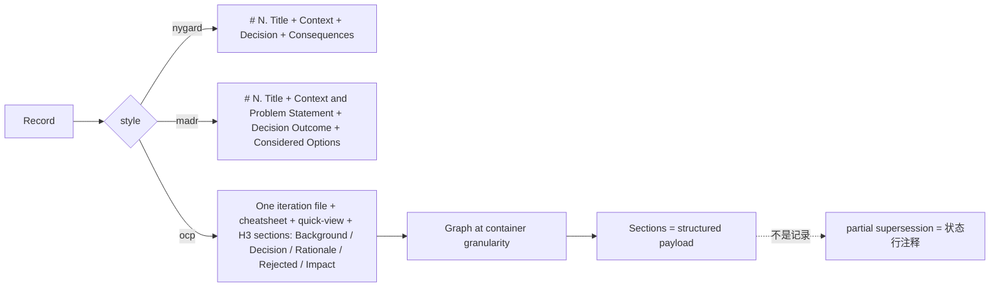
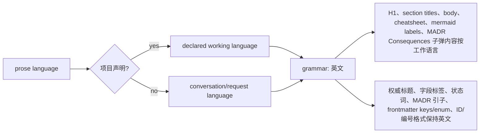

# 迭代 0.40.0 · 多样式 ADL 与 prose 语言策略

> 索引见 [`README.md`](./README.md)。修订（2026-09-18）：`ocp` 重定义为 容器 = 记录、section = 结构化载荷。

## 速查（cheatsheet）

1. 三种样式：`nygard` / `madr` 工业；`ocp` OCP-native 容器（ADR-0.40.0#01）
2. frontmatter 声明 `style`；适配器仅处理自身模板（ADR-0.40.0#01）
3. 编号与样式正交；容器预留整个 `<b>.<i>.*` 命名空间（ADR-0.40.0#01）
4. 图关系在 CONTAINER 粒度；section 是结构化载荷（ADR-0.40.0#01）
5. `/adr init` 发货 `standard` / `evolution` / `ocp` / `custom` 套件（ADR-0.40.0#01）
6. 语法固定英文；prose 按工作语言起草（ADR-0.40.0#02）

---

## 速览（图 + 表）

| 维度 | 语法（英文，永不翻译） | Prose（工作语言） |
| --- | --- | --- |
| 标题 | 权威 `## Context` / `## Decision Outcome` / `## Considered Options`；ocp `## Cheatsheet` / `## Quick view` | ocp H3 section 标题 `### 01. <title>`；H1 标题 |
| 字段标签 | `**Status**:` / `**Background**:` / `**Decision**:` / `**Rationale**:` / `**Rejected**:` / `**Impact**:` / `**Future extensions**:` | — |
| 状态词 | `✅ accepted` / `🟡 proposed` / `🔄 superseded` / `⛔ deprecated`（固定协议 token, 可 grep） | — |
| MADR 标签 | `**Positive**` / `**Negative / Risks**`；引子 `Chosen option: …, because …` | Consequences 子弹内容 |
| Frontmatter | keys + enum values（`status: accepted`）；`style:` | — |
| ID / 编号 | `0001.`、`### 01.`、`ADR-0.2.54#01`；数字文件名前缀；ASCII slug | — |
| 正文内容 | — | 背景 / 决策 / 理由 / rejected 理由 / 影响内容 |
| Cheatsheet / Mermaid | Cheatsheet 标题 | 结论行；mermaid 节点标签 |

---

### 01. 多样式 ADL 与 universal protocol
**Status**: 🟡 proposed

**Background**: `adr-guard` 插件围绕单一 MADR 形态模板成长，采用目录内编号、基于路径的引用、以及硬编码的 `feat`/`refactor` 门禁。`docs/plan/adr-multistyle-adl-refactor.md` 计划把该设计与业界实践与 OCP 工程纪律对照审查，提出八个决策点改变本项目（及其使用者）记录架构决策的方式：是否在业界模板之外保留专有 `ocp` 记录样式；新源文档是否强制 `style` frontmatter；记录 ID 是否在整 ADL 跨点号迭代 ID 全局唯一；演进 metadata 怎么分组（基准 / 迭代 vs. 域 / 重构主题）；universal protocol 层（不可变已接受语义、supersession、AI 起草 / 人类决策、可读性）是否对每种样式生效；编号策略（顺序默认 | 迭代点号 ID）是否与样式正交；治理选项（严格强制模式 + AI 辅助项目默认治理）；以及 `/adr init` 是否暴露套件（`standard` / `evolution` / `ocp` / `custom`）而非散装选项。没有更早的 ADR（0001–0006）记录本决策要替换的 ADR 工具指南，所以本记录无 supersession；本记录是增量的。

**Decision**:

| # | 决策点 | 内容 |
| --- | --- | --- |
| 1 | 样式 | `nygard` + `madr` 是 interop 模板；`ocp` 是 OCP-native 容器样式（OCP 语法）——本次重构的适配器是它们自己的第一个用户 |
| 2 | 容器形态 | 一个迭代文件一份记录（`ADR-<baseline>.<iteration>`，stem `0.2.54-slug.md`）；每个 section 是 H3 简短形式 `### 01. <title>`（权威 ID `ADR-0.2.54.01` 从容器命名空间派生，不在标题中拼写）；sections 承载 5 段骨架（background/decision/rationale/rejected/impact）+ emoji 状态行 |
| 3 | 命名空间 | 容器在创建时预留整个 `<baseline>.<iteration>.*` 子 ID 空间；点号语法与单决策记录保持无碰撞 |
| 4 | 图关系 | 在 CONTAINER 粒度上运作；sections 是结构化载荷，不是记录；部分 supersession = 状态行注释 + prose 交叉引用（OCP 实践） |
| 5 | 重述层 | Cheatsheet / quick-view 是容器正文内容（作者自创，受 prose-wins 红线约束）；跨记录视图保持生成 |
| 6 | `style` frontmatter | 新源文档强制声明（`nygard` / `madr`）；重构前的无样式文档仍作为 `legacy` 可读；转换仅经 `/adr migrate --to`（显式，先 dry-run） |
| 7 | ID 唯一性 | 顺序（`ADR-0001`）与点号（`ADR-0.2.54.01`）语法不相交；ID 永久冻结——永不重用、永不重新编号 |
| 8 | 演进分组 | 任何样式上的可选 `baseline` / `iteration` metadata；由 `INDEX.by-iteration.md` + `/adr context --iteration` 重建——不手工维护，也不成为多入口容器文件 |
| 9 | Universal protocol | 对每种样式生效；治理模式（`none` / `review` / `strict`）决定强制，而非按样式方言 |
| 10 | 编号 | 与样式正交；迭代 ID 仅在 `--baseline` / `--iteration` 传入时分配——永不臆造迭代值 |
| 11 | 严格治理 | 延后（只按需构建，在合格记录上）；AI 辅助项目默认 `review` |
| 12 | Init 套件 | `standard` / `evolution` / `ocp` / `custom`——持久化解析后的 `adr.*` 值 + 信息性 `adr.suite` 标签 |

**Rationale**:

- **一个适配器接口，一个标准化记录模型**——索引、树、history、完整性校验在样式间行为一致
- **`ocp` 重定义为 容器 = 记录、section = 结构化载荷**——审计把入口骨架与文件形态混淆；骨架映射到 MADR，文件形态不；重定义后 `ocp` 不再违反记录模型；图保持一份文件一份记录的运作方式；之前致命的"多入口容器"反对意见只适用于把 section 当记录处理
- **严格的样式隔离**——适配器只脚手架 / 解析 / 校验 / 格式化自身模板；样式之间不泄露；MADR 专属 section（Considered Options、Decision Drivers）在 Nygard 中无归宿，经 `--to nygard` 迁移时会被丢弃
- **命名空间预留让 ID 语法无碰撞**——迭代容器在创建时预留整个 `<baseline>.<iteration>.*` 子 ID 空间；单决策 ID 永不签发到已占用的迭代下
- **Universal protocol 层优于按样式方言**——治理模式决定强制；不可变已接受语义、supersession、AI 起草 / 人类决策、可读性对每种样式生效
- **编号与样式正交**——容器 `ADR-<baseline>.<iteration>` 与顺序 `ADR-NNNN` 仅在项目按迭代分组时共享分配器
- **`evolution` profile 作为可选 OCP 纪律**——非空的 Considered Options（每项有 cons）、好 / 坏 Consequences 分裂、`risk: high` 记录要求 Confirmation
- **`/adr init` 套件优于散装选项**——观点化打包降低决策疲劳，一次性钉死解析后的 `adr.*` 值

**Rejected**:

| 被否方案 | 否因 |
| --- | --- |
| 选项 A——把专有 `ocp` 模板作为第三样式保留但不重定义 | 审计把骨架与文件形态混淆；重定义让选项 A 变得可被采纳 |
| 选项 C——仅一种样式（MADR），丢掉 Nygard | 解析器表面积最简，但会锁死按原始 Nygard 语法标准化的团队 |
| 隐式 / 未声明样式 | 无 `style` frontmatter 的遗留文档经 MADR 适配器解析并保留 `legacy`；转换是显式的，永不静默 |
| 目录内编号 | 驳回，采用整 ADL 全局唯一 ID |
| 手工维护的演进快捷引用 | 基于共享 metadata 生成的 per-iteration 视图是单一真相源 |
| 按样式私有治理 | universal protocol 层对每种样式生效 |
| 编号嵌入样式 | 编号与样式正交 |
| 立刻机械严格门禁 | 延后；`/adr init` 把 AI 辅助项目默认 `review` |
| 散装选项 | 发货观点化 init 套件（`standard` / `evolution` / `ocp` / `custom`） |
| 通过 `/adr migrate --to` 把 `ocp` 迁过来 | 容器语法按文件无法达成；通过创建容器（`/adr new --style ocp --baseline <b> --iteration <i> <title>`）接纳 `ocp` |

**Impact**:

- **插件**——三个解析器（每样式一个适配器）共享一个标准化记录模型；`legacy` 审计（`/adr check --report-style`）让混合样式 ADL 中的文档保持诚实
- **迁移**——显式且先 dry-run；保留 `created`、`date`、状态、所有引用原文；写完校验为可重新解析为目标样式；MADR 专属 section（Considered Options、Decision Drivers）在 Nygard 中无归宿，经 `--to nygard` 时会被丢弃
- **OCP 容器**——第二种写入形态（`/adr section ADR-<容器> <标题>` 追加 section）；分配器绝不能绕过的命名空间预留；section 是结构化载荷，不是记录
- **生成索引**——渲染每条记录的样式；`/adr history` 与 `/adr context` 跨样式遍历关系
- **Supersession**——跨样式 supersession 生效因为引用是 ID 而非路径；单个 section 的部分 supersession 仍是状态行注释 + 正文交叉引用——不是图边
- **`adr-guard` 提交门禁**——保持较窄；启用时为 `feat` 与 `refactor` 提交强制 ADR 覆盖；不是迭代分类器，不替代架构判断
- **ID 语法**——顺序（`ADR-0001`）、单决策点号（`ADR-<基准>.<迭代>.<序号>`）、容器（`ADR-<基准>.<迭代>`）、容器 section（`ADR-<容器>#NN` 经 `#` 片段）；四种不相交语法不能碰撞；ID 永久冻结

**Future extensions**:标准化记录模型在足够多团队间稳定时，把 `adr-guard` 严格门禁从 `feat` / `refactor` 扩展到其他提交类型；加一个可选 `ocp` 严格 profile，要求每个 section 声明非空的 `Considered Options` 块作为第五段骨架字段；允许 `ocp` 容器声明每个 section 的非空 `Considered Options` 块，作为想要 section 粒度 OCP 入口骨架的第五骨架字段。

### 02. ADR prose 语言策略
**Status**: 🟡 proposed

**Background**: 三种 adr-guard 记录样式（nygard / madr / ocp）把它们的语法——权威标题、字段标签、frontmatter 键与枚举值——锁定到单一英文权威（`adr-types.ts` 的 `LANG_PAREN_RE`，适配器的 `FIELD_LINE_RE`）。这是解析稳定性与跨仓库互操作性的基石，不可协商。但宪法（ADR-0.40.0#01）与协议层从未规定 prose 用什么语言：现有规则仅仅是"prose 是作者的选择"。"允许任意语言"在工程上等于"没有规则"：脚手架占位只有英文、既有样本语料只有英文、草稿协议对语言沉默。这三种偏差叠加，LLM 起草的记录漂移到脱离团队语言环境的 prose——非英文团队拿到他们主要读者读起来蹩脚的架构记录。本决策要回答：prose 语言是自由选择，还是由语言环境驱动的确定性规则？

**Decision**:

| # | 决策点 | 内容 |
| --- | --- | --- |
| 1 | 优先级 | 项目级声明（init / config 钉死）优先；缺失时按起草时刻的对话 / 请求语言决定 |
| 2 | Prose（工作语言） | H1 标题；ocp section 标题 `### 01. <标题>`；所有正文 prose（背景 / 决策 / 理由 / rejected 理由 / 影响内容）；Cheatsheet 结论行；Mermaid 节点标签；MADR Consequences 子弹内容 |
| 3 | 语法（英文） | 权威 section 标题；ocp 字段标签；ocp section emoji 后的状态词（`✅ accepted` / `🟡 proposed` / `🔄 superseded` / `⛔ deprecated`——与 frontmatter 枚举呼应的固定协议 token）；MADR Consequences 标签；MADR 引子 `Chosen option: …, because …`；frontmatter 键 + 枚举值；ID + 编号格式；数字文件名前缀；ASCII slug；ocp 脚手架引文与 `## Cheatsheet` / `## Quick view` 标题 |
| 4 | Emoji | 语言中立的状态信号；解析只识别 emoji（`✅🟡🔄⛔`）；其后的词是装饰 |
| 5 | Rejected 分隔符 | ASCII 冒号（`REASON_SPLIT_RE` 不识别全角冒号），与工作语言无关 |
| 6 | 三段式落地 | 协议文档（`adr-guard-protocol.md`）吸收零散的语言注释；插件源码保持零中文（工程红线）；三样式样本库作为双语手册的一部分发货——英文树 `docs/workflows/adr-samples/`、中文树 `docs/zh/workflows/adr-samples/`——同构语料 |
| 7 | 生效 | 自本记录接受之时起对所有新记录生效 |

**Rationale**:

- **可读性**——记录的主要读者是团队本身；prose 应采用团队环境决定的那种语言
- **解析器稳定性**——本地化语法标签会彻底破坏 `headingLineRe` / `FIELD_LINE_RE`，让三个适配器与既有语料全部失效
- **环境确定性**——prose 语言必须由环境唯一派生（项目级声明优先，否则按起草时刻对话 / 请求语言），绝不按草稿即兴
- **生成偏差**——LLM 通过强烈模仿脚手架占位与既有样例起草；无指定规则会让偏差决定输出
- **样本保真**——样本语料必须能从既定规则派生，否则样本失去教学价值
- **一个概念一个词汇**——emoji + 状态词 token 是与 frontmatter 枚举呼应的固定协议 token；只有在状态词保持英文时，跨语言树的可 grep 性才能保留

**Rejected**:

| 被否方案 | 否因 |
| --- | --- |
| 仅英文记录 | 解析器与搜索最简，但非英文团队付出永久阅读成本，与"主要读者是团队本身"矛盾 |
| 现状（prose 语言未规定） | 零变更，但英文偏差持续，输出随每个起草者的即兴而漂移 |
| 语法也本地化（随环境翻译标题 / 标签） | 可读性最佳，但 `headingLineRe` 彻底失效、跨团队互操作为零——直接被 ADR-0.40.0#01 §7 严格样式隔离驳回 |
| 用全角冒号作为 rejected 选项分隔符 | `REASON_SPLIT_RE` 不识别全角冒号；分隔符是 ASCII 冒号，与工作语言无关 |

**Impact**:

- **可读性**——每个团队以其环境决定的语言读记录；脚手架、协议、样本偏差指向同一方向
- **解析器**——零变更；既有语料与所有测试继续有效
- **插件源码**——保持零中文（工程红线）；三个适配器的脚手架占位保持英文；以英文提示（`in the working language`）引导起草者按语言环境填充 prose
- **协议**——`adr-guard-protocol.md` 吸收零散语言注释（`styles/ocp.ts` 头注释、`adr-types.ts` 中的 `LANG_PAREN_RE`、协议原有的"Reading aids vs grammar"一节），把该规则提升到草稿协议；冲突时本节胜出
- **样本库**——三样式样本库作为双语手册的一部分发货，英文树 `docs/workflows/adr-samples/`、中文树 `docs/zh/workflows/adr-samples/`——同构语料展示同一语法在不同语言环境下渲染 prose
- **多语言仓库**——必须在 init 时钉死工作语言，否则 prose 语言会在同一 ADL 内随起草会话波动
- **互操作性**——保留英文 `Chosen option` 引子是互操作性妥协（解析器不强校验该行，但保留对上游 MADR 模板的忠诚）
- **全文搜索**——必须留意 prose 与标签之间的语言分隔
- **采纳**——本记录自身以英文 prose 起草，尽管起草对话使用中文；本 ADL 的项目级工作语言为英文（0001–0007 号记录），项目声明优先于对话语言——正是上述优先级规则

**Future extensions**:多语言仓库需要按 section 的语言覆盖（例如一份以英文为主的 ADR 中的一节记录只面向中文子系统的文档）时，把工作语言派生扩展为接受 section 级注释，仍然从项目声明继承语法；无论如何保留 ASCII 冒号作为 rejected 选项分隔符。