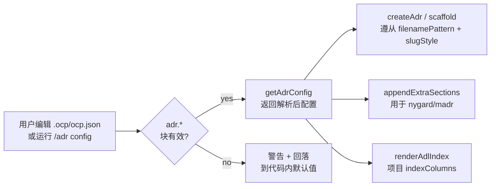

# 迭代 0.40.1 · 项目级 ADR 覆盖

> 索引见 [`README.md`](./README.md)。修订 / 取代：—。
>
> Cheatsheet 与 quick view 是重述层：图 / 表只重述 section 散文、绝不新增事实——冲突时以散文为准。
> 修订 / 取代关系声明在各 section 的状态行；
> 已接受语义一个字符都不动。

## 速查（cheatsheet）

1. `/adr config` 覆盖全部 8 个 `adr.*` 键；数组以 JSON 持久化 (ADR-0.40.1#02)
2. `.ocp/ocp.json` 损坏时渲染上一次良好的配置表 (ADR-0.40.1#04)
3. 协议正文是 L2 skill——仅在 ADR 意图时加载 (ADR-0.40.1#03)
4. OCP 容器对 `extraSections` opt-out——经 `/adr section` 扩展 (ADR-0.40.1#01)
5. 每回合 system prompt 成本 ~5200 → ~254 tokens（-95%）(ADR-0.40.1#03)
6. 四个覆盖键为 opt-in；默认值逐字节不变 (ADR-0.40.1#01)

---

## 速览（quick view）

| 维度 | 之前（0.40.0） | 之后（0.40.1） |
| --- | --- | --- |
| 文件名模式 | 硬编码 `${id}-${slug}.md` | 可配置 `adr.filenamePattern` |
| Slug 样式 | 仅 kebab | `adr.slugStyle`：kebab \| snake \| lower |
| 额外 H2 section | 无（仅样式适配器） | `adr.extraSections`（仅 nygard/madr） |
| INDEX.md 列 | 固定 8 列形状 | `adr.indexColumns` 投影 |
| 每回合 system prompt | ~5200 tokens（完整协议正文） | ~254 tokens（提示 + 配置表） |

---

### 01. 项目级覆盖——字段、默认值、语义

**Status**: 🟢 Accepted
**Background**: ADR-0.40.0 收拢了多样式 ADL 语法（nygard / madr / ocp），并把文件名模板 `${id}-${slug}.md` 加 kebab slugify 钉为规范行为。下游项目反复要求项目本地控制——下一个 package 团队想要带 snake_case slug 的 `ADR-{id}-{slug}.md`；另一个想给每份脚手架出的 MADR 追加 `## Risks` 与 `## Notes`。Phase-7 之前这些行为硬编码在三个适配器与引擎中，没有成文的扩展点。

**Decision**:

| # | 决策点 | 内容 |
| --- | --- | --- |
| 1 | Schema 扩展 | 在 `.ocp/ocp.json` 既有的 `adr.*` 块上扩展四个新的 OPT-IN 键；不加顶层字段，不加新文件。 |
| 2 | `adr.filenamePattern` | 字符串模板。必须有 `{id}` 占位符；`{slug}` 可选。折叠空白；游离占位符剥除并给一次性警告。默认 `{id}-{slug}`（Phase-7 前行为）。 |
| 3 | `adr.slugStyle` | 枚举：`kebab`（默认）/ `snake` / `lower`。驱动 `createAdr` 与 `createAdrContainer` 共用的 `slugify(title, style)`。 |
| 4 | `adr.extraSections` | H2 标题行数组（`## Risks` 等）。追加到 nygard/madr 脚手架该样式最后一个规范 section 之后；OCP 容器刻意不参与（见 ADR-0.40.1#01）。空数组 = 无操作。 |
| 5 | `adr.indexColumns` | 数组取值限于 8 个规范列（`id`、`title`、`style`、`layer`、`status`、`domain`、`iteration`、`created`）。重排 / 收窄 INDEX.md 表；缺列单元格渲染为空。默认 = 完整 8 列形状（与 Phase-7 前逐字节一致）。 |
| 6 | 非法值行为 | 一次性控制台警告 + 静默回落到代码内默认值。永不抛错——沿袭 ADR-0.40.0 的 `governance` 警告惯例。 |
| 7 | 向后兼容 | 每个默认值都精确复现 Phase-7 前的输出（由 `test-adr-project-overrides-unit.ts: test12_BackwardCompat_NoOverrides` 验证）。既有项目不改任何配置即再生成逐字节一致的 INDEX.md 并写出 `NNNN-slug.md` 文件名。 |

**Rationale**:

- **为什么放在 `adr.*` 而非新文件**：契约成文于 ADR-0.35.0——每个 artifact 一个路径，全部项目级开关都在 `.ocp/ocp.json`。加 `.adr/config.yaml` 会制造第二个会漂移的真相源。
- **为什么 opt-in 而非 opt-out**：每个默认值都复现 Phase-7 前行为。忽略新键的项目看不到任何变化；表面积纯增量。
- **为什么四个键而非一个巨型配置**：每个键对应一个引擎面（命名、slug、正文、视图）。拆开让项目只覆盖一处、不连带继承他处的观点。
- **为什么 OCP 对 `extraSections` opt-out**：ADR-0.40.0 §7 修订钉死了 OCP 容器语法——Cheatsheet、Quick view、然后每 section 一个 H3 块；注入 H2 要么被忽略、要么破坏 `validate()` 的结构检查。给容器加 section 的正道是 `/adr section ADR-x.y.z "<title>"`。

**Rejected**:

| 被否方案 | 否因 |
| --- | --- |
| 按样式插件（每个下游新增 `styles/<team>-madr.ts`） | 强迫每个项目发货 TS 代码；绕开 JSON 配置契约；与 §7 "样式零串扰"规则冲突。 |
| `.adr/config.yaml` 边车文件 | 第二个真相源——与 `.ocp/ocp.json` 漂移；ADR-0.35.0 为强制严格 JSON 已明确退役 `.jsonc` 旧路径。 |
| 环境变量（`ADR_FILENAME_PATTERN` 等） | 非项目本地；无法跨项目 diff；破坏 `git commit -m "docs: bump ADR filename pattern"` 审计线索。 |
| 把 `extraSections` 也应用到 OCP 容器 | 破坏容器语法校验器（`validate()` 会标记未知 H2 section）；OCP 的 section 语法本身就是扩展点。 |
| 新的顶层 `.ocp/ocp.json` 字段（`adrFilenamePattern` 等） | 重新引入 ADR-0.35.0 §6.4 已废弃的扁平键旧模式；嵌套 `adr.*` 块才是未来归宿。 |

**Impact**:

- **插件**——`adr-guard-config.ts` 新增 4 个 normalizer 与 `setAdrOverrideField` / `clearAdrOverrideField` 辅助函数；`adr-engine.ts` 导出 `slugify(title, style)`、`renderAdrFilename(pattern, id, slug)` 与 `appendExtraSections`；`adr-views.ts` 接受 `IndexColumn[]` 投影；无插件 manifest 变更，全部接线经 `getAdrConfig()`。
- **运行时**——`system.transform` 注入在每次请求读取 `getAdrConfig()`，会话中途编辑 `.ocp/ocp.json` 的项目在下一次 ADR 脚手架即见新行为；INDEX.md 再生成在下一次写入时采用新列。
- **分发器**——新增命令族 `/adr config [key] [value]` 与 `/adr config reset <key>`，在 `handleAdrConfigCommand` 中处理，与 `/adr layout`、`/adr init`、`/adr migrate` 并列；分发器本身零变更。
- **安装器**——无；schema 扩展位于 `.ocp/ocp.json`，不在 `install/options.jsonc`（仅安装期）。
- **测试**——新测试文件 `test-adr-project-overrides-unit.ts`（90 个用例）覆盖 schema 校验、默认值、set/clear 往返、逐字节向后兼容、端到端 `createAdr` 遵从配置、INDEX 列投影；既有 95 个 ADR 测试原样通过。
- **文档**——本 ADR（0.40.1）为权威记录；`commands/adr-guard-config`（无独立命令文件，像 `/adr-guard` 一样程序化注册）经 `guard.adr.configList` 打印当前解析后的配置。

**Future extensions**:

- `extraSections` 的 `--strict` 模式：可配置宽限期后 H2 仍为空则让 `validate()` 失败——适合想强制填满 section 的项目。
- `adr.frontmatterExtras`——每次脚手架追加的额外 frontmatter 字段（`extraSections` 在 YAML 块上的对应物）。
- `adr.dateFormat`——下游坚持 ISO 周或纪元时间戳时覆盖 `YYYY-MM-DD`。

### 02. `/adr config`——一条命令覆盖全部八个键

**Status**: 🟡 Proposed
**Background**: Phase 7.0 交付的 `/adr config` 只覆盖四个 Phase-7 覆盖键——`/adr config style madr` 被拒，因为套件字段不属于覆盖键。项目要改单个套件字段就得手改 `.ocp/ocp.json` 或重跑 `/adr init`。数组型覆盖还被序列化为带引号字符串而非 JSON 数组——一个双重编码 bug。

**Decision**:

| # | 决策点 | 内容 |
| --- | --- | --- |
| 1 | 类型改名 + 扩容 | `AdrOverrideKey` → `AdrConfigKey`；4 → 8 键，新增套件字段 `style` / `numbering` / `layout` / `governance`。 |
| 2 | 统一写入路径 | `setAdrConfigKey` 先经字段自身的 normalizer 校验，再经 `upsertAdrBlock` 持久化——即 `/adr init` 的保注释手术。 |
| 3 | 统一清除路径 | `clearAdrConfigKey` 从嵌套块移除该键；键缺失 = 代码内默认值，覆盖键与套件字段一视同仁。 |
| 4 | 数组序列化 | `extraSections` / `indexColumns` 以 JSON 数组字面量持久化——终结 `"[\"## Risks\"]"` 双重编码 bug。 |
| 5 | 无参列出 | `/adr config` 无参时渲染全部 8 键，各标记 `config`（块内已设）或 `default`（回落）。 |

**Rationale**:

- **一条写入路径**：套件字段与覆盖键共享嵌套 `adr.*` 块，因此共享同一个保注释 upsert；两个写入者必然漂移。
- **Normalizer 复用**：`/adr init` 与 `/adr config` 对每个字段接受完全相同的值——每字段一个校验器，无需维护第二套判定。
- **JSON 字面量而非字符串**：双重编码的数组在下一次读取时过不了 normalizer——写入"成功"，值静默消失回默认值。
- **知情 reset**：`config` / `default` 来源标签显示项目实际设置了哪些值，`reset` 决策因此是知情的、不是盲目的。

**Rejected**:

| 被否方案 | 否因 |
| --- | --- |
| 维持 4 键范围（现状） | 为改一个键，套件字段迫使手改 `.ocp/ocp.json` 或完整重跑 `/adr init`。 |
| 套件字段用顶层键 | 复活 ADR-0.35.0 §6.4 已废弃的扁平键布局；嵌套 `adr.*` 块才是唯一归宿。 |
| 无逐字段校验的通用 JSON 写入器 | 非法 `style` 会被持久化、到读取时才以警告降级；校验属于写入关口。 |

**Impact**:

- **插件**——`adr-guard-config.ts`：`AdrConfigKey`（8 键）、`setAdrConfigKey` / `clearAdrConfigKey` / `parseAdrConfigKeyValue`；Phase-7 的 `setAdrOverrideField` / `clearAdrOverrideField` 辅助函数移除。
- **运行时**——无；`getAdrConfig()` 早已读取全部 8 个块键，本次纯属写入路径修复。
- **分发器**——`/adr config <key> <value>` 接受全部 8 键；无参 `/adr config` 渲染带来源标签的表；未知键仍以 usage 拒绝。
- **测试**——`test-adr-project-overrides-unit.ts`：套件字段往返与数组序列化断言。
- **文档**——速查第 1 条改锚于此。

### 03. 协议 skill 化——两个片段取代正文

**Status**: 🟡 Proposed
**Background**: ADR 协议正文（`adr-guard-protocol.md`，约 5008 tokens）借道 `experimental.chat.system.transform` 在每个对话回合注入 system prompt。system prompt 开启每个 provider 请求，其字节把关整个会话的前缀缓存。约 90% 的回合从不触及 ADR 工作，却每个回合都为完整正文付费。

**Decision**:

| # | 决策点 | 内容 |
| --- | --- | --- |
| 1 | 正文 → L2 skill | 协议正文迁入 `skills/adr-protocol/SKILL.md`；frontmatter description 携带触发词，LLM 在出现 ADR 意图时经 `read_file` 加载。 |
| 2 | `[ADR-GUARD]` 提示 | 实测约 67 tokens——ADR 目录、命令入口、skill 指针。全会话字节稳定。 |
| 3 | `[ADR-CONFIG-RUNTIME]` 表 | 约 187 tokens——全部 8 个 `adr.*` 键 + `adrDir`；每回合从 `.ocp/ocp.json` 确定性重渲染。 |
| 4 | `adrGuard` 范围 | 不再切换 prompt 内容——只控制 `tool.execute.before` 提交门禁；提示始终告知该开关。 |
| 5 | 确定性加载触发 | `/adr new` / `/adr supersede` 回执内嵌"起草前先读 `skills/adr-protocol/SKILL.md`"。 |
| 6 | 剥除卫生 | 每个片段拥有一个 marker 跨度；`stripAllMarkers` 从 marker 剪切到下一个 marker，逐字节还原 prompt。 |

**Rationale**:

- **Provider 前缀缓存**：system prompt 位于每个请求头部；任何字节变化都对其后的一切重新计费，会话历史也在内。字节冻结的片段保持前缀稳定。
- **披露层契合**：约 5 KB 的工作流指南是按需 L2 内容，不是每一步都要付费的铁律——OCP 注入矩阵把工作流路由给 skills。
- **实测收益**：每回合 ~5200 → ~254 tokens（-95%）——普通会话中剩下的唯一每回合 ADR 成本。
- **确定性胜过启发式**：把读取指令内嵌进命令回执，恰在起草开始时触发 skill 加载；单靠发现机制则依赖模型自己注意到。

**Rejected**:

| 被否方案 | 否因 |
| --- | --- |
| 继续注入更短的正文 | 任何正文体量都在 100% 的回合付费——仍在向约 90% 从不起草 ADR 的回合收税。 |
| 把协议摘要进 system prompt | 摘要是第二个协议真相源；会偏离 skill 与记录。 |
| 按 `adrGuard` 状态切换正文 | 翻转开关即改变 prompt 前缀、对整个会话重新计费；应把范围限定在工具门禁。 |
| 仅在检测到 ADR 意图时注入 | Hook 级意图检测是启发式——漏检丢协议，命中破坏字节稳定前缀。 |

**Impact**:

- **插件**——`adr-guard-protocol.md` 删除；`adr-guard-instructions.ts` 构建两个片段；`adr-guard-system-inject.ts` 注入两个独立 marker 跨度。
- **运行时**——每回合成本 ~5200 → ~254 tokens（-95%）；配置不变时渲染逐字节一致的片段（前缀缓存安全）。
- **分发器**——`/adr new` / `/adr supersede` 回执获得确定性 skill 读取行。
- **测试**——`test-adr-guard-unit.ts` 的片段与剥除测试改指向双 marker 契约。
- **文档**——skill description 记录按需契约（Phase 7.8）。
- **Skills**——新增 `skills/adr-protocol/SKILL.md`（347 行）——frontmatter 触发词 + 完整协议正文。

### 04. 配置表 last-good 回落——损坏文件防护

**Status**: 🟡 Proposed
**Background**: `.ocp/ocp.json` 不存在与存在但解析失败时，`readProjectConfig()` 都返回 null——两种状态读取者无法区分。于是手改的一个笔误就让 `[ADR-CONFIG-RUNTIME]` 表静默翻回协议默认值：一张断言项目从未设置之值的表。

**Decision**:

| # | 决策点 | 内容 |
| --- | --- | --- |
| 1 | 损坏检测 | `isProjectConfigCorrupt()` 镜像 `parseConfigFile` 语义——文件存在但 `JSON.parse(stripJsonc(...))` 抛错 = 损坏；文件缺失 ≠ 损坏（默认值在彼处正当正确）。 |
| 2 | Last-good 备忘 | `getAdrConfigRuntimeFragment()` 记忆最近一次解析成功的渲染，文件持续损坏期间继续供给——过时但真实。 |
| 3 | 不记忆损坏态渲染 | 损坏状态下产生的渲染绝不入备忘；首次良好读取即替换备忘。 |
| 4 | 冷启动即损坏 | 尚无备忘（进程面对损坏文件启动）→ 以默认值优雅渲染，依旧不入备忘。 |

**Rationale**:

- **真实胜过新鲜**：这张表是 agent 遵从的策略；损坏期间供给默认值等于宣称用户从未写过的值——比昨天的真相更糟。
- **镜像读取者**：检测运行与配置读取者相同的解析，"损坏"恰好意为"文件存在而读取者返回 null"。
- **自愈**：只记忆解析成功的渲染，文件修好后下一回合即痊愈——无需重启、无需失效钩子。

**Rejected**:

| 被否方案 | 否因 |
| --- | --- |
| 在 `readProjectConfig()` 中区分两种 null | 改变共享读取者对所有消费方的契约；旁路检查把修复限定在说谎的那张表面上。 |
| 损坏期间拒绝渲染 | 片段构建器绝不能因配置打断聊天请求；降级而不抛错是插件惯例。 |
| 渲染默认值并附警告 | 警告会滚出视野；表本身仍展示项目从未设置的值。 |

**Impact**:

- **插件**——`adr-guard-instructions.ts`：`isProjectConfigCorrupt()`、`lastGoodFragment` 备忘、`resetAdrLastGoodFragment()` 测试钩子。
- **运行时**——损坏的 `.ocp/ocp.json` 渲染上一次良好的表；修好文件后下一回合自愈、无需重启。
- **测试**——损坏往返：损坏时供给备忘、修复后重渲染新表、冷启动损坏优雅降级。
- **文档**——速查第 2 条锚于此。
