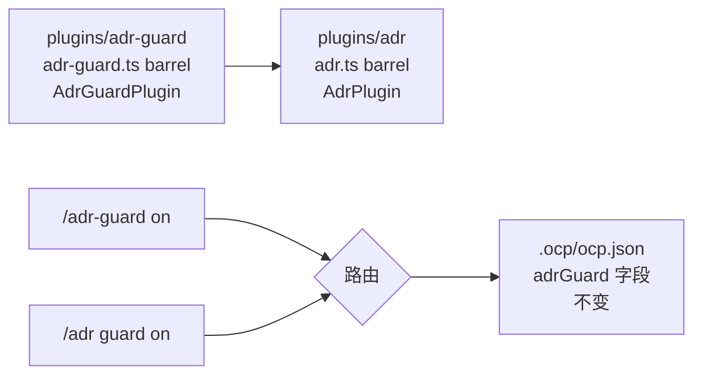

# Iteration 0.40.2 · adr-guard 插件更名为 adr

> 索引：[`README.md`](./README.md)。

## 速查表

1. 插件是完整的 ADR 工作台，提交门禁只是其中一个子模块 —— 应命名为 `adr` 而非 `adr-guard`（ADR-0.40.2#01）
2. `plugins/adr-guard/` → `plugins/adr/`；barrel 为 `adr.ts`；导出 `AdrPlugin`（ADR-0.40.2#01）
3. 开关命令为 `/adr guard on|off|reset|status`；`/adr-guard` 保留为第一类别名（ADR-0.40.2#01）
4. `adrGuard` 配置字段、i18n key、向导 schema 全部不变 —— 零状态迁移（ADR-0.40.2#01）
5. 文件名遵循单一规则：`plugins/adr/` 下一律 `adr-<角色>.ts` —— 名不副实者与注入层去掉 `guard` 前缀，门禁本体即 `adr-tool-guard.ts`；守卫的身份由 `/adr guard`、`[ADR-GUARD]` 拦截消息与文档承载，不在文件名里（ADR-0.40.2#01，2026-09-19 修订）
6. 历史记录不动：`install/versions/*`、`docs/adr/0.x*`、`adr-upgrade-guide`（ADR-0.40.2#01）

---

## 快速视图

| 表面 | 旧 | 新 |
| --- | --- | --- |
| 插件目录 | `plugins/adr-guard/` | `plugins/adr/` |
| Barrel / 入口 | `plugins/adr-guard.ts` / `adr-guard.ts` | `plugins/adr.ts` / `adr/adr.ts` |
| 导出符号 | `AdrGuardPlugin` | `AdrPlugin` |
| 名不副实文件 | `adr-guard-command/-config/-runtime.ts` | `adr-command.ts` / `adr-config.ts` / `adr-runtime.ts` |
| 门禁文件 | `adr-guard-tool-guard.ts` | `adr-tool-guard.ts`（注入层：`adr-instructions/-system-inject/-announce.ts`） |
| 开关命令 | `/adr-guard <state>` | `/adr guard <state>`（含别名） |
| 配置字段 | `adrGuard` | 不变 |
| 侧边栏徽标 | `adr-guard` | `adr` |

---

### 01. adr-guard 插件更名为 adr
**Status**: ✅ accepted

**Background**: 本插件以铁律提交门禁起步，但已长成项目完整的 ADR 生命周期工作台。更名时的实测占比：守卫专用钩子（`tool-guard`、`system-inject`、`instructions`、`announce`）仅占该目录代码的约 15%；`adr-engine.ts`（47.6K）、`adr-views.ts`（28.7K）、`adr-migration.ts`（22.6K）、`adr-evolution.ts` + `adr-governance.ts`（约 27K）以及多风格 ADL 适配器（Nygard / MADR / OCP）均为纯工作台职能，与强制执行无关。命令界面同样说明问题：`/adr` 路由 13+ 个子命令，而开关只是一个状态位。以 "guard" 作为插件身份因此错标了约 85% 的代码，并让新用户对插件职能产生误解。约束此次更名的代码事实：插件 id 派生自根 barrel 文件名（`plugins/*.ts`）；`plugin-scope.json` 没有 `adr-guard` 条目（继承 blanket deny —— 更名后姿态不变）；向导 / 侧边栏 / i18n 链路锚定 `adrGuard` 配置字段名；兄弟插件已采用短名词 id（`sdd`、`tgrep`、`tui`）；`tests/test-all.ps1` 仍在断言已不存在的 `adr-guard-protocol.md`（协议正文已在 Phase 7.8 拆分至 `skills/adr-protocol/SKILL.md`）—— 5 个存量结构 FAIL。

**Decision**:

| # | 要点 | 内容 |
| --- | --- | --- |
| 1 | 身份 | `plugins/adr-guard/` → `plugins/adr/`；barrel `adr-guard.ts` → `adr.ts`；入口 `adr-guard/adr-guard.ts` → `adr/adr.ts`；导出 `AdrGuardPlugin` → `AdrPlugin` |
| 2 | 名不副实文件 | `adr-guard-command.ts` → `adr-command.ts`（路由整个 `/adr`）、`adr-guard-config.ts` → `adr-config.ts`（90% 为 ADR 配置）、`adr-guard-runtime.ts` → `adr-runtime.ts`（被 env-guard/e2e-guard 复用） |
| 3 | 文件名按角色 | 一律 `adr-<角色>.ts`：名不副实者 → `adr-command/-config/-runtime.ts`；注入层 → `adr-instructions/-system-inject/-announce.ts`；门禁 → `adr-tool-guard.ts`（2026-09-19 修订：初版保留 `adr-guard-tool-guard.ts`，为统一规则更名 —— 守卫的身份由 `/adr guard`、`[ADR-GUARD]` 拦截消息与文档承载，不在文件名里） |
| 4 | 命令界面 | 新增 `/adr guard on\|off\|reset\|status` 子命令，经共享的 `handleGuardCommand` 路由；`/adr-guard <state>` 保留为第一类别名（沿用 `COMMAND_NAME` 注册，描述标注 "Alias of /adr guard"）；help 与 toast 改为宣传 `/adr guard` |
| 5 | 配置兼容 | `adrGuard` 字段、`LEGACY_ADR_KEYS` 处理、i18n key（`project.switchAdrGuard` 等）、向导 schema `project-guards.json` 全部不变 —— 无状态迁移、无破坏性变更 |
| 6 | 用户可见文案 | 侧边栏徽标 `adr-guard` → `adr`；toast/警告前缀 `[adr-guard]` → `[adr]`；日志 service 名 `adr` |
| 7 | 作用域 id | `adr-system-inject.ts` 中 `scoped(..., "adr", client)` —— 行为中性：`plugin-scope.json` 对新旧名字均无条目，均继承 blanket deny |
| 8 | 历史不动 | `install/versions/*.manifest.txt` 及 notes、`docs/adr/0.x*` 记录（EN+zh）、`docs/workflows/adr-upgrade-guide.md`（时点式升级实录）为不可变记录；活文档（EN + zh 镜像）、skills、`tests/README.md` 更新 |
| 9 | 存量检查修复 | `tests/test-all.ps1` 的协议断言由已不存在的 `adr-guard-protocol.md` 改指 `skills/adr-protocol/SKILL.md`；文件清单改为新路径 |
| 10 | 测试 | 全部导入路径与符号更新；新增 05b 节钉住 `/adr guard` 路由、别名等价、status/reset、且不落入 `new` 分支 |

**Rationale**:

- **名实相副** —— id 应命名工作台本身，guard 作为子模块可见；`adr` 也是用户日常输入的主命令
- **约定对齐** —— `sdd/`、`tgrep/`、`tui/` 已确立短名词先例；`adr/` 与之一致，目录内 `adr-guard-*` 文件名让子模块保持自描述
- **单一命令空间** —— 开关收编进 `/adr guard` 后消灭第二个顶级命令，别名又保住全部既有习惯与脚本
- **零惊吓兼容** —— 真正高风险的改名（配置字段、作用域语义）被显式否决；别名 + 字段稳定使变更对已安装项目无破坏
- **最小 diff 纪律** —— 3 个文件改名修复真实 misnomer；4 个准确的守卫文件名保留，避免无清晰度收益的翻搅

**Rejected**:

| 备选 | 否决理由 |
| --- | --- |
| `adr-suite` / `adr-workbench` | 修饰词不增加含义；`adr` 本身既符合兄弟插件约定，也是主命令面 |
| `adrGuard` 字段更名为 `adr`/`guard` | 为零功能收益破坏既有项目 `.ocp/ocp.json` 状态与向导/i18n/schema 链路；该字段描述的正是守卫开关 |
| 保留 `adr-guard` 仅改文档 | 误导性 id 仍永远存在于路径、清单与界面；文档治不了身份问题 |
| 废除 `/adr-guard` 别名 | 为装饰性收益破坏肌肉记忆与用户脚本；别名成本仅一段注册代码 |
| 守卫文件一并改为 `guard-*` | 在 `adr/` 目录内属纯翻搅；现名已经说明「这是 guard 部分」 |

**Impact**:

- **运行时** —— 插件 id `adr`；`/adr guard` 与 `/adr-guard` 别名并存；作用域 deny 姿态不变；`adrGuard` 字段读写行为一致
- **测试** —— 15 个套件（约 1200 断言）在路径/符号更新后全绿；新增 12 条路由/别名断言（05b 节）；`test-adr-project-overrides-unit` 的 hint 断言更新为新宣传命令；`test-all.ps1` 结构 FAIL 数 5 → 0
- **文档** —— 活文档 EN+zh 镜像（`plugins.md`、`commands.md`、`sdd.md`、`getting-started`、`DEVELOPING.md`、`adr/README.md`、`git-commits.md`）与 `skills/adr-protocol`、`skills/sdd-workflow` 更新；历史记录不动
- **发布** —— 下版本 manifest 由目录树重新生成（`bun run manifest:generate`；安装器/生成器无 adr-guard 硬编码）；release notes 应说明新命令与别名
- **已知残留** —— `install/versions/*` 与历史 ADR 按设计仍含 `adr-guard`；`/adr-guard` 别名的废除时限遵循既有 legacy-key 政策（不早于 v1.0）

**Future extensions**: v1.0 legacy-key 清理后退役 `/adr-guard` 别名；别名退役后可考虑在 `/adr` 补全提示中露出 `guard`。
