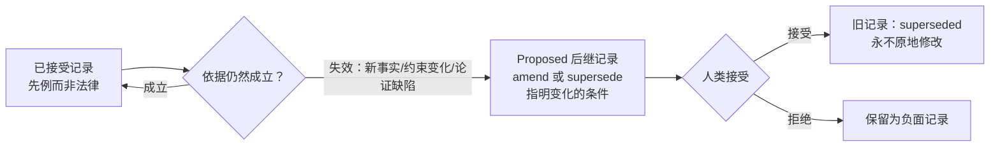

# Iteration 0.40.3 · 已接受决策的可上诉性

> 索引：[`README.md`](./README.md)。

## Cheatsheet

1. 已接受的记录是先例，不是法律——依据可能失效 (ADR-0.40.3#01)
2. 上诉依据：新事实、约束变化、原论证有缺陷 (ADR-0.40.3#01)
3. 永不原地修改——挑战落为 proposed 后继记录 (ADR-0.40.3#01)
4. 挑战必须指明具体变化的条件 (ADR-0.40.3#01)
5. "我更喜欢别的方案"不是理由——这就是防翻烧饼门槛 (ADR-0.40.3#01)
6. 接受权在人；agent 只负责起草与质询 (ADR-0.40.3#01)

---

## Quick view

| 维度 | 不可变红线（既有） | 可上诉性（新增） |
| --- | --- | --- |
| 问题 | 记录可以**怎样**变 | 记录何时**可以**被质疑 |
| 规则 | 永不原地修改；必须走后继记录 | 依据失效 → 允许挑战 |
| 通道 | 通过新记录 amend/supersede | 同一通道——proposed 后继 |
| 闸门 | 人类接受 | 人类接受 |

---

### 01. 将可上诉性原则写入起草协议
**Status**: ✅ accepted

**背景**：本套件面向外部团队发布，agent 面协议即产品本身——采用方无法按团队逐个重调提示词。变更决策的**机制层**已完整：`/adr supersede`、amend/supersede 状态行语义、以及 Frontmatter semantics 中"变更后的决策必须是显式接受的后继"规则（`skills/adr-protocol/SKILL.md`）。但**许可层**缺失：没有任何 agent 面文本说明已接受的决策可以被质疑。该失败可观察：一次起草会话中，agent 把 ADR-0.40.0#02 的 Rejected 表当作不可上诉的权威，引用它来终结重新分析；用户推回了两次才拿到重新论证。LLM 起草者模仿提示词层，这种"挑战不足"行为会原样发布给每个采用团队。反向风险同样真实：宽松的"有理由就能推翻"会邀请决策翻烧饼——反复重审已定记录，supersede 噪音淹没 INDEX。

**决策**：

| # | 要点 | 内容 |
| --- | --- | --- |
| 1 | 原则 | 已接受的记录是先例，不是法律。当其立足依据不再成立时，任何决策都可以被挑战 |
| 2 | 依据 | 新事实、约束变化、或原论证有缺陷。"我更喜欢别的方案"不是理由；"决策所假设的条件已经变化"才是 |
| 3 | 通道 | 挑战永不原地修改旧记录：它落为 proposed 后继（新记录或新 section），amend 或 supersede 旧记录，并必须指明具体变化的条件 |
| 4 | 人类闸门 | 接受权在人；agent 只负责起草与质询——既有的"Agents draft and interrogate; humans decide and own"立场不变 |
| 5 | 落点 | `skills/adr-protocol/SKILL.md` Frontmatter semantics 段不可变行之后加一条 Appealability——skill 随套件发布；`docs/**` 是 dev-only，不发布 |
| 6 | 不做配置轴 | `adr.governance`（none/review/strict）度量的是接受度执行——与质疑许可正交。防翻烧饼靠措辞门槛，不靠开关 |
| 7 | 与不可变红线的关系 | 互补不冲突：不可变红线规定记录可以**怎样**变（永不原地改），可上诉性规定何时**可以**质疑（依据可能失效）。"accepted semantics never move one character" 依然成立 |

**论证**：

- **默认即产品**——发布的套件无法按采用团队调提示词；协议默认说什么，每个团队就得到什么
- **实证失败**——"挑战不足"不是假设；它在本 ADL 自己的起草会话中被观察到，付出了两次显式用户推回的代价
- **门槛写进措辞**——具体条件负担 + proposed 后继通道，让重审保持显式、留痕、低频
- **落在 agent 阅读处**——`skills/*/SKILL.md` 注入 agent 系统提示词；只写 README 的规则到达零个外部团队
- **扩展而非修订**——本记录不推翻任何先前决策；ADR-0.40.0#02 的被否决选项继续成立，除非被各自依据独立挑战

**否决**：

| 选项 | 否决理由 |
| --- | --- |
| 配置化可上诉性（新增 `adr.governance` 轴） | 正交轴是 YAGNI；开关会邀请团队整体关闭许可层，重建"挑战不足"默认 |
| 宽松措辞（"有理由就能推翻"） | 邀请模仿型 LLM 起草者翻烧饼；supersede 噪音劣化 INDEX 的导航价值 |
| 只落 `docs/adr/README.md` | `docs/**` 按 ships 清单是 dev-only；规则到达零个采用团队 |
| 落 scaffold 注释（`styles/ocp.ts`） | scaffold 已承载输出协议；它教记录形态，不管治理姿态 |
| 不留记录直接改 skill/README | 违反套件自身治理：协议语义变更必须落新记录，不能手改 |

**影响**：

- **Skills** — `skills/adr-protocol/SKILL.md` 加一条 Appealability（约 60 tokens，对 ~5 KB skill 预算可忽略）；其余随发布文件不变
- **Docs** — 本记录及 zh 阅读树镜像；`docs/adr/README.md` 治理段可交叉引用 skill 规则（dev-only）
- **采用团队** — agent 获得显式且有边界的质疑许可（需具体依据）；合规取向团队获得留痕的变更论证，这正是审计想要的
- **治理** — 解析器、配置、语料零变更；`/adr supersede` 仍是唯一通道；既有记录不动
- **已知遗留** — 随发布的 scaffold 注释引用了不随发布的 `docs/adr/README.md`（对采用团队是悬空引用）；既有缺口，另行修复

**Future extensions**: 若某团队的合规 regime 需要法律式的不可变记录，未来治理轴可对个别记录加 pin；在此类需求具体化之前，可上诉性保持默认。
