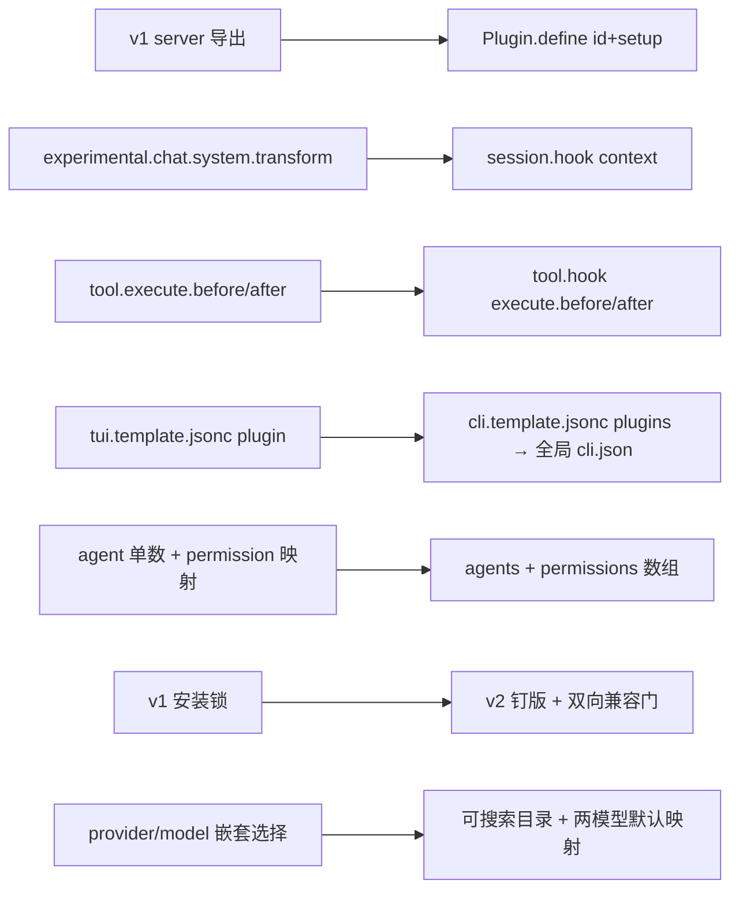

# Iteration 2.0.0 · 让 OpenCode Prime 适配 OpenCode v2 运行时

> 索引：[`README.md`](./README.md)。取代/修订：修订 ADR-0.41.0#05（opencode v1
> 安装锁由本迭代退役；大版本锁机制本身不变）。
>
> 速查表与快速视图为复述层：图/表只重述章节正文，不新增事实——冲突时以正文为准。

## 速查表

1. 只认原生 `Plugin.define({id, setup})`——v1 的 `server()` 导出已消失（ADR-2.0.0#01）
2. v1 配置自动归一化只用于吸收用户旧文件，绝不作为 OCP 的书写面（ADR-2.0.0#01）
3. 出厂即 `agents` + 有序 `permissions[]` + `providers{package,settings}` + `mcp.servers`（ADR-2.0.0#01）
4. TUI：全局 `cli.json` + slot；预设可搜索并双模型设置（ADR-2.0.0#02）
5. v2 没有按 Agent 的钩子作用域——`agent-scope.ts` 重建这道门（ADR-2.0.0#01）
6. 每项被接受的降级都是代码里的 `OCP-V2-GAP` 标记，不是口头传说（ADR-2.0.0#01）

---

## 快速视图

| v1 表面 | v2 替代（已发货） | 备注 |
|---|---|---|
| `server()` 导出、字符串键钩子映射 | `Plugin.define({id, setup})` + 域钩子与同步 transform | `@opencode/plugin@^2.0.15`；注册返回可释放句柄，`setup` 返回清理函数 |
| `chat.params` / `experimental.chat.system.transform` | `SystemPart[]` 上的 `ctx.session.hook("context")` | 事件携带 `agent` + `model`——即作用域通道 |
| `tool.execute.before` / `after` | `ctx.tool.hook("execute.before" / "execute.after")` | 单一可变事件；`execute.after` 重新承载 question 授权 |
| `tool:` 与 `config` 钩子注册工具/命令 | `ctx.tool.transform` / `ctx.command.transform` | 命令是注册而非拦截 |
| `file.edited` 事件 | `ctx.event.subscribe` → `filesystem.changed` | 过滤 `unlink` |
| v1 `tui.json(c)` 分层、`display_thinking` | 唯一全局 `cli.json`、`session.thinking`、`plugins` 列表 | 升级时迁移 v1 遗留插件列表 |
| 根 `small_model` | `agents.title.model` | 运行时 `normalize.ts` 迁移旧键 |
| 预设编辑 | 按 provider 分组的可搜索模型选择器 + 两模型层级默认映射 | 使用原生 select；每个层级仍可单独修改 |

---

### 01. 原生 v2：原生插件 API 与 V2 原生配置键，不留 v1 垫片
**状态**：✅ accepted

**背景**：OpenCode v2（运行时 2.0.x）更换了插件契约、配置模式与 TUI 客户端表面；
OCP 0.x 锁在 v1 大版本上，遇到 v2 运行时只会静默失效。`dev-v2-copy2` 分支把套件
重置为 2.0.0，使命只有一个：在 v2 上原生运行，同时不伤害 v1 用户。

**决策**：

| # | 要点 | 内容 |
| --- | --- | --- |
| 1 | 插件 API | 每个入口都是 `@opencode/plugin@^2.0.15` 的 `Plugin.define({ id, setup })`；行为经域钩子与同步 transform 注册；不发货任何 v1 `server()` 导出 |
| 2 | 配置契约 | `opencode.template.jsonc` 使用 V2 原生键（`agents`、有序 `permissions[]`、`providers{package,settings}`、`plugins`、`mcp.servers`）；运行时 v1 归一化只用于吸收被保留的用户配置，绝不作为 OCP 的书写面 |
| 3 | TUI 契约 | `tui.template.jsonc` → `cli.template.jsonc`，合并进唯一全局 `~/.config/opencode/cli.json`；六个 TUI 插件按 `@opencode/plugin/tui` slot/keymap API 迁入 `plugins/tui/`；v1 遗留 `tui.jsonc` 插件列表在升级时自动迁移 |
| 4 | 作用域与授权 | `plugins/shared/agent-scope.ts` 以 `event.agent` → system 哨兵 → `parentID` 重建按 Agent 门控；question 授权重建于 `ctx.tool.hook("execute.after")` |
| 5 | 安装器 | v1 大版本安装锁退役；`@script:opencode` 解析最新 v2 发布包并就地升级 profile 内的 v1 二进制；`checkRuntimeCompat` 在任何写盘前双向拒绝 v1 运行时↔v2 包 |

**依据**：

- **平台原生**——v2 扩展点唯一可持续；"能跑"的兼容绕行违背平台设计，过不了维护者自己的可辩护性门槛
- **单一心智模型**——v1/v2 双表面迫使每个贡献者先分辨自己在写哪一半；干净切换让插件、配置、测试只有一套语法
- **诚实的失败面**——解锁之后，运行时不匹配表现为安装被拒（兼容门），而不是半加载的会话
- **降级登记册胜过口头传说**——每个被移除且影响 OCP 功能的 v1 能力都在降级落点标注 `OCP-V2-GAP`：打标记时共 15 处——通告降级为服务器日志行（无 TUI 通知域）、步数改用每回合 assistant 消息做代理（v2 把 steps 折进一条消息）、工具结果标题消失（`Tool.Result` 无此字段）、命令级变体改写搁置（v2 `Command` 不携带模型）、向导筛选框外观差异

**否决**：

| 方案 | 否决理由 |
| --- | --- |
| 依赖 v1 兼容自动归一化（继续按 v1 键/钩子书写，让 `normalize.ts` 翻译） | 那是上游给用户旧文件准备的迁移跑道，不是目标契约；OCP 会发货一套自己的文档都无法辩护为 v2 原生的配置表面 |
| 同一包入口双导出 v1+v2（`{ ...Plugin.define(...), server() }`） | 为一条被明确放弃的运行时线翻倍维护与测试矩阵；未被测试的 v1 路径随发货一起腐烂 |
| 等 v2 成熟前维持 v1 锁 | 上游默认分支就是 v2 线，且需求本体就是适配 v2；N2 WORKING-EXAMPLE（`plugins/lite-mode.ts` barrel：v2 自动发现机制在沙箱中端到端加载了 `Plugin.define` 默认导出）已证明 v2 插件按既定条件可加载——继续锁版是惯性而非审慎 |

**影响**：

- **插件**——20 个服务端 barrel + 6 个 TUI 功能模块重写；barrel 默认导出 `Plugin.define` 对象
- **运行时**——全新安装即纯 V2 原生配置；flash 层模型引用落在 `agents.title.model` 而非根 `small_model`
- **安装器**——v1 锁退役（`opencode.sh\|.ps1`），兼容门 + `cli.json` 合并 + 预设计账本同步发货
- **测试**——新增 v2 钩子接线单元测试；完整运行时集成与最终 E2E 是未完成的 N8/N9 节点
- **文档**——`docs/**` + `docs/zh/**` + 双 README + `DEVELOPING.md` 全部改为 v2 事实；发布说明见 `install/versions/2.0.0.notes.md`
- **治理**——修订 ADR-0.41.0#05（v1 安装锁）；大版本锁机制不变，现在守的是 v2↔v3

**后续扩展**：TBD #1——变体折叠进模型引用：v2 钩子层没有 effort 变体，推理档
引用被折叠到已证实的同族模型上并清除变体标记（命令级折叠因 v2 命令暂无模型引
用而搁置）。TBD #2——服务商预设：`providers/*.json` 仍按 v1 定义形状（`npm`/
`options`）发货、依赖运行时旧形状归一化；V2 原生预设定形（或
`ctx.provider.transform` 注册路径）推迟到后续迭代，用编译版 v2 二进制（而非
源码运行的沙箱副本）复验同样在列。

### 02. 可搜索模型选择与两模型快速建档
**Status**: 🟡 proposed

**Background**: 此前新建预设会产生五个空白层级映射；修改模型时则必须分别打开 provider 与 model 对话框。现有模型目录包含用户需要搜索的 provider/model 名称。

**Decision**:

| # | 要点 | 内容 |
| --- | --- | --- |
| 1 | 模型查找 | 在一个可搜索选择器中展示模型目录，并按 provider 分组；保留自定义引用入口 |
| 2 | 快速设置 | 快速模型填入 `flash`、`standard`、`vision`；旗舰模型填入 `pro`、`max` |
| 3 | 审阅 | 新建后进入层级编辑器；现有预设也可使用两模型快速设置，并继续单独编辑每个层级 |
| 4 | UI 表面 | 使用原生 TUI select 对话框，不另建自定义表单或重复实现模型目录/搜索 |

**Rationale**:

- **默认可用**——新预设直接获得五个具体映射，避免空引用导致无法有效应用
- **查找更直接**——单个按 provider 分组的搜索列表消除嵌套的 provider→model 导航
- **不牺牲能力**——用户仍可覆写任意层级、输入自定义引用，并在应用前审阅

**Rejected**:

| 方案 | 否决理由 |
| --- | --- |
| 创建五层全空预设 | 应用前仍需重复查找五次模型 |
| 保留 provider 与 model 两级对话框 | 对已加载目录增加导航，却不能跨目录直接搜索 |
| 自建多字段表单 | TUI 对话框 API 没有原生表单；重复实现目录选择会增加不受支持的 UI 与维护负担 |

**Impact**:

- **TUI**——实时层级与预设模型选择统一为按 provider 分组的可搜索列表；新建和编辑都支持两模型快速设置
- **预设核心**——将两个选定引用扩展为现有五层映射，不改变持久化预设 schema
- **测试**——固定层级扩展行为，并保持八种语言目录完整
- **文档**——同步更新英文和中文预设向导说明
