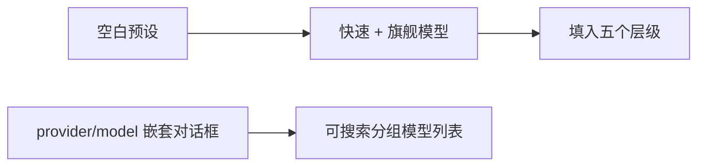

# Iteration 2.0.1 · 可搜索模型与两模型快速建档

> 索引：[`README.md`](./README.md)。
>
> 速查表与快速视图仅复述章节内容；冲突时以章节正文为准。

## 速查表

1. 一个按 provider 分组的搜索列表取代嵌套模型对话框（ADR-2.0.1#01）
2. 两个选择填入 `flash`/`standard`/`vision` 与 `pro`/`max`（ADR-2.0.1#01）
3. 保留审阅流程与逐层覆写能力（ADR-2.0.1#01）
4. 保留自定义引用与 provider 分类（ADR-2.0.1#01）
5. 新建与编辑预设共用快速设置（ADR-2.0.1#01）
6. 使用原生 TUI 选择器，不造表单或第二套目录（ADR-2.0.1#01）

---

## 快速视图

| 表面 | 决策 | 保留能力 |
|---|---|---|
| 预设默认值 | 快速模型填入 `flash`、`standard`、`vision`；旗舰模型填入 `pro`、`max` | 应用前可审阅并编辑每个层级 |
| 模型查找 | 使用一个按 provider 分组的可搜索列表 | 保留自定义引用与 provider 分类 |
| UI | 使用原生 TUI select 对话框 | 不自建表单或重复实现模型目录 |

---

### 01. 直接搜索模型，并用两个选择填充预设
**Status**: 🟡 proposed

**Background**: 此前新建预设会产生五个空白层级映射；修改模型时则必须分别打开 provider 与 model 对话框。用户需要可直接使用的默认映射，同时仍能精确调整各层级。

**Decision**:

| # | Point | Content |
| --- | --- | --- |
| 1 | 模型查找 | 在一个可搜索选择器中展示模型目录，并按 provider 分组；保留自定义引用入口 |
| 2 | 快速设置 | 快速模型填入 `flash`、`standard`、`vision`；旗舰模型填入 `pro`、`max` |
| 3 | 审阅 | 新建后进入层级编辑器；现有预设也可快速设置，并继续单独编辑每个层级 |
| 4 | UI 表面 | 使用原生 TUI select，不添加自定义表单或重复实现模型目录/搜索 |

**Rationale**:

- **默认可用**：新预设直接获得五个具体映射，避免空引用
- **查找直接**：单个按 provider 分组的搜索列表消除嵌套导航
- **能力不减**：仍可覆写任意层级、输入自定义引用，并在应用前审阅

**Rejected**:

| Option | Reason rejected |
| --- | --- |
| 创建五层全空预设 | 预设可用前仍需重复查找多个模型 |
| 保留 provider 与 model 两级对话框 | 增加导航，却不能跨 provider 搜索 |
| 自建多字段表单 | TUI 对话框 API 没有原生表单；重复实现会增加不受支持的 UI 与维护成本 |

**Impact**:

- **TUI**——预设与实时层级共用可搜索模型选择器；新建和编辑都支持两模型快速设置
- **预设核心**——将两个引用扩展为五层映射，不改变持久化 schema
- **测试**——固定层级扩展行为，并保持八种语言目录完整
- **文档**——同步更新英文和中文预设向导说明
