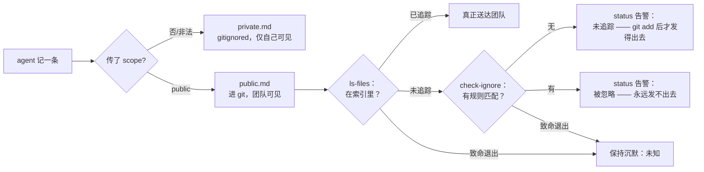

# Iteration 2.0.2 · 项目记忆里诚实的 public scope

> 索引：[`README.md`](./README.md)。
>
> 速查表与快速视图仅复述章节内容；冲突时以章节正文为准。

## 速查表

1. agent 工具默认 `private`，用户命令默认 `public`（ADR-2.0.2#01）
2. `scope` 缺失或非法一律回落到 `private`，绝不回落 `public`（ADR-2.0.2#01）
3. public 条目是要进 git 的仓库内容 —— 英文、一条一规则（ADR-2.0.2#01）
4. `/memory status` 先问 git `public.md` 是否被追踪，再问是否被忽略（ADR-2.0.2#02）
5. 未追踪与被忽略都告警；探测的致命退出码是"未知"，保持沉默（ADR-2.0.2#02）
6. `memory_note` 单测绝不写到沙箱之外（ADR-2.0.2#03）
7. 截断绝不在条目里留下半个码点（ADR-2.0.2#04）

---

## 快速视图

| 表面 | 决策 | 保留能力 |
|---|---|---|
| `memory_note` 工具 | 默认 `private` | 传 `scope: "public"` 仍能进团队文件 |
| `/memory note` 命令 | 默认 `public` | `--private` 仍能得到纯本地笔记 |
| public 条目内容 | 英文、一条一规则 | 团队审阅时一行一条规则 |
| `/memory status` | 四态 tracked / untracked / ignored / unknown 探测 + 告警 | 没有 git 时状态照常工作 |
| 单测套件 | 假插件 ctx 注入沙箱目录 | 套件永不触碰开发者真实记忆 |

---

### 01. agent 工具默认 `private`，命令保持 `public`
**Status**: 🟡 proposed

**Background**: `memory_note` 工具把 `public` 焊死成了 `scope` 缺失、拼错或不合规时的回落值，三个 agent prompt 又各自复述一遍"默认 `public` scope（进 git，PR 审阅）"作为常驻指令。它给出的安全网是"拿不准就 public，PR 会打回"——而这条安全网成立的前提是 agent 写的文件总会进 diff。实际并不：本仓库根 `.gitignore` 排除了整个 `.ocp/` 目录，`public.md` 从未进过 git，于是根本没有任何环节会审它。实际结果是：一个名为"公开"、实为私人笔记本的文件，为无人策展的文本永久支付每次 session 的注入成本；5 条条目里只有 2 条是干净的可复用团队规则，1 条在复述 AGENTS.md，1 条是外部 API 的调研结论，1 条读不懂。

**Decision**:

| # | 要点 | 内容 |
| --- | --- | --- |
| 1 | 工具默认 | `memory_note` 把缺失或无法识别的 `scope` 解析为 `private`；`public` 必须显式传参 |
| 2 | 命令默认 | `/memory note` 保持 `public` —— 人手动敲这条是明确、可见的动作，且回执会显示最终落盘路径 |
| 3 | 决胜规则 | 默认取"错判更便宜"的一侧：一条没人看到的私人笔记，而不是一条永远被注入、还污染仓库的笔记 |
| 4 | public 内容 | public 条目是要进 git 的仓库内容：英文、一条一规则 |
| 5 | prompt 措辞 | `lite` / `code` / `build` 说出工具的真实默认值，并把细则指回工具描述，不再第三次复述启发式 |

**Rationale**:

- **旧 rationale 有个洞**："PR 会打回"只有在文件进了 diff 时才是安全网；在本仓库实测里它压根没被追踪
- **代价不对称**：错判 private 损失一条自己都看不到的笔记；错判 public 损失仓库洁净度、revert 成本，以及每次 session 的永久 token 开销
- **两个角色不对称**：agent 是无审阅人地凭猜测写笔记；用户自己的按键已经是一个被审过的决定 —— 一个默认值无法诚实地同时服务两者
- **能力保留**：`scope: "public"` 行为未变且有测试，原本用团队文件的场景一点没少

**Rejected**:

| 选项 | 拒绝理由 |
| --- | --- |
| 保持工具默认 `public`，只修 `.gitignore` | 只拔因不纠偏：团队文件仍是"错判更贵"的一侧，且每个下游仓库都会继承同一个坑 |
| 保持 `public` 默认并加 confidence 下限 | 硬门槛是表演 —— 工具无法验证一条经验是否正确，而拦下就等于彻底丢掉这条笔记 |
| 在 private 与 public 之间加一层草稿 | 第三个文件是一套没人要求的策展流程；代价不对称本身已经选出了正确默认值，不需要新状态 |
| 直接砍掉 `public` scope | 毁掉这个插件存在的意义 —— 团队共享 |

**Impact**:

- **插件工具** —— `project-memory-tool.ts` 的 scope 解析、schema 描述与随包描述文案（启发式压缩，`DO NOT USE FOR` 增加"外部工具/服务的调研结论"）
- **Agent prompts** —— `prompts/lite.md`、`prompts/code.md`、`prompts/build.md` 说明真实默认。对照 ADR 前基线（`2d009af`，用仓库自带估算 `chars/4`）实测净效果：`lite` −2 tok、`code` −5 tok、`build` −4 tok —— 净**下降**，因为新措辞比它替换掉的 public 优先版更短，而"public 条目要进 git，所以用英文写"那句已被同一句里本就存在的"指回工具描述"交叉引用取代
- **Token 预算** —— 本 ADR 新增的随包上下文成本只有 `memory_note` 描述：334 → 367 est tok（+33），且只在该工具进入上下文的 session 里付费。**L0 未被触碰**（`instructions/**` + `opencode.template.jsonc` 未改动）
- **Skill** —— `skills/memory-summarize/SKILL.md` 逐条显式选 scope，并要求 public 条目用英文
- **文档** —— 中英文插件页 / 命令页，以及 `DEVELOPING.md`

### 02. public scope 发不出去时在 `/memory status` 告警
**Status**: 🟡 proposed

**Background**: "public" 是关于 git 可见性的承诺，而没有任何东西验证它。2026-09-12 的 project-memory 评审把这条缺口记为 P2 待办 —— 根 ignore 可以悄悄让 `public.md` 不进 git，缺少 `git check-ignore` 检测 —— 而本仓库就是活证据：`public.md` 从未被追踪。用户往团队文件里写经验，除了自己动手翻 git plumbing 之外没有任何途径发现这件事。

这个缺口有两半，第一版修复只覆盖了一半。"被忽略"与"发不出去"不是一回事：一条未被追踪、却没匹配任何 ignore 规则的文件，能通过所有 `check-ignore` 查询，却依然出不了本机 —— 因为没人 stage 过它。这正是 `.gitignore` 那道开关落地后本仓库 `public.md` 的状态：一个只问"有没有规则匹配它？"的探测，在 `git status` 显示 `??` 的同时报告该文件健康。关于一条没发出去的文件说"已送达"，比没有探测更糟：它把静默失败变成了虚假保证。

**Decision**:

| # | 要点 | 内容 |
| --- | --- | --- |
| 1 | 探测 | `/memory status` 按顺序问 git 两个问题：`git ls-files --error-unmatch`（`public.md` 在不在索引里？），若不在再问 `git check-ignore -q`（有没有规则匹配它？） |
| 2 | 四态 | `tracked` → 沉默。`untracked` → 告警，有人 stage 后即发出。`ignored` → 告警，永远发不出去。任何致命退出（128 非仓库、129 用法错误）、子进程被杀、git 缺失 → `unknown`，保持沉默 |
| 3 | 顺序即短路 | 已被追踪的文件无论规则怎么写都已在仓库里，所以先问索引、`check-ignore` 兜底：健康时 1 个子进程，其余情况 2 个 |
| 4 | 感知索引 | `check-ignore` **不**加 `--no-index`，因此已被追踪的 `public.md` 即使还匹配着过期 ignore 规则也不会被误报成"被忽略" |
| 5 | 路径写法 | 探测传仓库相对的 POSIX pathspec，而不是 git 自己的诊断信息所针对的原生绝对路径；`D:\…` 盘符分量轻则被容忍、重则被当作 pathspec 解析，失败形态是退出 128 → `unknown` → 沉默 |
| 6 | 落地 | 本仓库根 `.gitignore` 取消忽略 `.ocp/memory/public.md`（先目录、后文件），让随包契约在这里真正成立 |
| 7 | 表面 | 8 个 locale 各加两条新 i18n key，仅在 `statusText()` 中追加；每条文案都给出具体补救动作，不只报故障 |

**Rationale**:

- **这个失败天生是静默的**：条目看起来已归档、回执说"已保存"，团队却永远收不到
- **"被忽略"只是失败的一半**：一条路径可以对每条规则都可共享，却仍然是本地的 —— 共享是索引的属性，不是 ignore 列表的属性
- **两种状态需要不同的话**：`ignored` 不可能因意外而自愈，文案要写清 `.gitignore` 的正确形状；`untracked` 距 `git add` 只差一步，文案就直说这一步
- **沉默优于假警报**：未知的判定 —— 没有 git 的机器、不在任何仓库里的项目、spawn 超时 —— 一律不提醒
- **"感知索引"才是正确判据**：真正的问题是"这个文件能不能到达同事手上"，而已被追踪的文件早已到达，无论规则怎么写
- **健康时开销极小**：只在用户主动执行的命令里跑一次快速子进程，5 秒超时且吞掉错误

**Rejected**:

| 选项 | 拒绝理由 |
| --- | --- |
| 只在文档里写注意事项，不做检测 | 失败模式按定义就是不可见的；一行没人读的文档不构成检测 |
| 只探测 `check-ignore`（本 ADR 的第一版尝试） | 对未追踪情况完全失明 —— 对本 ADR 立项时描述的那个状态报"已共享" |
| 读 `.gitignore` 自己实现匹配规则 | 重造 gitignore 语义（取反、嵌套、`**`、目录 vs 文件）必输 |
| 读 `git status --porcelain` 判断追踪状态 | porcelain 输出是一种需要解析的格式，贴近 locale 且路径带引号；`--error-unmatch` 的退出码才是契约 |
| 每次写 public scope 时都告警 | 在捕获时刻就响，而那时用户还没写入任何值得告警的内容；文件正常后还会永远重复 |
| 被忽略时直接让 public 写入失败 | 只读状态报告必须保持只读；拒绝写入把可见性 bug 升级成数据丢失 |

**Impact**:

- **插件配置** —— `classifyLsFiles()` 与 `classifyIsIgnored()`（纯函数，有单测固定）由 `classifyPublicScope()` 组合（纯函数，3×3 矩阵全覆盖单测）+ `publicScopeReach()`（spawnSync、5s 超时、`windowsHide`）
- **插件命令** —— `statusText()` 仅在 `ignored` 与 `untracked` 判定上追加告警
- **i18n** —— 8 个 locale 各带 `guard.memory.publicUnshared`（改写为带补救动作）与 `guard.memory.publicUntracked`（新增）；目录规模 612 → 614 keys
- **仓库** —— 根 `.gitignore` 不再遮蔽 `.ocp/memory/public.md`；`private.md` 与其余 `.ocp/` 运行时状态仍然忽略

### 03. 给 project-memory 单测套件加沙箱
**Status**: 🟡 proposed

**Background**: `tests/test-project-memory-unit.ts` 构造假插件上下文时写的是 `location: { directory: process.cwd() }`。插件入口会调用 `setProjectDir(ctx.location.directory)`，此后文件里每一次 `publicPath()` / `privatePath()` 都跟着它走 —— 于是从那一行起，套件的夹具（`rule A`、`note P`、`no-ctx allowed`）被写进真实的 `<repo>/.ocp/memory/`，覆盖掉开发者真正记下的内容。它以一条与测试夹具字符串逐字相同的垃圾 public 条目的形式暴露出来。每次跑这套测试都会摧毁仓库自己的记忆；只有 `private.md` 未被追踪这一事实让破坏显得安静。

**Decision**:

| # | 要点 | 内容 |
| --- | --- | --- |
| 1 | 夹具 | 假 ctx 注入套件自己的 `tmp` 沙箱，绝不用 `process.cwd()` |
| 2 | 固定 | 在 `setup` **之前**先用另一个目录污染全局，再断言 `getProjectDir() === tmp`。不污染就在 setup 之后断言是同义反复 —— 正是 setup 设的它，这条断言只是复述它上面那一行 |
| 3 | 沙箱可能在别处 | 探测的 git 仓库分支要断言"非仓库 → unknown"，而 git 会向上层目录找 `.git`，所以 `os.tmpdir()` 恰好落在某个工作树里时该断言不成立 —— 探测出这种情况并大声跳过，而不是断言一个不稳的结论 |
| 4 | 不留残迹 | git 仓库夹具在 `finally` 里删除；每个可能合理失败的 git 调用（init、add）都包上守卫与大声跳过，而不是让整个套件中断 |
| 5 | 恢复 | 把被套件摧毁的条目重新写回 |

**Rationale**:

- **测试套件绝不能写到沙箱之外**：这个套件存在一条真实的数据丢失路径，而不只是不稳定的断言
- **bug 在入口，不在断言**：修好注入目录一次性修好所有下游路径
- **这条断言把静默隐患变成显式失败**：断言就放在未来会引入这个错误的位置 —— 但前提是先给它一个可以失败的对象
- **会自己出声的跳过是诚实的，藏在全绿结果里的跳过不是**：每条依赖环境的分支都要打印自己为什么退让

**Rejected**:

| 选项 | 拒绝理由 |
| --- | --- |
| 读真实文件并在 teardown 里恢复 | 把套件耦合到开发者状态；新增一个 `rmSync(publicPath())` 就会重新引入丢失 |
| 用 `git` 守住写入（在仓库内就跳过） | 掩盖配置错误，而不是消除它 |
| 给整个文件加快照-恢复 | 同样的耦合、更多活动部件，而且掩盖了是哪条断言写了什么 |

**Impact**:

- **测试** —— 沙箱 `location.directory` + 污染后的 setup 断言；git 仓库夹具在 `finally` 里清理；依赖环境的分支大声跳过；`statusText()` 每次断言只调一次而不是两次；跑完后已用 md5 验证真实 `.ocp/memory/` 文件逐字节未变

### 04. 绝不在条目里留下半个码点
**Status**: 🟡 proposed

**Background**: 2026-09-12 的评审在这里也记了一条 P2：`formatMemoryEntry()` 用 `slice(0, 1000)` 截断，而它按 UTF-16 码元计数，所以落在代理对两半之间的截断会留下一个孤立的高代理项 —— 它会序列化成 `U+FFFD`，也就是一条规则中间夹着一个替换字符。它之所以被记为 P2，正是因为那时的 public 条目还只是本地文件；按本 ADR 的前提（public 条目是要进 git 的仓库内容），同一个字节会落进团队的文件里，而那里一个乱码字形是一次评审对话，不是一个隐形的本地痕迹。

**Decision**:

| # | 要点 | 内容 |
| --- | --- | --- |
| 1 | 截断 | 截断后丢掉末尾孤立的高代理项（`/[\uD800-\uDBFF]$/`） |
| 2 | 代价 | 1000 码元的上限少一个码点的余量。为省一个字而留一个坏字形不值得 |
| 3 | 范围 | 两个 scope 共用 `formatMemoryEntry()`，因此 public 与 private 一并受益 —— 条目格式是共享契约，不是 public 专属 |

**Rationale**:

- **截断不该造成损坏**：长度上限是一次有意为之的切断，而一次留下非法文本的切断正是这个上限自己引入的 bug
- **这个修复在边界上可测**：恰好在上限处结束的代理对要活下来；被它切开的代理对不能留下孤项

**Rejected**:

| 选项 | 拒绝理由 |
| --- | --- |
| 改用码点截断（`Array.from`） | 正确，但会改写上限的单位与含义；孤项才是唯一可观测的缺陷 |
| 继续留作 P2 待办 | 这条待办诞生于"文件还是私有的"那个前提之前 |
| 从经验里剥掉所有非 ASCII | public 条目可能合法引用非英文原文，中文/日文经验是真实存在的经验 |

**Impact**:

- **插件配置** —— `formatMemoryEntry()` 在长度截断后丢弃孤立的高代理项
- **测试** —— 边界用例已固定：恰好在上限处结束的代理对活下来，被切开的代理对不产生孤项也不产生 `U+FFFD`
