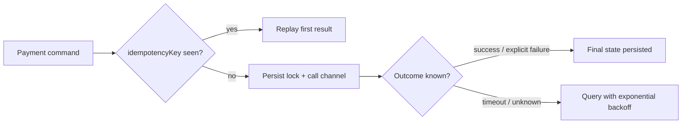

# Iteration 0.2.54 · Payment retry and idempotency

> Cheatsheet & quick view are restatement layers: diagrams/tables restate the
> section prose and never add facts — on conflict the prose wins.
> Amend/supersede relations are declared in each section's status line;
> accepted semantics never move one character.

## Cheatsheet

- Payment commands carry a client-generated `idempotencyKey` (UUID); the server enforces uniqueness at the database and replays the first result for duplicates
- Retries happen only in the "result unknown" state (timeout/network error); explicit failures never auto-retry
- Reconciliation runs on dual channels — active query first, callback as an accelerator only

## Quick view

---

### 01. Idempotency key on payment commands
**Status**: ✅ accepted
**Background**: After channel-gateway timeouts, both the frontend and scheduled jobs re-send payment commands; the last 30 days saw 137 duplicate-charge complaints. Existing dedup logic is scattered across callers and behaves inconsistently.

**Decision**: Payment commands uniformly carry a client-generated `idempotencyKey` (UUID v4), persisted under a unique index; on a key hit the server returns the first outcome without invoking the channel again.

**Rationale**:
- **Idempotence**: a payment command can only ever settle once, no matter how often it is replayed — duplicate charges become structurally impossible
- **Single ownership**: dedup semantics converge to one server-side place; callers just pass the key through instead of inventing their own schemes
- **Auditability**: the key binds to the first outcome, so reconciliation can answer "what did this duplicate request return at the time"

**Rejected**:
- Server-side key derived from business fields (order number + amount): the same order may legitimately trigger multiple distinct payments (repriced re-pay); a business-field key would block those
- Channel-side idempotency: covers a single channel only; replays between the aggregation layer and the channel stay unprotected

**Impact**:
- Data layer: `payment_command` gains a unique `idempotency_key` index; migration includes backfill for existing rows
- API layer: payment command schema adds a required field; during the legacy-client grace period the server generates a fallback key
- Tests: e2e adds timeout-replay and concurrent same-key cases

### 02. Result-unknown retry with exponential backoff
**Status**: 🟡 proposed
**Background**: Timed-out payment commands are currently retried immediately and arbitrarily by callers, producing burst storms against the channel; some callers also blindly retry explicit failures, wasting quota.

**Decision**: Retry converges server-side: only commands in the "result unknown" state are re-queried against the channel with exponential backoff (1s/4s/16s, 3 attempts max); explicit failure is terminal and never auto-retries.

**Rationale**:
- **Storm suppression**: backoff spreads instantaneous retries; channel-side peak QPS becomes predictable
- **Semantic safety**: retrying only "unknown" outcomes means no automatic action can ever turn an explicit failure into a second charge

**Rejected**:
- Fixed-interval retries: simpler, but all tasks wake simultaneously the moment the channel recovers — the storm is merely postponed
- Callbacks as the only outcome channel: callbacks drop and reorder; the active query must be authoritative, callbacks only accelerate

**Impact**:
- Service layer: new retry-scheduler job; state machine gains the "result unknown" transition
- Ops: channel timeout dashboard gains a retry-queue-depth metric
