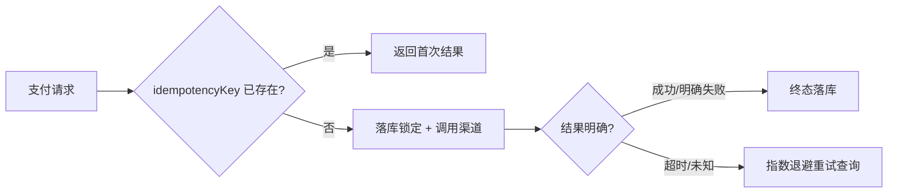

# 迭代 0.2.54 · 支付重试与幂等

> Cheatsheet & quick view are restatement layers: diagrams/tables restate the
> section prose and never add facts — on conflict the prose wins.
> Amend/supersede relations are declared in each section's status line;
> accepted semantics never move one character.

## Cheatsheet

- 支付指令携带客户端生成的 `idempotencyKey`(UUID),服务端唯一约束落库,重复请求返回首次结果
- 重试只发生在"结果未知"(超时/网络错误)状态,明确失败永不自动重试
- 回调与主动查询双通道对账,查询优先;回调仅作加速

## Quick view

---

### 01. 支付指令幂等键
**Status**: ✅ accepted
**Background**: 渠道网关超时后前端与定时任务都会重发支付指令,过去 30 天产生了 137 笔重复扣款投诉;现有去重逻辑散落在各调用方,行为不一致。

**Decision**: 支付指令统一携带客户端生成的 `idempotencyKey`(UUID v4),服务端以唯一索引落库;命中已有 key 时直接返回首次的处理结果,不再触发渠道调用。

**Rationale**:
- **幂等性**: 同一笔支付指令无论被重放多少次,只可能落一次账,重复扣款在结构上不可能发生
- **归属清晰**: 去重语义收敛到服务端一处,调用方只需透传 key,不再各自发明去重逻辑
- **可审计**: key 与首次结果绑定,对账时能直接回答"这笔重复请求当年返回了什么"

**Rejected**:
- 服务端按业务字段(订单号+金额)生成幂等键:同一订单允许合法地发起多次不同支付(改价重付),业务字段键会误伤
- 渠道侧幂等:只覆盖单一渠道,聚合层与渠道之间的重放仍然裸奔

**Impact**:
- 数据层: `payment_command` 表新增 `idempotency_key` 唯一索引,迁移含存量回填
- API 层: 支付指令 schema 新增必填字段,旧客户端灰度期服务端兜底生成
- 测试: e2e 增加超时重放、并发同 key 双请求两条用例

### 02. 结果未知重试与指数退避
**Status**: 🟡 proposed
**Background**: 超时的支付指令目前由调用方随意立即重试,形成了对渠道的瞬时风暴;同时明确失败的单也被部分调用方盲目重试,浪费配额。

**Decision**: 重试收敛到服务端任务:仅当指令处于"结果未知"状态时,按指数退避(1s/4s/16s,最多 3 次)主动向渠道查询;明确失败为终态,永不自动重试。

**Rationale**:
- **风暴抑制**: 退避把瞬时重试摊平,渠道侧峰值 QPS 可预期
- **语义安全**: 只对"未知"重试意味着任何自动动作都不可能把明确失败变成二次扣款

**Rejected**:
- 固定间隔重试:实现更简单,但渠道恢复瞬间所有任务同时醒来,风暴只是推迟
- 回调作为唯一结果通道:回调会丢、会乱序,必须以主动查询为权威,回调只做加速

**Impact**:
- 服务层: 新增 retry-scheduler 任务,状态机增加"结果未知"迁移
- 运维: 渠道超时率看板增加重试队列深度指标
