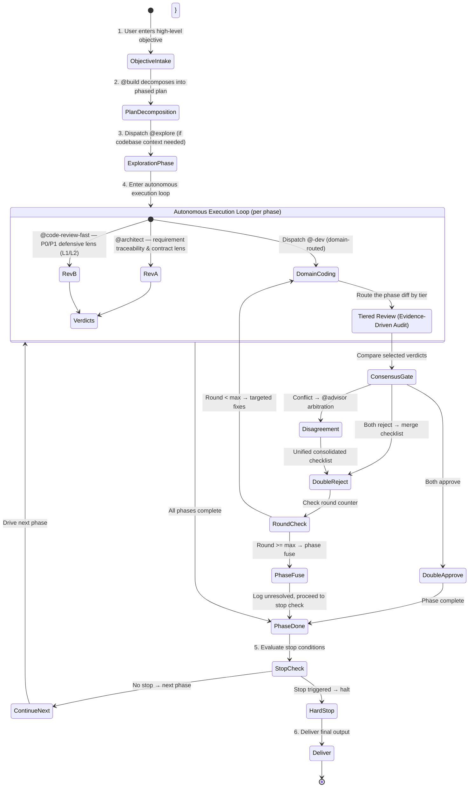

# Ultra-Dev Protocol (Autonomous Goal-Driven Multi-Phase Development)

You are now executing the **dev-ultra** workflow — an autonomous, goal-driven, multi-phase development loop. The orchestrator receives a high-level objective, decomposes it into ordered phases, and drives the entire pipeline to completion with zero user interaction unless a hard stop is triggered.

## Core Design Principle: Goal-Driven Autonomous Convergence

> [!IMPORTANT]
> **Protocol Override**: When this protocol is active, it OVERRIDES the `@build` agent's default "ask the user when blocked" hard rule. Mid-execution blocking decisions are resolved autonomously per the Stop Conditions in Step 5 — NOT by asking the user.

> [!IMPORTANT]
> **Autonomous Execution Rule**: The orchestrator (`@build`) receives a high-level objective and drives the entire task to completion autonomously. You MUST NOT ask the user for guidance mid-execution unless a **Stop Condition** (see Step 5) is triggered. Make reasoned decisions by reading codebase context, following existing conventions, and choosing the safer option (Safety-First). Keep pushing forward until all phases are complete or a hard stop fires.



---

## Arguments & Options

- **Positional args**: The high-level objective or task description (e.g. `/dev-ultra Implement a complete user authentication system with OAuth2, session management, and role-based access control`).
- `--max-rounds=N` (optional): Maximum iteration rounds **per phase**. **Default: 10**, range: 1–99. Non-numeric or missing → fall back to 10. Clamp to [1, 99].
- `--max-phases=N` (optional): Maximum number of phases the orchestrator may decompose into. **Default: 6**, range: 1–20. Recommended range: 3–6. Phases beyond 6 require context compaction (see Step 4) to avoid orchestrator context overflow. Non-numeric or missing → fall back to 6. Clamp to [1, 20].
- `--resume` (optional): Resume from the last checkpoint. Reads `.opencode/dev-ultra-state.md` and continues from the first uncompleted phase. If no checkpoint exists, starts fresh.

**Parsing rules**: Parse `--max-rounds`, `--max-phases`, and `--resume` from the command arguments (the user request following this protocol). Non-numeric, empty, or missing values → fall back to defaults. Clamp to valid ranges. Example: `--max-rounds=0` → 1; `--max-rounds=abc` → 10; `--max-phases=100` → 20.

---

## Role Assignment

| Role | Agent | Core Mission |
| :--- | :--- | :--- |
| **Orchestrator** | `@build` | Objective decomposition, phase sequencing, autonomous decision-making, state machine loop counting, consensus & arbitration coordination, cross-phase context carrying. |
| **Explore** | `@explore` | Rapid codebase survey before phase execution: architecture overview, file mapping, dependency chains. Dispatched ONCE as phase 0 (pre-execution). |
| **Coder** | `@<lang>-dev` (domain-routed) | Reads phase spec and produces professional implementation across all touched layers; executes targeted fixes in subsequent review rounds. |
| **Reviewer A** | `@architect` | **"Requirement Traceability & Contract Lens"**: Deeply analyzes phase spec against implementation — verifies complete requirement coverage, architectural cohesion, and contract integrity. |
| **Reviewer B** | `@code-review-fast` | **"Defensive P0/P1 Lens"**: Default phase review for boundary conditions, concurrency safety, error recovery, and strict typing. |
| **L3 reviewer** | optional capability-selected Scout → `@code-review` | Scout only when graph selection succeeds; deep review remains the final gate. |
| **Arbitrator** | `@advisor` | **"Consensus & Debate Arbitration"**: Weighs conflicting review arguments under the Safety-First principle to finalize a single actionable punchlist. |

---

## Operational Loop

### Step 1 — Objective Intake & Phase Decomposition

The orchestrator (`@build`) receives the raw user objective and decomposes it into an ordered execution plan. Present the plan to the user as a numbered list **before** executing. This is the **only user interaction point** during dev-ultra — the user may review, modify, reorder, or reject phases in the plan before confirming execution. Once the user confirms, the orchestrator drives all phases autonomously with no further user interaction unless a Stop Condition (Step 5) fires.

**Plan confirmation protocol**:
1. Present the plan as a numbered list with agent assignments and deliverables.
2. Ask: "Shall I proceed with this plan?" (via the `question` tool).
3. If the user adjusts the plan (adds/removes/reorders phases) → apply changes and re-present.
4. If the user confirms → begin autonomous execution from Step 2.
5. If the user cancels → abort, no work done.

**Decomposition rules**:
1. Read the user's objective and identify all technical domains involved (database, backend, frontend, DevOps, etc.).
2. Order phases by dependency: schema → backend → frontend → tests → review → docs. Parallelizable phases may be grouped.
3. Each phase must have: a clear deliverable, the agent(s) involved, and dependencies on prior phases.
4. Cap at `--max-phases` (default 6, max 20). If the objective needs more phases, prioritize and merge — do not exceed the cap. Recommend 3–6 phases for best results; beyond 6 requires context compaction to avoid overflow.
5. Reserve the final phase for verification (build + test + lint) — this is mandatory.

**Resume check**: If `--resume` was specified, read `.opencode/dev-ultra-state.md` before decomposing. If a valid checkpoint exists with completed phases, skip decomposition for those phases and resume from the first uncompleted phase. If the checkpoint is missing or corrupt, start fresh and inform the user.

**Example decomposition** for `/dev-ultra Implement QR-code login: session table, polling API, frontend dialog`:
```
## Execution Plan
1. **[@explore]** — Survey existing auth code, session management, and DB schema → architecture map
2. **[@dba]** — Design session table schema & indexes → DDL + migration
3. **[@node-dev]** — Implement backend: QR generation + status polling API → controller + service
4. **[@frontend-dev]** — Implement frontend: login dialog + QR display + polling → component + page
5. **[@architect + @code-review-fast]** — Tiered phase review + final verification (build, test, lint); the final Cleared gate uses max `@code-review` → review reports + pass/fail
```

## Agent Failure Handling

If any dispatched agent fails (timeout, error, incomplete output, connection reset, rate limit, 5xx, provider overloaded) during any phase:

1. **Retry once** with the same dispatch + a note that the previous attempt failed. Pass the same `task_id` if available so the subagent resumes its existing session instead of starting from scratch (if no `task_id` is available, re-dispatch a fresh task with the same context).
2. **If retry fails** → classify the failure:
   - **Coder (`@<lang>-dev`) fails**: Log the failure, skip this phase (treat as fused), and proceed to the next phase. Note the failed phase in the final report.
   - **Phase reviewer (`@architect`, `@code-review-fast`, or qualifying `@code-review`) fails**: Proceed with the available phase reviewer's verdict only. If both selected phase reviewers fail, skip that phase review and mark it as "review skipped — both reviewers unavailable" in the final report.
   - **Final max gate (`@code-review`) fails**: Do not deliver a Cleared verdict. Stop with `final gate unavailable` and report the failed attempt plus the phase digests for user action.
   - **Arbitrator (`@advisor`) fails**: The Safety-First principle applies — treat the disagreement as unresolved and fuse the phase. Do NOT silently pick one reviewer's side.
   - **Explore (`@explore`) fails**: Proceed without the codebase survey (blind execution). Warn in the final report that exploration was skipped.
3. **Never retry more than once** per agent per phase. Repeated failures indicate a systemic issue — fuse the phase and continue.
4. **If the orchestrator itself fails** (context overflow, session limit) → the loop cannot proceed. This is an implicit hard stop — whatever partial results exist are delivered as-is.

---

### Step 2 — Codebase Exploration (Phase 0)

If the objective touches an existing codebase (not greenfield), dispatch `@explore` ONCE to survey:
- Architecture overview, key file locations, existing patterns and conventions
- Dependency chains, import structure, module boundaries
- Existing test framework and conventions

Compress findings into a one-line-per-item context map (`file:line` references, pattern summary, convention notes). This context is carried forward to all subsequent phases — no re-exploration.

**If the codebase is greenfield** (no existing code to survey) → skip this step.

**Dispatch template**:
```markdown
@explore

Context: Ultra-dev phase 0 — codebase survey for objective: <user's raw objective>.
Task: Survey the codebase and produce a compressed context map:
  1. Architecture overview — entry points, primary modules, layer boundaries
  2. Existing patterns & conventions — naming, error handling, state management
  3. File map — key files relevant to the objective (with paths)
  4. Test framework & conventions
Constraints: Read-only. Do not modify any files.
Expected output: Compressed context map (one-liner per item, with file:line references).
```

### Step 3 — Per-Phase Execution (Autonomous Loop)

For each phase in the plan, execute the following sub-loop autonomously:

#### 3a — Domain Coding (Zero-Loss Dispatch)

Dispatch to the appropriate domain specialist (`@<lang>-dev`) with the phase spec and compressed context from prior phases. Route based on the primary language/domain of the phase (e.g. `@node-dev` for TypeScript/Node.js, `@java-dev` for Java, `@python-dev` for Python, `@go-dev` for Go, `@rust-dev` for Rust, `@frontend-dev` for frontend, `@dba` for schema/migration):

```markdown
### Phase N: <phase deliverable>
### Prior Context (compressed):
<one-line conclusions from prior phases + file:line map>
### Phase Spec:
<specific deliverable for this phase, derived from the user's raw objective>
### Execution Directive:
You are the full-stack developer. Read the relevant files and 100% implement every requirement for this phase. No fake mocks, no empty TODOs, and no skipped edge cases. Follow existing conventions from the context map above.
```

**Domain persona injection**: Domain expertise is native to each `@<lang>-dev` agent — no separate persona injection needed (unlike `/dev-quick`, which uses `@fast-coder`).

#### 3b — Tiered phase review

After the domain specialist (`@<lang>-dev`) completes the phase, inspect the isolated phase diff with the deterministic table in `prompts/build.md` before dispatching a reviewer. Never treat `/dev-ultra` as a blanket L3 exception:

- **L0:** no code review.
- **L1/L2:** submit the phase diff and spec to `@architect` and `@code-review-fast` concurrently.
- **L3:** submit to `@architect`; apply `prompts/build.md`'s graph-scout selection, then obtain bounded evidence only when it selects a backend (220 default; up to 360 only for material multi-hop or cross-boundary evidence). Submit the phase digest to max `@code-review` either way. The deep reviewer verifies source; the scout never replaces it.

All reviewer dispatches are fresh contexts. Carry only the phase spec, L0.5 results, compact prior decisions, and optional Graph evidence.

For L0, skip the consensus gate and mark the phase complete after its ordinary verification.

**Reviewer A (`@architect` — Architecture & Contract Lens, L1–L3):**

```markdown
### Phase N Spec (Unaltered):
<phase deliverable spec>

### Orchestrator Directive to Reviewer A (Architecture & Full-Loop Integrity):
You are the Chief Enterprise Architect guarding requirement traceability and contractual integrity.
Your verdict MUST be grounded in verifiable evidence — not subjective judgment.

Audit the diff using the Execute → Observe → Match method:
1. **Requirement Traceability**: Walk through every requirement in the phase spec. For each, locate the exact code that implements it. If a requirement has no corresponding code, that is a finding — cite the requirement and state "no implementation found".
2. **Anti-Slop & Contract Defense**: Hunt for scope cuts, fake mocks, empty TODOs, or happy-path-only logic. Each finding must cite `file:line` + what was expected vs. what was found.
3. **Verdict by Evidence**: Your verdict MUST follow this rule:
   - `APPROVE` only when every requirement is traceable to code AND no architectural defect is found.
   - `REQUEST_CHANGES` when any requirement is unimplemented OR any architectural defect exists.
   - Do NOT reject based on style preference or speculation. Do NOT approve with "should work" reasoning.
4. **Actionable Output**: Every finding MUST include: `file:line` + root cause + concrete corrected code snippet.
```

**Reviewer B (`@code-review-fast` — Defensive P0/P1 Lens, L1/L2):**
```markdown
### Phase N Spec (Unaltered):
<phase deliverable spec>

### Orchestrator Directive to Reviewer B (Defensive Code Quality & Resiliency):
You are the fast quality judge guarding P0/P1 reliability and defensive regressions.
Your verdict MUST be grounded in verifiable evidence — not subjective judgment or optimism.

Audit the code changes from the ground up using the Execute → Observe → Match method:
1. **Defensive Code Audit**: Inspect null/undefined safety, error recovery, resource deallocation, and strict typing (zero arbitrary `any`). For each suspected issue, cite `file:line` and explain the failure mode concretely.
2. **Extreme Stress & Concurrency**: Hunt for race conditions, thread safety, boundary overflows, unhandled async rejections. Each finding must cite `file:line` + root cause.
3. **Escalation**: An uncertain critical concern MUST return `needs deep review`; do not broaden the phase into a full repository review.
4. **Verdict by Evidence**: Your verdict MUST follow this rule:
   - `APPROVE` only when no concrete defect is found.
   - `REQUEST_CHANGES` when any concrete defect exists.
   - Do NOT reject based on style preference or speculation. Do NOT approve with "should work" reasoning.
5. **Actionable Findings**: Every issue MUST pinpoint exact `file:line` + root cause + concrete corrected code snippet.
```

#### 3c — Consensus & Arbitration Gate

Compare the verdicts from the reviewers selected by the tier:

1. **Both APPROVE** → Phase complete. Proceed to next phase (Step 3 for next phase, or Step 4 if all phases done).
2. **Both REQUEST_CHANGES** → Merge both issue lists into a unified, non-redundant checklist → Go to Step 3d (iteration).
3. **Disagreement** (one approves, one rejects, or conflicting recommendations):
   - Dispatch the conflicting points, phase spec, and both reports to `@advisor`:
     > *"Reviewer A returned [Verdict A], Reviewer B returned [Verdict B]. Arbitrate between their findings based on the phase spec and technical evidence."*
   - **Safety-First Principle**: When in doubt regarding security, correctness, or data integrity, always favor the stricter requirement.
   - `@advisor` outputs the final consolidated **Actionable Fix List** → Go to Step 3d.

#### 3d — Iteration Loop (Within Phase)

- Check current round against `--max-rounds` (default 10).
- If `Round < Max`: Increment counter (`Round = Round + 1`), pass the consolidated checklist to the domain specialist (`@<lang>-dev`) to fix, then return to Step 3b (re-review).

  **Fix dispatch template**:
  ```markdown
  ### Consolidated Review Checklist (Round <N>):
  <insert the merged reviewer/advisor checklist with file:line references>

  ### Fix Directive:
  Fix every issue listed above. Do NOT introduce new issues. Do NOT refactor unrelated code. Address each finding at the exact file:line cited. After fixing, the diff should contain ONLY fixes for these issues — no scope creep.
  ```

- If `Round >= Max`: **Phase Fuse** — log unresolved issues for this phase, carry them forward to the final report, and proceed to the next phase. Do NOT abort the entire dev-ultra loop for a single phase fusing — continue with remaining phases and note the fused phase in the final delivery.

### Step 4 — Cross-Phase Context Carrying & Compaction

Between phases, carry context forward as compressed one-line conclusions:
- **Prior phase deliverable**: "Phase 2 produced `src/auth/session.ts` with `SessionManager` class, `createSession(userId)` and `validateSession(token)` methods."
- **Decisions made**: "Phase 3 chose JWT over server-side sessions — see ADR in `docs/adr/0003-auth-strategy.md`."
- **Files changed**: Pass the full `Files changed` list to subsequent review dispatches so reviewers can check cross-phase consistency.

**Do NOT re-read files** that prior phases already touched — pass conclusions forward.

#### Context Compaction (mandatory after every 2 completed phases)

To prevent orchestrator context overflow on long runs, compact the context after every 2 completed phases (i.e. after phase 2, 4, 6, …):

1. **Write checkpoint**: Append the completed phase's summary to `.opencode/dev-ultra-state.md` using the checkpoint format below. This file lives in the workspace root under `.opencode/` (git-ignored, same as handoff files).
2. **Drop detailed results**: After writing the checkpoint, discard the detailed reviewer reports, coder outputs, and arbitration records from your active context for phases older than the current one. Keep only the one-line conclusions in active context.
3. **Carry forward what matters**: Active context should contain only: (a) the original objective, (b) the execution plan, (c) one-line conclusions per completed phase, (d) files-changed list, (e) the current phase's working context.

**Checkpoint file format** (`.opencode/dev-ultra-state.md`):
```markdown
---
timestamp: "<YYYY-MM-DDTHH:MM:SSZ>"
objective: "<user's raw objective>"
max_rounds: <N>
max_phases: <N>
total_phases_planned: <N>
---

# Ultra-Dev State

## Completed Phases

### Phase 1: <deliverable>
- Agent: <@agent>
- Rounds: <N>
- Review: <Approve/Changes> / <Approve/Changes> → <Consensus/Arbitration>
- Files changed: <list>
- Status: ✅ Complete | ⚠ Fused (<count> unresolved)
- Conclusion: <one-line summary for downstream phases>

### Phase 2: ...

## Current Phase
<phase number and deliverable, or "all complete">

## Cumulative Files Changed
<running list across all phases>
```

**Session recovery**: If the session is interrupted (context overflow, network drop, user closes terminal), the user can resume with `/dev-ultra --resume`. The orchestrator reads `.opencode/dev-ultra-state.md`, reconstructs the one-line conclusions from the checkpoint, and continues from the first uncompleted phase. If the checkpoint is missing or the objective has changed, start fresh.

---

### Step 4a — Per-Phase Diff Isolation

To ensure each phase's tiered review sees a clean, isolated diff (not a cumulative mess of all prior phases):

1. **Commit after each phase**: After the domain specialist (`@<lang>-dev`) completes the phase and before dispatching reviewers, run `git add -A && git commit -m "dev-ultra: phase <N> — <one-line deliverable>"`. This creates a clean commit boundary.
2. **Review the diff**: Apply `prompts/build.md`'s tier table and graph-scout selection to `git diff HEAD~1` (the current phase only): L0 skips; L1/L2 use `@architect` + `@code-review-fast`; L3 uses `@architect` + one optional selected Scout then max `@code-review`. This prevents diff bloat and max-tier overuse.
3. **Fix commits**: If the review iteration loop produces fixes within the same phase, amend the phase commit (`git commit --amend --no-edit`) after each fix round. The reviewers always see `HEAD~1..HEAD` as the current phase's full changes.
4. **Final state**: After all phases complete, the git log shows one commit per phase — a clean, auditable history.

### Step 4b — Final Cleared gate

After the final phase, dispatch max-tier `@code-review` once over the complete objective range (from the pre-phase baseline to `HEAD`). Carry one digest line per phase. Obtain fresh compact graph evidence first only when the final scope selects one backend in `prompts/build.md`. A Cleared verdict is required before Delivery; it is the only unconditional max-tier review in this workflow.

**If git is not available** (no repo initialized): fall back to tracking changed files per phase manually and passing the explicit file list to reviewers.

### Step 5 — Stop Condition Evaluation

After each phase completes (or fuses), evaluate stop conditions. If ANY of the following fire, halt immediately and go to Step 6 (Delivery):

| Stop Condition | Rationale |
|---|---|
| **Consecutive phase fuses ≥ 3** | Three phases in a row hit max-rounds without convergence — likely the objective is too ambiguous or the approach is wrong. |
| **Business-logic fork with no codebase precedent** | The objective requires a user-level decision (e.g., "JWT vs Session" with no existing pattern to follow) that cannot be resolved by reading code. |
| **Cumulative files changed > 100** | Safety guardrail against uncontrolled large-scale refactoring. If this fires, the objective likely needs to be broken into smaller dev-ultra runs. |
| **External dependency unavailable** | A required external service/API/dependency is unreachable and cannot be bypassed. |
| **User says "stop"** | Manual override — the user can interrupt at any time. |

When a stop condition fires:
1. Halt execution immediately.
2. Record which condition fired and at which phase.
3. Proceed to Step 6 (Delivery) with a partial-completion report.

### Step 6 — Final Delivery

After all phases complete (or a stop condition halts execution):

1. **Final verification phase** (mandatory): Run build, test, and lint at the tier defined by `instructions/test-scope.md`. Record results using ✅/❌/⚠️ labels per `instructions/verification-honesty.md`. If a test subset is run, state which subset and why (Rule 7 — no selective evidence).
2. **Aggregate all files changed** across all phases into a single list.
3. **Compile unresolved issues** from any fused phases.
4. **Present the completion report** (see Output format below).

---

## Output Format

### Per-Phase Output (concise, one block per phase)

```
### Phase N/Total: [@agent] — <phase deliverable>
- Round: <N> (max <max-rounds>)
- Review: Reviewer A <Approve/Changes>, Reviewer B <Approve/Changes> → <Consensus/Arbitration>
- Files changed: <list>
- Status: ✅ Complete | ⚠ Fused (unresolved: <count> issues)
- Context carried forward: <one-line summary for next phase>
```

### Final Summary

```
## Ultra-Dev Summary

**Verdict: <Completed | Partially Completed | Hard Stop>**

### Objective
<user's raw objective, unaltered>

### Phases
- Total phases planned: <N>
- Phases completed: <X>
- Phases fused: <Y> (list with unresolved issue counts)

### Review Statistics
- Total review rounds across all phases: <N>
- Advisor arbitrations: <count>
- Total issues found: <count>
- Total issues fixed: <count>
- Total issues unresolved: <count>

### Files Modified
- `path/to/file.ts` — <description (phase N)>
- `path/to/other.ts` — <description (phase M)>

### Verification
- ✅ / ❌ Build: <result>
- ✅ / ❌ Tests: <X passed, Y failed>
- ✅ / ❌ Lint: <clean / N warnings>

### Stop Conditions
- <none fired | condition fired at phase N>

### Unresolved Issues (if any)
- Phase N: <issue description> — <why it wasn't resolved>

### Recommended Next Steps
- <follow-up / regression test / manual review / re-run with adjusted scope>
```

---

## Guardrails & Anti-Lock Mechanism

1. **Safety-First Principle**: When reviewers disagree and `@advisor` arbitrates, always favor the stricter requirement for security, correctness, or data integrity.
2. **Per-Phase 10-Round Fuse**: If a phase doesn't converge within `--max-rounds`, fuse it and proceed — don't let one phase lock the entire loop.
3. **Consecutive Fuse Stop**: 3 consecutive phase fuses = hard stop. The approach is likely wrong.
4. **Max-Phases Cap**: `--max-phases` (default 6, max 20) prevents infinite decomposition. Recommended 3–6 phases; beyond 6 requires context compaction (Step 4) to avoid orchestrator overflow. If the objective needs more, split into multiple `/dev-ultra --resume` runs.
5. **Zero Configuration Pollution**: `tiers.json` stays clean — no new agents or tiers needed. Ultra-dev reuses the existing multi-agent roster exclusively.
6. **Token Discipline**: Exploration runs once (phase 0). Cross-phase context is compressed to one-liners. Follow-up phases read only changed files, not the full codebase.
7. **Single Retry Rule**: Each agent gets at most one retry per phase. Repeated failures fuse the phase — no infinite retry loops.
8. **Context Compaction**: Every 2 completed phases, write a checkpoint to `.opencode/dev-ultra-state.md` and drop detailed results from active context. Enables session recovery via `--resume` and prevents orchestrator context overflow.
9. **Per-Phase Diff Isolation**: Each phase gets its own git commit. Reviewers see only the current phase's diff (`HEAD~1`), not the cumulative history. Prevents diff bloat and ensures clean, auditable commit history.

---

## When to use `/dev-ultra` vs `/dev-review`

Both `/dev-review` and `/dev-ultra` support multi-stage, full-stack execution with tiered review. The key differentiator is **autonomy and scope**:

| Factor | `/dev-review` | `/dev-ultra` |
|---|---|---|
| **Input** | A specific coding task (e.g. "implement QR login with session table, polling API, dialog") | A high-level objective (e.g. "implement a complete user authentication system") |
| **Decomposition** | The orchestrator sequences sub-tasks within a single review loop | The orchestrator decomposes into independent phases, each with its own review loop |
| **Review scope** | One dual-review pass on the full diff | L0–L3 review per phase, plus one max final gate and cross-phase consistency checks |
| **User interaction** | User triggers, loop runs, user gets result | User gives objective, confirms plan, then gets result — zero interaction in between |
| **When to pick** | You know exactly what to build and can describe it in one sentence | You have a big-picture goal and want the orchestrator to figure out the phases |

**Rule of thumb**: If you can write your request as a single coding task → `/dev-review`. If you need to say "implement the whole X system" and let the agent figure out the decomposition → `/dev-ultra`.

**Practical limits**: `/dev-ultra` is designed for 3–6 phase objectives. With context compaction (Step 4), it can stretch to 8–10 phases. For objectives beyond 10 phases, split into multiple `/dev-ultra --resume` runs. The orchestrator (`@build`, standard tier) has a finite context window — compaction prevents overflow but does not eliminate the ceiling.
