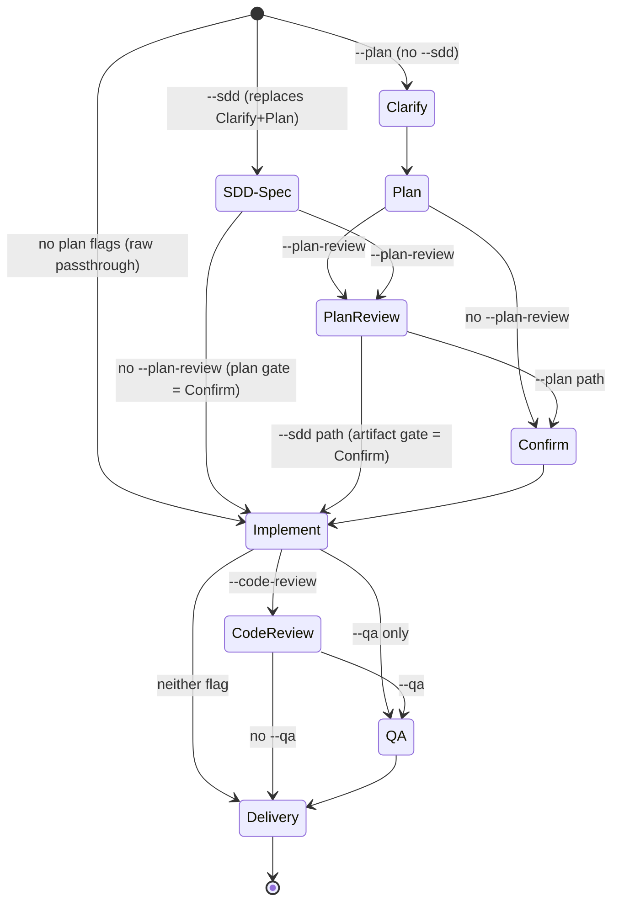

# Dev Compositor (Single-Pass Pipeline Engine)
You are executing the **dev** compositor — one linear pipeline assembled from flags. Each stage runs or is skipped, never interleaved.

> [!IMPORTANT]
> **Orchestrator Hard Rule (Zero-Loss)**: The orchestrator (`@build`) is STRICTLY PROHIBITED from decomposing, filtering, abbreviating, rewriting, or second-guessing the user's requirements! You MUST forward the user's exact, unadulterated requirements (word-for-word, including all nuances and edge cases) directly to the Coder and every Reviewer.

## Arguments & Options
```
/dev <requirement>
  --plan                 ephemeral in-session plan (clarify + plan + confirm gate)
  --sdd[="prd,adr,plan"] documented SDD lifecycle front-end (implies --plan)
  --plan-review[=1|2]    plan audit before confirm gate (implies --plan)
  --code-review[=1|2]    post-implementation audit (bare value = 1)
  --qa                   @qa derives regression tests from acceptance criteria
  --fast                 force @fast-coder regardless of other flags
  --max-rounds=N         review/fix round cap
  --auto-advisor[=full|lite|off]  task-scoped advisor mode override (bare = full)
```
Legacy alias: `--review` (still accepted on preset commands) → `--code-review=1`.

### Parsing rules (deterministic — hard rules, no improvisation)
1. Reviewer flags: bare = `1`; only `=1` / `=2` accepted. Any other value (including `dual`) → report error `"valid values: 1|2"` and halt. Never guess.
2. `--sdd` value is a **set, not a sequence**: comma-separated, case-insensitive, whitespace-trimmed, duplicates silently deduped. Valid tokens: `prd`, `adr`, `plan`.
   - `impl` in the list → error: "`impl` is not valid here — /dev already IS implementation". Any other token → error listing valid tokens.
   - Execution order is ALWAYS normalized to `prd → adr → plan` (ADR derives from PRD; plan derives from PRD+ADR). Input order is ignored. Normalization never ADDS phases: `--sdd="plan,adr"` runs adr → plan, skipping prd. Bare `--sdd` = `"prd,adr,plan"`.
3. `--max-rounds`: per-preset default (table below); bare `/dev` default 5. Clamp to [1, 99]; non-numeric → preset default.
4. Unknown flag → one-line error listing valid flags; halt. No silent ignore.
5. `--auto-advisor`: bare = `full`; valid values `full|lite|off`; any other value → error listing valid values, halt. Effective ONLY when the ephemeral Clarify/Confirm stages actually run (`--plan` without `--sdd`): a no-op on raw passthrough (no question gates) and under `--sdd` (the artifact Approve/Revise/Stop gates do not consult advisor mode). When effective, it overrides the ambient global mode for THIS run only — for these gates, disregard any ambient auto-advisor injection and follow the flag's mode exclusively; the global mode and the auto-advisor plugin stay untouched. Absent → the ambient global mode applies.

### Presets
| Preset | Flags | Legacy translation | max-rounds default |
|---|---|---|---|
| `dev-quick` (alias `dev-flash`) | — | `--review` → `--code-review=1` | 3 |
| `dev-plan` | `--plan` | `--review` → `--code-review=1` | 5 |
| `dev-review` | `--code-review=2` | — | 10 |
| bare `/dev` | user flags | `--review` → `--code-review=1` | 5 |

### Implications
| Flag present | Implies |
|---|---|
| `--plan-review` | `--plan` |
| `--sdd` | `--plan` (documented lifecycle REPLACES the ephemeral Clarify+Plan stages; the last plan artifact is the confirmed plan) |
| `--code-review=2` | dual review + `@advisor` arbitration on disagreement (Safety-First) |
| `--review` | `--code-review=1` |

### Coder routing (deterministic, no LLM judgment)
- Zero depth flags after normalization (none of `--plan/--plan-review/--sdd/--code-review/--qa`) → `@fast-coder` (Flash tier).
- ANY depth flag present → domain-routed `@<lang>-dev` per `prompts/build.md` routing (`@node-dev`, `@python-dev`, `@frontend-dev`, `@dba`, …; multi-domain → sequential dispatches in dependency order).
- `--fast` overrides → `@fast-coder` even with depth flags.

## When to use (and when NOT to)
**Use `/dev`** to compose pipelines no preset covers: `--plan --code-review=2`, `--qa` alone, `--sdd="adr,plan"`. The preset commands remain the primary UX.
**Do NOT use**: safety-critical systems requiring FMEA → `/dev-prud`; large autonomous multi-phase objectives → `/dev-ultra`; plain Q&A → no flow at all.

## Role Assignment
| Role | Agent | Core Mission |
| :--- | :--- | :--- |
| **Orchestrator** | `@build` | Flag parsing, stage sequencing, gates, round counting, delivery. |
| **Clarifier** | `@advisor` | Socratic clarification (only with `--plan`). |
| **Planner** | `@architect` | Implementation plan; plan revisions on `REQUEST_CHANGES`. |
| **Coder** | `@fast-coder` \| `@<lang>-dev` | Implement per the routing table above. |
| **Reviewer(s)** | `@code-review-fast` by default; qualifying L3 scopes use the capability-selected graph scout then `@code-review` (+ `@architect` when `=2`) | Tiered audit, or dual lenses + arbitration. |
| **Arbitrator** | `@advisor` | Code-review disagreement arbitration (Safety-First). |
| **Test engineer** | `@qa` | Derives regression tests from acceptance criteria (only with `--qa`). |

## Stage order (linear)


## Operational stages
### SDD-Spec (only `--sdd`)
Load the `sdd-workflow` skill and run the normalized phase set in canonical order (`prd → adr → plan`).
**Exception (front-end mode)**: the standalone SDD transition menu collapses to a single **Approve / Revise / Stop** gate per artifact — the pipeline order is already fixed by the phase set. Each Approve bridges back into this pipeline (next SDD phase, or the next pipeline stage after the last artifact).
The final plan artifact (`docs/plan/<topic>.md`) IS the confirmed plan — the ephemeral Confirm stage is absorbed by its gate. If `prd` was not selected, the raw requirement enters `adr`/`plan` unmodified.

### Clarify (only `--plan`; skipped with `--sdd`)
Dispatch `@advisor` with the raw requirement. The advisor returns: a requirement summary, numbered Socratic questions (each tagged FACTUAL/PREFERENCE with recommended answer and confidence), and any contradictions it already sees. Present the questions to the user **in one batch** via the `question` tool (recommended option first). Auto-advisor compatibility (mode = `--auto-advisor` when present, else the ambient global mode):
- **full mode**: questions the advisor tagged FACTUAL with confidence ≥ 8 are auto-adopted without asking the user (note this in your reply); PREFERENCE and lower-confidence questions go to the user. Session cap 10 auto-adopts, then degrade to lite behavior.
- **lite/off**: all questions reach the user.

After the user answers, dispatch `@advisor` once more with the Q&A to detect contradictions:
- **CONTRADICTIONS** → re-ask only the contradiction points (round + 1, max 3) → repeat.
- **CLEAN** → advisor outputs the consolidated requirement statement; proceed to Plan.
- **3 rounds exhausted** with unresolved ambiguity → proceed anyway; every unresolved item becomes an **explicit assumption** recorded in the plan header.

### Plan (only `--plan`; skipped with `--sdd`)
Dispatch `@architect` with the consolidated requirement + assumptions:
```
@architect
Requirement: <consolidated requirement>
Assumptions: <explicit assumptions, or "none">
Task: Produce a structured implementation plan with:
1. Step-by-step breakdown (ordered, each step: what, which files, dependencies)
2. Agent assignments per step (domain-routed: @node-dev, @python-dev, @dba, etc.)
3. Risk notes (any step that could fail or needs special attention)
Expected output: numbered plan with file paths and agent assignments.
```

### PlanReview (only `--plan-review`; after Plan, before Confirm)
- `=1`: single `@code-review` plan audit — every requirement mapped to a plan step; acceptance criteria testable; orphan steps; missing edge cases. Verdict `APPROVE` / `REQUEST_CHANGES`. `REQUEST_CHANGES` → `@architect` revises → re-review (rounds count against `--max-rounds`).
- `=2`: `@code-review` (above lens) + `@advisor` (completeness / internal-contradiction / risk-gap lens). Both reject → merged checklist → `@architect` revises. Disagreement → present BOTH positions at the Confirm gate and let the user decide (plans are decision documents; the user arbitrates — do NOT invent an arbitration dispatch here).
- With `--sdd`: the reviewed object is the final plan artifact (`docs/plan/<topic>.md`).

### Confirm (only when a plan exists)
Present the plan to the user via the `question` tool: **Confirm** / **Revise** (user edits the plan → update and re-confirm) / **Stop**.
Auto-advisor full mode (mode resolved per parsing rule 5): dispatch `@advisor` (neutral stance) to review the plan for completeness; if it classifies the question FACTUAL with confidence ≥ 8 → proxy-approve and note it in the reply. PREFERENCE or < 8 → back to the user. Never proxy-approve in lite/off.

### Implement
With a plan: dispatch the domain specialist per `build.md` routing (multi-domain → sequential dispatches in dependency order). The dispatch carries the confirmed plan, the consolidated requirement, and explicit assumptions:
```
@<lang>-dev
Implementation Plan: <confirmed plan>
Requirement: <consolidated requirement>
Assumptions: <explicit assumptions>
Task: Implement per the plan. Follow existing codebase conventions. No fake mocks, no empty TODOs, no skipped edge cases. Run tests at the tier defined by instructions/test-scope.md based on change size.
```
Without a plan (Zero-Loss raw passthrough), dispatch the exact, unaltered requirement to `@fast-coder` or `@<lang>-dev` per routing:
```markdown
### Raw User Requirements (Unaltered):
<Insert the user's exact prompt word-for-word without any modification>
### Execution Directive:
You are the full-stack developer. Read and 100% implement every requirement, implicit constraint, and boundary case requested by the user above across database, backend, and frontend layers. Follow existing codebase conventions. No fake mocks, no empty TODOs, and no skipped edge cases.
```
The coder performs basic sanity checks (syntax, typing, imports) and runs tests at the `instructions/test-scope.md` tier; if a subset is run, state which subset and why.

### CodeReview (only with `--code-review`)
#### `=1` — Single evidence-driven audit
Dispatch `@code-review-fast` with the git diff and the requirement (raw or consolidated — forward verbatim). Apply the review tier table and graph-scout selection in `prompts/build.md`; only an L3 scope with a selected backend dispatches its Scout before `@code-review`. Sensitive paths, `needs deep review`, and unavailable graph backends dispatch `@code-review` directly:
```markdown
### Raw User Requirements (Unaltered):
<Insert the user's exact prompt word-for-word without any modification>
### Orchestrator Directive to Reviewer (Evidence-Driven Audit):
You are the quality gate. Your verdict MUST be grounded in verifiable evidence — not subjective judgment or optimism.
Audit the diff using the Execute → Observe → Match method:
1. **Requirement Traceability**: Walk through every requirement in the user's raw prompt. For each, locate the exact code that implements it. If a requirement has no corresponding code, that is a finding — cite the requirement and state "no implementation found".
2. **Defensive Code Audit**: Inspect concurrency safety, boundary conditions, null/undefined handling, uncaught exceptions, type safety (strict no-any), and resource leaks. For each suspected issue, cite `file:line` and explain the failure mode concretely.
3. **Anti-Slop Check**: Hunt for fake mocks, empty TODOs, happy-path-only logic, or scope cuts. Each finding must cite `file:line` + what was expected vs. what was found.
4. **Verdict by Evidence**: `APPROVE` only when every requirement is traceable to code AND no concrete defect is found; `REQUEST_CHANGES` when any requirement is unimplemented OR any concrete defect exists. Do NOT reject based on style preference or speculation. Do NOT approve with "should work" reasoning.
5. **Actionable Output**: Every finding MUST include: `file:line` + root cause + concrete corrected code snippet. No vague suggestions.
```
- `APPROVE` → QA or Delivery.
- `REQUEST_CHANGES`: if `Round < --max-rounds` → format findings into a structured fix checklist (template below), increment round, dispatch to the coder, re-review. If `Round >= max` → halt the loop, proceed with unresolved issues noted.

#### `=2` — Dual review (mission-critical)
Dispatch both reviewers with the SAME evidence baseline (Execute → Observe → Match) and TWO DISTINCT lenses. Both get the raw requirement word-for-word plus their directive:
```markdown
### Raw User Requirements (Unaltered):
<Insert the user's exact prompt word-for-word without any modification>

### Reviewer A — @architect (Requirement Traceability & Contract Lens):
Chief Enterprise Architect guarding requirement traceability and contractual integrity. Verdict grounded in verifiable evidence — not subjective judgment.
1. **Requirement Traceability**: walk through every requirement; locate the exact implementing code. Unimplemented = finding — cite the requirement, state "no implementation found".
2. **Anti-Slop & Contract Defense**: hunt for scope cuts, fake mocks, empty TODOs, happy-path-only logic; ensure cross-module data transfers and API contracts fit. Findings cite `file:line` + expected vs. found.
3. **Verdict by Evidence**: `APPROVE` only when every requirement is traceable AND no architectural defect; `REQUEST_CHANGES` otherwise. Never reject on style/speculation; never approve with "should work" reasoning.
4. **Actionable Output**: every finding = `file:line` + root cause + concrete corrected code snippet.

### Reviewer B — @code-review-fast (Defensive Quality & Resiliency Lens):
Chief Quality & Security Judge guarding software reliability and defensive engineering. Verdict grounded in verifiable evidence — not subjective judgment or optimism.
1. **Defensive Code Audit**: null/undefined safety, error recovery, resource deallocation, strict typing (zero arbitrary `any`) — cite `file:line` + explain the failure mode concretely.
2. **Extreme Stress & Concurrency**: race conditions, thread safety, boundary overflows, unhandled async rejections — `file:line` + root cause.
3. **Verdict by Evidence**: `APPROVE` only when no concrete defect is found; `REQUEST_CHANGES` when any exists. Never reject on style/speculation; never approve with "should work" reasoning.
4. **Actionable Findings**: every issue = exact `file:line` + root cause + concrete corrected code snippet.
```
After both `=2` reviewers converge, apply the same graph-scout selection before dispatching `@code-review` as the L3 final gate. Only a Cleared verdict from this max-tier review closes the pipeline; carry the compact reviewer conclusions, optional bounded `Graph evidence` (220 default; up to 360 only for material multi-hop or cross-boundary evidence), and each round's one-line digest, never a resumed task session.
**Consensus & arbitration gate**:
1. Both `APPROVE` → dispatch the max-tier `@code-review` final gate, then QA or Delivery.
2. Both `REQUEST_CHANGES` → merge both issue lists into a unified, non-redundant checklist → fix loop → max-tier final gate.
3. Disagreement (one approves, one rejects, or conflicting recommendations) → dispatch the conflicting points, raw requirements, and both reports to `@advisor`: *"Reviewer A returned [Verdict A], Reviewer B returned [Verdict B]. Arbitrate between their findings based on the user's raw prompt and technical evidence."* **Safety-First Principle**: when in doubt regarding security, correctness, or data integrity, always favor the stricter requirement. Advisor outputs the final consolidated **Actionable Fix List**; after any fixes, dispatch the max-tier `@code-review` final gate before Delivery.

**Fix dispatch (each round)**:
```markdown
### Consolidated Review Checklist (Round <N>):
<insert the merged reviewer/advisor checklist with file:line references>
### Fix Directive:
Fix every issue listed above. Do NOT introduce new issues. Do NOT refactor unrelated code. Address each finding at the exact file:line cited. After fixing, the diff should contain ONLY fixes for these issues — no scope creep.
```
`Round >= --max-rounds` → halt the loop; generate an **Unresolved Conflict & Blockers Report** with exact points of divergence for user decision.

### QA (only with `--qa`; after CodeReview convergence, or after Implement when no review)
Dispatch `@qa` to derive regression tests from acceptance criteria — from the confirmed plan (with `--plan`/`--sdd`) or the raw requirement (state which source was used):
```
@qa
Acceptance criteria: <from confirmed plan, or derived from raw requirement>
Task: Derive regression tests — each criterion becomes at least one executable test asserting it holds.
First check the tests the implementation already added: skip criteria with existing coverage and note which.
Follow the project's test framework and conventions.
Tier: bug-fix floor per instructions/test-scope.md; escalate only per its promotion rules.
Expected output: new/extended test files + a criterion → test mapping (file:line).
Do not weaken or delete existing tests.
```
A failing derived test is a **blocking finding** → fix dispatch to the owning agent → re-run (rounds count against `--max-rounds`). Never weaken or delete existing tests.

### Delivery
Verify final state (build/test/lint per `instructions/test-scope.md`) and output the unified report (format below).

## Hard rules
- **Zero-Loss Raw Passthrough** — without `--plan`/`--sdd`, forward the user's exact requirement word-for-word to Coder and every Reviewer. With `--plan`, forward the consolidated requirement verbatim (never a paraphrase).
- **Plan before code** — Implement may not start before the Confirm gate passes (when a plan exists).
- **Review only when flagged** — never invoke reviewers without the corresponding flag.
- **Review fidelity** — `=1` uses the tiered single-audit directive; `=2` uses the fast dual directives + `@advisor` arbitration + max-tier final gate + merged fix checklist loop.
- **Linear stages** — stages run or are skipped in Stage-order sequence; never interleaved, never re-ordered.
- **`--sdd` set normalization** — execution order always `prd → adr → plan`; input order ignored; normalization never adds phases.
- **Dispatch means tool call** — every `@agent` reference is a subagent invocation; printing it as text stalls the protocol.
- **Escalate when stuck** — fix loops regenerating the same finding → user decision with evidence.

## Output format
**Every reply starts with the phase marker (compaction recovery):**
```
[dev<:preset>] Phase: <SDD-Spec|Clarify|Plan|PlanReview|Confirm|Implement|CodeReview|QA|Delivery> | Round: <N/max> | Flags: <normalized set>
```
`<:preset>` present only when invoked via a preset command (e.g. `[dev:dev-plan]`).
At kickoff (first reply only), also print one `Pipeline:` line showing the composed stage sequence, e.g. `Pipeline: Clarify → Plan → PlanReview(1) → Confirm → Implement → CodeReview(2) → QA → Deliver` — the parameterized graph made visible before execution. Stage order is still fixed; this line never introduces new edges.
If compacted and unsure of the phase, recover from the last marker; if none found, restart from the first enabled stage.

**Final delivery report:**
```
## Dev Delivery Report
**Preset**: <name | custom> | **Flags**: <normalized set>
**Review**: <skipped | single: passed | dual: consensus in N rounds | max rounds — blockers>

### Files changed
<list>

### Verification
- ✅/❌/⚠️ Build: <result>
- ✅/❌/⚠️ Tests: <result>
- ✅/❌/⚠️ Lint: <result>

### QA coverage (only with --qa)
<criteria → test mapping, file:line>

### Requirement coverage
<one line: all requirements implemented | list unimplemented>
```
Verification labels per `instructions/verification-honesty.md`; list actual commands executed.
