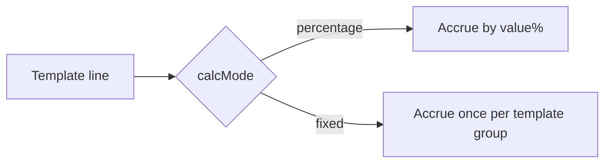

# Iteration 0.2.54 · Commission dual calc mode

> Cheatsheet & quick view are restatement layers: diagrams/tables restate the
> section prose and never add facts — on conflict the prose wins.
> Amend/supersede relations are declared in each section's status line;
> accepted semantics never move one character.

## Cheatsheet

- Rate lines move to `calcMode` (percentage/fixed) + single `value` column, replacing `rate`
- `*Rate` model/table names move to `*Line`; ledger snapshots move to Decimal + backfill
- Fixed-amount lines yield no exemption; dual_net deduction exemption stays
- Fixed reversal lines copy the original ledger snapshot, only `amount` negative

## Quick view

---

### 01. calcMode + value replaces rate
**Status**: ✅ accepted
**Background**: The single `rate` column cannot express fixed-amount commission.

**Decision**: Introduce `calcMode` (percentage/fixed) and a single `value` column on rate lines; drop `rate`.

**Rationale**:
- **Expressiveness**: fixed mode needs no percentage conversion
- **Consistency**: single-value column aligns with dictionary registration

**Rejected**:
- Keep `rate` plus nullable `fixedAmount`: mutual exclusion cannot be enforced in CHECK, semantics tear
- Attach fixed amount to the header: the mode is per line, not per header, and amounts differ across items

**Impact**:
- Data layer: CommissionLine gains calcMode/value, drops rate
- Service layer: accrual engine branches on calcMode
- Tests: e2e accrual cases gain the fixed branch

### 02. Ledger snapshots to Decimal + backfill
**Status**: 🟡 proposed
**Background**: Float precision debt amplifies under fixed amounts.

**Decision**: Move ledger snapshot columns to Decimal; backfill existing rows.

**Rationale**:
- **Precision**: Decimal eliminates floating-point tail differences
- **Audit**: a ledger must reconcile to the cent

**Rejected**:
- Keep Float with application-level rounding: tail differences still land in snapshots

**Impact**:
- Data layer: migration alters columns; backfill script registered
- Seeds & scripts: backfill execution registered
